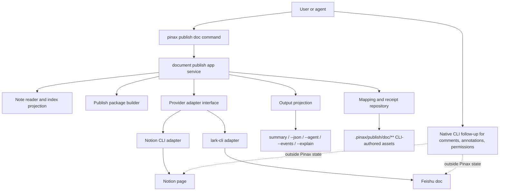

## Context

Pinax 的本地 Markdown vault 仍是真源。用户需要把选定 note 发布到协作型文档平台，方便分享、协作和归档，但不希望 Pinax 变成 Notion/飞书的完整客户端，也不希望 agent 绕过 Pinax 直接写 `.pinax/**` 状态。

因此本设计只把“文档发布关系维护”放进 Pinax：生成发布包、调用 provider adapter、新建或更新外部文档、记录 mapping/receipt、判断 stale、提供 status/list/link/unlink。平台原生协作动作由 agent 调用原生 CLI，Pinax 只在 status 中暴露外部 URL 和 safe object ref，供 agent 后续操作。

## Goals / Non-Goals

**Goals:**

- 支持 `notion-page` 和 `lark-doc` 两个初始 target。
- 提供一套统一命令：provider 配置检查、prepare、dry-run、push、status、list、link、unlink。
- 保持 Pinax vault 为真源；外部文档只是发布副本。
- 用 CLI-backed provider adapter 调用外部工具，首版不直接引入 Notion/飞书 SDK。
- 生成 CLI-authored mapping 和 receipt，不让 agent 手写结构化资产。
- 对 provider 输出、错误、events、receipt 和测试证据做统一脱敏。
- 为 agent 提供清晰 handoff：Pinax 完成发布维护，评论/批注/权限等动作由 agent 调原生 CLI。

**Non-Goals:**

- 不同步 Notion/飞书评论、批注、审批、通知、权限策略和协作者列表。
- 不把 Notion database 或飞书知识库作为首版目标。
- 不从外部文档反向导入或覆盖本地 Markdown 正文。
- 不实现长期 daemon、实时同步或 webhook 监听。
- 不把 static-site publishing 的主题、搜索、Hugo/GitHub deploy 引入本能力。

## Architecture



## Command Surface

新增命令族使用 `publish doc`，避免和现有 static publish 的 profile/plan/build/deploy 语义混淆。

Provider 与 profile：

```bash
pinax publish doc provider list --json
pinax publish doc provider doctor --target notion-page --vault ./my-notes --json
pinax publish doc provider doctor --target lark-doc --vault ./my-notes --json
pinax publish doc profile set notion-page --workspace <workspace-id> --parent-page <page-id> --vault ./my-notes --json
pinax publish doc profile set lark-doc --space <space-id> --folder <folder-token> --vault ./my-notes --json
pinax publish doc profile set lark-doc --folder <folder-token-or-url> --as user --layout mirror --template vault --index-page --vault ./my-notes --json
```

发布维护：

```bash
pinax publish doc prepare --note <note-id> --target notion-page --vault ./my-notes --json
pinax publish doc prepare --note <note-id> --target lark-doc --vault ./my-notes --json
pinax publish doc push --package <package-id> --target notion-page --vault ./my-notes --dry-run --json
pinax publish doc push --package <package-id> --target lark-doc --vault ./my-notes --dry-run --json
pinax publish doc push --package <package-id> --target notion-page --vault ./my-notes --json
pinax publish doc push --package <package-id> --target lark-doc --vault ./my-notes --json
pinax publish doc status --note <note-id> --vault ./my-notes --json
pinax publish doc list --target notion-page --vault ./my-notes --json
pinax publish doc link --note <note-id> --target lark-doc --external-url <url> --vault ./my-notes --json
pinax publish doc unlink --note <note-id> --target lark-doc --vault ./my-notes --json
```

凭据配置不放进 publish 命令参数。若 Pinax 已有 auth/profile 体系，应复用；否则本变更只读取外部 CLI 的已配置状态并通过 `provider doctor` 报告缺失，不持久化真实 token 到 vault。`lark-doc` profile 可以声明 provider 身份选择 `--as auto|user|bot`，该字段只控制调用 `lark-cli` 时使用哪个已授权身份，不保存 credential。默认 `auto` 兼容外部 CLI 的默认选择；写入用户文件夹时建议显式 `--as user`，避免 bot 只能 inspect 但没有文件夹写权限。

## Provider Adapter Boundary

Provider adapter 是 Pinax 和外部 CLI 之间的唯一写入边界。命令层不得直接调用 Notion/飞书工具。

接口概念：

```go
type DocumentPublishProvider interface {
    Target() PublishDocTarget
    Doctor(ctx context.Context, profile PublishDocProfile) (ProviderHealth, error)
    Preflight(ctx context.Context, pkg PublishDocPackage, opts PublishDocOptions) (PreflightResult, error)
    Create(ctx context.Context, pkg PublishDocPackage, opts PublishDocOptions) (PublishDocResult, error)
    Update(ctx context.Context, mapping PublishDocMapping, pkg PublishDocPackage, opts PublishDocOptions) (PublishDocResult, error)
    Status(ctx context.Context, mapping PublishDocMapping) (ExternalDocStatus, error)
}
```

首版 target：

| Target | Provider | Create | Update | Status | Notes |
| --- | --- | --- | --- | --- | --- |
| `notion-page` | Notion CLI adapter | 在配置的 parent page 下创建页面 | 更新已映射页面内容 | 检查页面存在和 digest marker | 不管理 database/comment/permission |
| `lark-doc` | `lark-cli` adapter | 在配置的 folder/space 下创建文档 | 更新已映射文档内容 | 检查文档存在和 digest marker | 不管理评论/批注/权限 |

外部 CLI stdout/stderr 必须经过 adapter 解析和脱敏。Pinax 不把 raw provider payload 写入 stdout、events、receipt、fixtures 或 integration evidence。

## Data Model

结构化资产建议归档在 `.pinax/publish/doc/`，只能由 CLI/service 写入。

```text
.pinax/publish/doc/
  profiles/<target>.yaml
  packages/<package-id>.json
  mappings/<note-id>/<target>.json
  runs/<run-id>/receipt.json
```

核心字段使用英文稳定 key：

```json
{
  "schema_version": "pinax.publish_doc_mapping.v1",
  "note_id": "note_123",
  "target": "lark-doc",
  "provider": "lark",
  "external_object": {
    "type": "document",
    "id": "doccn_xxx",
    "url": "https://..."
  },
  "content_digest": "sha256:...",
  "publish_status": "published",
  "last_published_at": "2026-07-02T00:00:00Z",
  "updated_at": "2026-07-02T00:00:00Z"
}
```

状态枚举：

```text
package_prepared
dry_run_verified
published
linked
stale
failed
detached
```

`stale` 的最小判断：当前 note 正文、允许 frontmatter 和允许附件引用生成的 digest 与 mapping 中 `content_digest` 不一致。首版不读取外部文档正文来做双向 diff。


## Cloud Vault Layout And Reading Render

`lark-doc` 的默认产品体验是 cloud-vault，而不是文件上传器。Profile 支持 `layout`、`template` 和 `index_page`：

| Field | Values | Purpose |
| --- | --- | --- |
| `layout` | `mirror`, `flat` | `mirror` 按 note path 创建或复用远端文件夹，例如 `notes/index/`；`flat` 保留兼容上传行为。 |
| `template` | `vault`, `plain` | `vault` 在正文前生成 Pinax overview、source path、tags/status 等阅读上下文，并去掉重复 H1；`plain` 保持原 Markdown。 |
| `index_page` | boolean | 在目标 folder 维护 `_Pinax Vault Index.md`，列出已发布 note、远端路径、状态和链接。 |

远端文件夹 token 记录在 `.pinax/publish/doc/folders/<target>/*.json`，由 CLI/service 写入。创建 folder 前必须先尝试按 parent folder + folder name 查找并复用已有 folder，避免重复目录。旧的 flat mapping 在下一次 push 时会被移动到镜像 folder，并更新 `remote_path` 和 `remote_folder_token`。

## Agent Native CLI Handoff

Pinax 只返回外部文档 safe refs。agent 如果要执行评论、批注、权限、协作者、页面块级编辑或平台特有格式调整，应在 Pinax 发布成功后调用平台原生 CLI。Pinax 不需要也不应该为这些平台细节新增 connector 子系统；agent 的 skill/runbook 负责说明如何从 `pinax publish doc status` 取外部 ref，再调用 `lark-cli` 或 Notion CLI。

示例 handoff：

```bash
pinax publish doc status --note <note-id> --vault ./my-notes --json
lark-cli doc comment add --doc <doc-token> --text "请确认这一版标题" --json
```

或：

```bash
pinax publish doc status --note <note-id> --vault ./my-notes --json
notion page comment add --page <page-id> --text "Ready for review" --json
```

Pinax 不记录这些评论/批注动作的业务状态；如果后续需要审计 agent 的平台操作，应由对应原生 CLI 或 agent run evidence 记录，而不是写入 Pinax publish mapping。

## Output Contract

`--json` 示例：

```json
{
  "spec_version": "1.0",
  "mode": "json",
  "command": "publish.doc.push",
  "status": "success",
  "summary": "Document published.",
  "facts": {
    "note_id": "note_123",
    "target": "lark-doc",
    "publish_status": "published"
  },
  "data": {
    "package_id": "pubpkg_456",
    "external_object": {
      "provider": "lark",
      "target": "lark-doc",
      "type": "document",
      "id": "doccn_xxx",
      "url": "https://..."
    },
    "content_digest": "sha256:..."
  }
}
```

`--agent` 必须包含稳定 facts：

```text
spec_version=1.0
mode=agent
command=publish.doc.push
status=success
fact.note_id=note_123
fact.target=lark-doc
fact.publish_status=published
fact.external_url=https://...
action.status="pinax publish doc status --note note_123 --vault ./my-notes --json"
```

失败输出仍是合法 envelope，错误码稳定，例如 `provider_cli_not_found`、`provider_auth_failed`、`provider_preflight_failed`、`publish_mapping_not_found`、`publish_stale`、`publish_conflict`、`approval_required`。

## Testing and Evidence

- Unit tests 覆盖 target/profile/package/mapping/status/stale 纯逻辑。
- Command tests 覆盖 `--json`、`--agent`、`--events`、`--explain`、stdout/stderr 分离和脱敏。
- E2E 使用 fake Notion/lark executables，不依赖真实公网、真实 token 或用户 vault。
- Provider adapter tests 必须覆盖 executable missing、auth failure、create success、update success、status missing、stderr secret redaction、raw payload rejection。
- Integration/component/e2e entrypoint 必须按项目标准写入 `temp/integration-test-runs/<run-id>/`，至少包含 `summary.json`、`command.txt`、`stdout.log`、`stderr.log`、`env.json` 和 `artifacts/`。

## Compatibility

本变更新增 pre-1.0 文档发布 surface，属于 additive change。命令名、target id、status enum、JSON envelope 字段、`--agent` keys 和 persisted schema 一旦发布后按演进策略只做向后兼容扩展；重命名、删除或改义必须另开 OpenSpec 并提供迁移、弃用窗口和 rollback。
