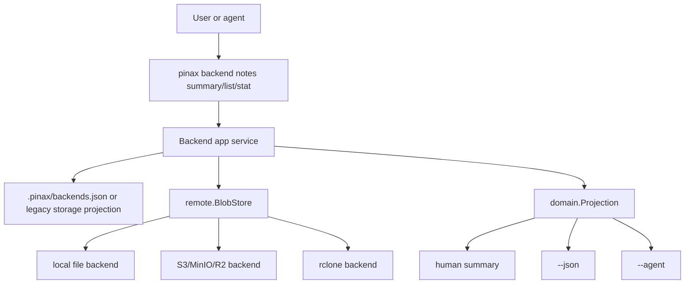

## Context

Pinax 的 backend 控制面已经有 profile、doctor、capabilities、object list/stat、diff/push/pull。用户实际排查云端笔记时，需要比 raw object key 更高一层的视图，但 Pinax 又不能假设所有 Cloud Sync 对象都是明文 Markdown：S3/rclone direct 可能保存 Cloud Sync 加密 blob，也可能保存普通 Markdown 备份镜像。

因此本变更采用“note-like object inspection”模型：只读扫描 backend object list，把 `.md` 结尾的对象识别为可见 note-like 对象；加密 blob 或 manifest 仍通过 `backend object list/stat` 查看。

## Architecture



## Command Model

| Command | Purpose | Writes |
| --- | --- | --- |
| `pinax backend notes summary [name] [prefix]` | 统计 backend 下可见 note-like Markdown 对象；省略 `name` 时使用 default backend。 | No |
| `pinax backend notes list [name] [prefix]` | 列出 `.md` note-like 对象；省略 `name` 时使用 default backend。 | No |
| `pinax backend notes stat <name> <path>` | 查看单个 note-like 对象 revision。 | No |
| `pinax backend object list <name> [prefix]` | 继续作为底层对象诊断入口。 | No |

## Completion Model

`backend notes` 和 `backend object` 的 positional completion 走同一只读 service projection：

- 第一个 positional argument 补 backend profile name，例如 `work-s3`、`local-dev`；`summary/list` 可省略该参数并使用 default backend。
- `backend notes summary/list` 的第二个 argument 补 note prefix，例如 `notes/`、`notes/research/`。
- `backend notes stat` 的第二个 argument 补 note-like Markdown path，例如 `notes/cloud-sync.md`。
- `backend object stat` 的第二个 argument 补 raw object key，例如 `pinax/manifest.json`。

补全不得写 `.pinax/**`、本地 note 或远端 object；provider 不可用时失败关闭并返回空补全。补全 description 使用 `backend`、`prefix`、`note`、`object` 等英文稳定词，不包含 provider secret 或 raw payload。

## Data Shape

`backend.notes.list` 的 `data.notes[]` 使用 snake_case 字段：

```json
{
  "path": "notes/cloud-sync.md",
  "key": "notes/cloud-sync.md",
  "size_bytes": 13,
  "revision": "...",
  "updated_at": "2026-07-03T00:00:00Z"
}
```

`backend.notes.summary` 的 facts 至少包含：`backend`、`kind`、`prefix`、`objects`、`notes`、`bytes`，有更新时间时包含 `newest_updated_at`。

## Error Mapping

底层 provider 错误不能直接作为 `internal_error` 泄漏。服务层把 provider 失败归一化为：

- `backend_region_invalid`：错误文本表明 S3 region 无效或不是合法 DNS name。
- `backend_provider_error`：其他 provider request failure。

输出只包含 backend name/kind/region 等非 secret facts 和可运行的下一步命令，例如：

```bash
pinax backend show default-s3 --vault ./my-notes
```

## S3 Profile Runtime Mapping

S3 profile 中的 `bucket`、`prefix`、`region`、`endpoint`、`profile` 都必须进入 runtime client options。带 custom endpoint 时默认 `path_style=true`，匹配 MinIO/R2 等 S3-compatible provider。

## Security

- 不读取或输出 provider secret。
- 不保存 provider raw payload、完整 SDK trace 或 Authorization header。
- `backend notes` 只读，不写 `.pinax/**`、本地 note、远端 object 或 sync state。
