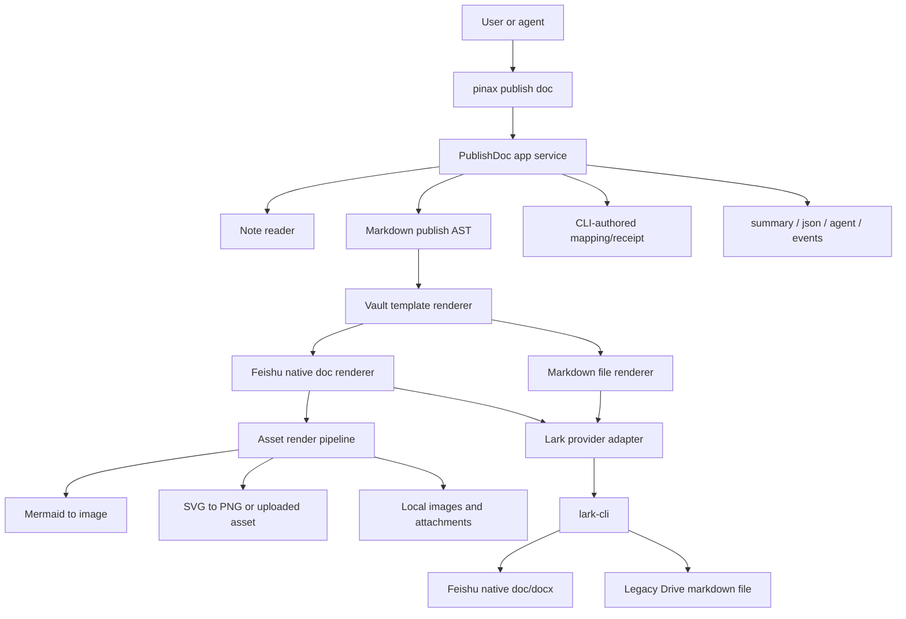

## Context

这次变更来自真实发布验证：`lark-cli markdown +create/+overwrite` 可以把 Markdown 文件放进飞书 Drive，但生成对象是 `file`，不是飞书原生 Docs/Docx。它能保留 Mermaid fenced block、SVG 链接和 inline SVG 源码，却不能保证飞书阅读端把它们渲染成图，也不能给评论、目录、块级编辑等原生文档协作能力提供正确对象。

因此 `lark-doc` 必须从“Markdown file uploader”升级为“Feishu native document renderer”。Pinax 仍保持 local-first：本地 Markdown note 是真源；远端飞书原生文档是发布副本；平台原生评论、权限和协作者动作由 agent 通过 `lark-cli` 自己执行。

## Goals / Non-Goals

**Goals:**

- 新 profile 默认生成飞书原生 Docs/Docx，而不是 Drive `.md` file。
- 保留 `renderer=markdown-file`，避免立刻破坏已发布 mapping 和已有自动化。
- 定义 Markdown 到飞书原生文档的可测试 render contract。
- 为 Mermaid、SVG、本地图片和附件提供预渲染/上传/插入策略。
- 在 `status/list/push` 输出中清楚暴露 renderer、remote object type 和 render warnings。
- 让 index page 也走原生文档 renderer。
- 用 fake `lark-cli` 覆盖命令合同，用真实飞书 smoke checklist 验证阅读效果。

**Non-Goals:**

- 不反向同步飞书正文到 Pinax note。
- 不实现飞书评论、批注、权限、协作者、审批、通知。
- 不把 provider raw payload、token、cookies 或本地绝对路径写入 stdout、receipt、fixtures 或 evidence。
- 不在首版支持每个 Markdown 扩展语法；不支持项必须产生稳定 warning。
- 不删除 Markdown file renderer。

## Architecture



## Renderer Model

`lark-doc` profile 新增 `renderer` 字段：

| Renderer | Default | Remote object | Purpose |
| --- | --- | --- | --- |
| `native-docx` | yes for new `lark-doc` profiles | `docx` preferred, `doc` only if provider requires | 飞书原生文档，支持阅读、评论和富内容渲染。 |
| `markdown-file` | legacy/fallback only | `file` with `.md` name | 保留当前行为，用于 provider 缺少原生能力或用户显式要求源码文件。 |

读取旧 profile 时：

- 如果缺少 `renderer` 且 target 是 `lark-doc`，Pinax SHALL treat it as `markdown-file` for existing mappings unless the user runs profile set with `--renderer native-docx`.
- 新建或重设 `lark-doc` profile 时默认 `renderer=native-docx`。
- `push` 不允许在同一个 active mapping 上静默改变 remote object type；从 `file` 迁移到 `docx` 时必须创建新对象或要求用户 `unlink` 后重新发布，并在输出 actions 中给出命令。

## Markdown Publish AST

Pinax 先把 note 转为 publish AST，而不是直接把 Markdown 字符串交给 provider。首版节点：

| AST node | Native output |
| --- | --- |
| document title | Feishu doc title |
| heading 1-6 | heading blocks |
| paragraph | text block with inline marks |
| emphasis/strong/code/link | rich text marks |
| unordered/ordered list | list blocks |
| blockquote | quote/callout block when supported, otherwise paragraph with warning |
| fenced code | code block with language |
| table | native table when supported, otherwise image or Markdown fallback block with warning |
| image | uploaded image/media block |
| Mermaid fenced block | rendered image plus optional collapsed source block |
| inline/raw SVG | rendered PNG image; raw SVG source is not inserted into native doc |
| unsupported HTML | omitted or fenced as source according to policy, with render warning |

复杂转换逻辑需要中文注释说明边界：例如 HTML/SVG sanitization、Mermaid renderer failure、asset path resolution、remote object type migration。

## Asset Rendering

首版资产策略：

1. 本地相对图片和 Pinax attachments 先解析到 vault 内路径，拒绝路径逃逸。
2. SVG 文件和 inline SVG 转成 PNG 后再上传，避免飞书端不渲染或过滤 SVG。
3. Mermaid fenced block 通过本地 renderer 生成 PNG；如果 renderer 不可用，`prepare` 失败或产生 `render_warnings`，具体取决于 `--strict-render` 后续是否启用。首版默认 warning + 源码 code block fallback，但 `native-docx` smoke 验收必须覆盖成功渲染路径。
4. 远程图片 URL 首版可作为链接保留；若 provider 支持远程导入再上传为图片块。不能把私有 URL、cookie 或 Authorization header 写进 package。
5. package/receipt 只记录相对 artifact path、sha256、media type、render status，不记录 provider raw response。

## Provider Adapter Boundary

Pinax 不直接引入飞书 SDK。`lark-cli` adapter 新增能力探测和 normalized operations：

```text
lark native-doc capability check
lark native-doc create from package
lark native-doc update existing document
lark native-doc upload media asset
lark native-doc inspect object type
```

实际命令名由 `lark-cli` 当前能力决定，Pinax adapter 必须把它们封装为稳定内部接口。若 `lark-cli` 暂时没有原生文档块写入能力，adapter 返回 `provider_capability_missing`，并在 actions 中提示用户升级或安装支持原生 Docs 的 `lark-cli` 版本；不得静默降级到 `markdown-file`，除非 profile 显式设置 `--renderer markdown-file`。

## Remote Object Types And Mapping

`external_object.type` 的含义需要更严格：

| Type | Meaning |
| --- | --- |
| `docx` | 飞书新版原生文档，首选 native renderer 输出。 |
| `doc` | 飞书旧版原生文档，仅在 provider 实际返回时记录。 |
| `file` | Drive 文件；只能由 `renderer=markdown-file` 产生。 |

Mapping 追加字段：

```json
{
  "renderer": "native-docx",
  "render_revision": "pinax.publish.render.v1",
  "remote_object_type": "docx",
  "render_warnings": []
}
```

这些字段均为 additive。旧 mapping 读取时字段为空也必须可用；status 输出应显示 `renderer=unknown` 或根据 object type 推断。

## Index Page

`index_page=true` 且 `renderer=native-docx` 时，索引页也必须是飞书原生文档，标题为 `Pinax Cloud Vault Index`。它应包含：

- 生成说明和 vault 真源提示。
- 已发布 note 表格：folder、title、status、renderer、link。
- 可选分组：按 folder 聚合。
- 不包含 provider token、raw payload 或本地绝对路径。

旧 `_Pinax Vault Index.md` file 不自动删除；新 renderer 可以创建新的原生 index doc，并在 profile `index_object` 中记录 object type 和 renderer。

## CLI Contract

新增 flag：

```bash
pinax publish doc profile set lark-doc --folder <folder-token-or-url> --as user --renderer native-docx --layout mirror --template vault --index-page --vault ./my-notes --json
pinax publish doc profile set lark-doc --folder <folder-token-or-url> --as user --renderer markdown-file --vault ./my-notes --json
```

输出新增 facts/data 字段：

```text
fact.renderer=native-docx
fact.external_object_type=docx
fact.render_warnings=0
```

`--json` 在 `data.mapping` 和 `data.package` 中包含 renderer 和 render warnings。旧消费者忽略新增字段即可。

## Testing And Evidence

- Unit：Markdown AST、renderer selection、object type migration、asset sanitizer、Mermaid/SVG fallback。
- Command：profile set `--renderer`、push output facts、status/list old mapping compatibility。
- E2E：fake `lark-cli` 模拟 native doc create/update/upload media/inspect，并拒绝 silent fallback。
- Integration evidence：`go test ./tests/e2e -run TestPublishDoc -count=1` 继续写 `temp/integration-test-runs/<run-id>/`。
- Real smoke：在用户授权的真实飞书文件夹执行一篇测试 note 发布，检查 `drive +inspect` 返回 `type=docx|doc`，并用 `lark-cli` 支持的 export/preview/inspect 命令验证 Mermaid/SVG 以图片或原生块存在。若 API 无法证明视觉渲染，必须在验收记录中要求人工打开文档检查，而不能声称已验证。

## Compatibility And Rollback

- Change class: additive。新增 renderer 字段、输出 facts 和 provider capabilities。
- Deprecation: 无删除；`markdown-file` 保留。
- Migration: 旧 file mapping 不原地改义。用户可 `pinax publish doc unlink --note <note> --target lark-doc --vault ./my-notes --json` 后用 `renderer=native-docx` 重新发布。
- Rollback: 将 profile 设回 `--renderer markdown-file` 后，现有 Markdown file renderer 仍可使用；代码回滚不会破坏旧 mapping 读取。
