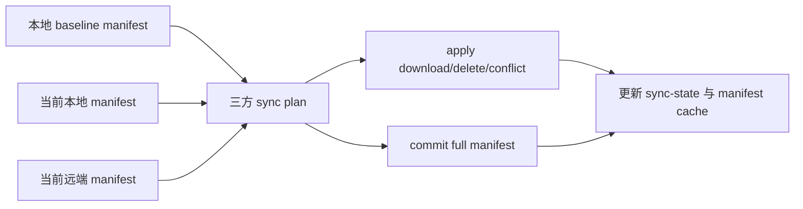

## Design

Cloud Sync 将本地 vault 视为真源。每次成功 push/pull 后，CLI 写入 `.pinax/sync-state.json` 的 revision/blob cache 指针，并把已解密 manifest 缓存在 `.pinax/cloud/manifest-cache/`。下一次同步读取 base manifest，再现场构建 local manifest，并从 Cloud backend 读取 remote manifest，交给现有 sync planner 生成三方操作。

`sync pull` 是 pull-only 命令；当三方 diff 发现本地存在未 push 的 `upload_blob` 或 `delete_remote` 操作时，返回 `LOCAL_UNPUSHED_CHANGES` 并提示运行 `pinax sync --target cloud --yes`。`pinax sync` 允许这类本地操作存在：pull 阶段只应用安全远端操作，随后 push 当前本地 full manifest，让远端删除旧路径并记录新路径。

note soft delete 不新增云端 API。records ledger 为 `note.trashed` materialize tombstone，manifest builder 输出 `object_kind=note` delete marker 和 trash backup blob；另一设备 pull 时根据 marker 把 active note 移入本地 trash。

## Risks

- 旧 vault 没有 manifest cache 时只能做空 baseline；首次同步后会建立基线。
- 远端和本地同时改同一文件时仍走 conflict sidecar，不做自动内容合并。
