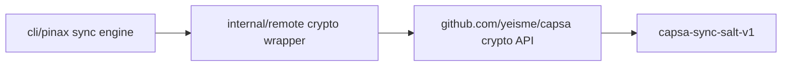

# pinax-sync-hardening Design

This duplicate planning change is superseded by `pinax-sync-consumer-hardening`.

The accepted implementation keeps Pinax sync orchestration local while importing `github.com/yeisme/capsa` for encryption. That makes the current key derivation salt `capsa-sync-salt-v1`; remote objects written by the older `pinax-cloud-sync-salt-v1` path require a fresh push from a complete local vault.

No spec deltas from this duplicate change are applied during archive.
