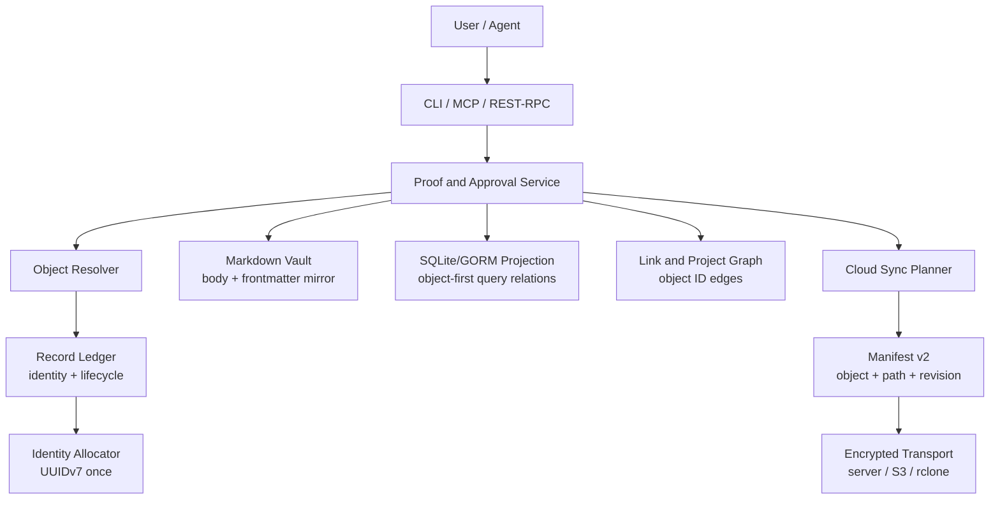
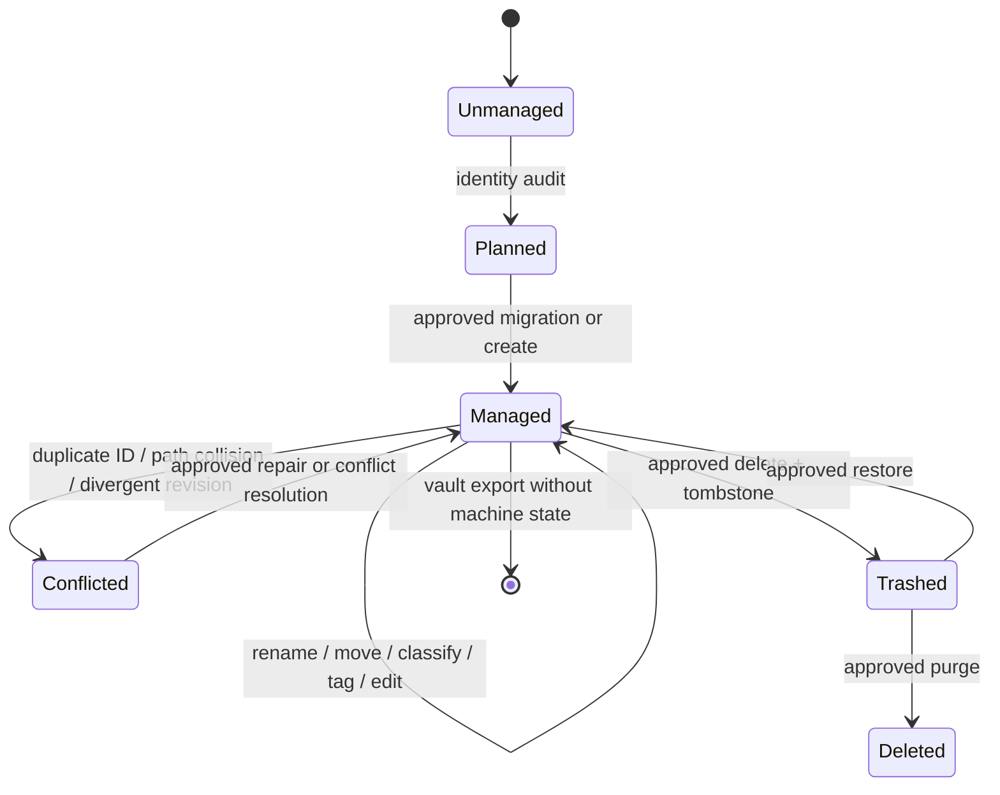
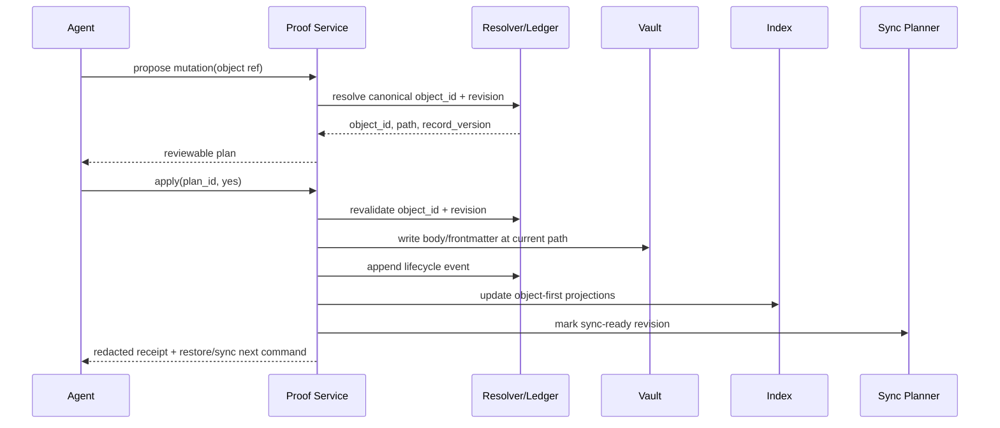

## Context

Pinax 当前已经形成用户需要的笔记内核表层：项目和子项目、内容分类、Tag、SQLite/GORM 索引、安全 SQL/Dataview、双链、proof loop、Record Ledger 以及加密多端同步。当前身份实现却存在三套并行语义：Record Ledger 规范宣称持有 `note_id`，缺失 ID 时应用服务仍用 path SHA-1 推导，SQLite `NoteRecord` 仍以 path 为主键，Cloud Sync manifest v1 普通 entry 也通过 path 标识文件。删除 marker 已开始携带 object ID，但创建、更新、移动和删除尚未共享同一个对象模型。

历史提交曾把 `stableNoteID(path)` 直接改为 UUIDv7，但该函数在同一创建流程中被多次调用，每次生成不同值，破坏了 ledger、board 和 projection 幂等性。该失败证明 UUID 必须由一次性分配器产生并作为数据流输入传递，而不是证明路径哈希适合长期身份。

本设计面向一个明确用户：使用多个设备和 Agent 管理真实 Markdown vault 的所有者。核心工作不是新增更多命令，而是让项目、分类、Tag、SQL/Dataview、双链、Agent 写入和多端同步共享一个可证明稳定的对象身份。

## Goals / Non-Goals

**Goals:**

- 以 UUIDv7 `object_id` 建立 note、asset、project、subproject、folder、view、template 等 durable object 的统一身份合同。
- 保持 Markdown 为用户正文真源，Record Ledger 为机器身份与生命周期真源，frontmatter 为可携带镜像，SQLite 为可重建查询投影。
- 让 rename、move、分类、Tag 和项目归属变化只修改对象属性，不改变对象身份。
- 让 SQL/Dataview、双链、项目看板和 Agent proof loop 使用 object ID 关联数据。
- 将 Cloud Sync 升级为 object-first manifest v2，并区分 revision conflict、path collision 和 tombstone delete。
- 为旧路径派生 ID 和 manifest v1 提供可预览、可恢复、可分批执行的迁移方案。

**Non-Goals:**

- 不增加新的内容分类维度、一级命令、编辑器、桌面客户端、发布平台或团队协作产品。
- 不改变 Markdown 正文作为可移植内容格式的地位。
- 不让 SQLite、Cloud Sync server 或 Agent 成为笔记正文真源。
- 不在启动时静默迁移真实 vault，不自动合并身份冲突，不以全量重写换取实现简单。
- 不要求 v1 manifest 永久双写；兼容层必须有明确退出条件。

## Architecture

## Decisions

### 1. 一个 canonical object ID，而不是 file ID 和 UUID 两套身份

`object_id` 使用 UUIDv7 字符串，note 继续通过 `note_id` 暴露同一值以兼容现有 frontmatter、CLI 和 API。`file_id` 不新增为第二套逻辑主键；如果用户界面需要“文件 ID”措辞，它就是 object ID 的展示名称。

选择 UUIDv7 是因为它全局唯一、按时间有序、可离线生成且不依赖路径或内容。拒绝 path hash，因为 rename/move 会改变输入；拒绝 content hash 作为身份，因为内容编辑会改变 hash；拒绝每次随机调用，因为同一事务会产生身份分裂。

### 2. 身份只分配一次并显式穿过调用链

新增窄接口 `IdentityAllocator`，只在 create、approved adoption 和明确 clone 时调用。应用服务首先取得一个 ID，随后将同一值传给 ledger event、frontmatter writer、index projection、project/link projection 和 output receipt。读取、重建、rename、move、Tag 和分类流程禁止调用 allocator。

复杂身份分配、幂等性、错误处理和事务边界必须添加中文注释，说明为何不能重复生成。

### 3. Record Ledger 是机器身份真源

Ledger 持有 canonical ID、object kind、lifecycle、current path、legacy aliases、record version 和 revision evidence。Frontmatter `note_id` 是 portability mirror；缺失或冲突时先报告 issue，再通过 migration/repair plan 更新。Markdown body 仍是用户内容真源，ledger 不保存完整正文。

### 4. SQLite 使用 object-first schema v2

Note、Tag、Link、Task、Asset 和 Property projection 以 object ID 关联；active path 建唯一索引用于 locator 冲突检测。为了降低切换风险，迁移先创建 v2 表或列并回填，再切换 query DAO，最后删除 path-primary 假设。普通业务读写继续通过 GORM repository 和生成的 typed DAO，不在 handler 或 service 中硬编码 SQL。

SQL/Dataview 用户字段保持兼容。`object_id` 和 `note_id` 成为可查询稳定字段，但旧 saved view 不必显式选择它们。

### 5. 双链保存 ID edge 和原始文本两套证据

已解析关系保存 source object ID、target object ID、当前 paths 和 raw target。raw target 负责可移植性和 Markdown 展示，ID edge 负责机器稳定性。目标移动后关系仍有效，rewrite 只作为 reviewable plan。歧义 link 不猜测 target ID。

### 6. Manifest v2 按对象合并

Manifest v2 entry 包含 object ID、kind、current path、blob ID、content hash、object revision、updated time 和 device ID。Planner 先按 object ID 比较，再检查 path：

- 同 ID、不同 path：move/rename。
- 同 ID、相同 base、不同内容：允许的 three-way merge 或 revision conflict。
- 不同 ID、相同 path：path collision。
- tombstone ID 命中同 object ID：对象删除或与本地未推送修改冲突。

Manifest、冲突状态机、协议转换和非显然 fixture 必须使用中文注释解释边界与安全原因。

### 7. 迁移采用 dual-read、v2-write、显式 promotion

兼容期读取 ledger ID、frontmatter ID、legacy path-derived ID mapping 和 manifest v1 path facts，但新创建对象只写 UUID identity。只有 audit 无 blocker、迁移 plan 已批准且 snapshot 新鲜时，才 promotion 为 authoritative manifest v2。迁移不会由 `index refresh`、`sync status` 或 daemon 启动隐式触发。

### 8. Agent plan 锁定 object ID 和 expected revision

Agent、MCP、REST/RPC 和 CLI 使用同一个 resolver。Plan 保存 object ID、expected record version、expected content revision 和 observed path。Apply 以 ID 重解析，并对 stale revision、ID/path 不一致和 path 被其他对象占用分别报错。路径移动但 revision 未变化时可以安全重定位；不能把旧 path 上的新对象误当成计划目标。

## Data Flow

## Error and Rescue Map

| 失败 | 检测点 | 处理 | 用户可见结果 |
| --- | --- | --- | --- |
| UUID 分配后 ledger 写失败 | create/adopt transaction | 不写 Markdown；允许同幂等键重试 | `identity_persist_failed` 与重试命令 |
| frontmatter mirror 写失败 | approved apply | 保留 ledger issue 和 snapshot，不声称完成 | `frontmatter_mirror_failed` 与 repair next action |
| duplicate object ID | audit/replay/index rebuild | 阻止 promotion 和危险写入 | `duplicate_object_id` |
| different IDs share path | resolver/sync planner | 保存双方证据，不覆盖 | `path_collision` |
| same ID divergent revisions | sync planner | three-way merge 或 conflict queue | `revision_conflict` |
| manifest v1 identity ambiguous | migration planner | 不写 manifest v2 | `identity_mapping_ambiguous` |
| stale Agent plan | proof apply | 重新解析 ID 后拒绝或安全重定位 | `plan_stale` 或 `locator_rebased` |
| migration interrupted | phase receipt | 从最近完成 phase 幂等恢复 | `migration_incomplete` 与 resume command |

禁止用 catch-all 吞掉身份、迁移或同步错误。所有被处理错误必须返回稳定 error code、红acted evidence 和真实下一步命令。

## Security and Privacy

- UUID、path hash、content hash 和 revision ID 不是授权凭证；API/MCP 仍执行现有 token、write gate 和 vault boundary 检查。
- Cloud Sync server 只接收加密 manifest/blob；对象 key、metadata 和日志不得泄露明文正文、token、Authorization header、provider payload 或完整私密 path。
- Migration receipt 和 integration evidence 只保存 redacted IDs、相对路径摘要、counts、error codes 和 artifact references。
- Agent 不能提供任意 object ID 覆盖已管理对象，也不能手写 ledger、mapping、manifest 或 receipt。

## Performance and Scale

- UUID 和 object relation 回填必须流式或分页执行，遵守现有 record scan 内存预算。
- active path uniqueness、object ID、Tag relation、link source/target、project relation建立索引。
- 常规 search、SQL/Dataview 和 backlinks 必须继续走 projection，不因 identity migration 回退为每次全 vault 扫描。
- 验证至少覆盖小型、10k notes、100k links 和多资产 vault fixture；性能退化超过既有基线时不得 promotion。

## Migration Plan

1. 增加 domain identity types、allocator 和兼容 parser，不改变默认数据。
2. 增加 audit/plan projection 与 fixture，识别 missing、legacy、duplicate、path collision 和 frontmatter mismatch。
3. 增加 ledger identity schema 和 compatibility mapping，保持旧读路径。
4. 增加 index schema v2 和双写验证，回填 object relations后切换 typed DAO。
5. 升级 links、projects、tasks、SQL/Dataview 和 proof plans 使用 object ID。
6. 增加 manifest v2 encoder/decoder、v1 migration planner 和对象级 conflict state machine。
7. 通过真实双设备 fixture 和真实 transport smoke 后，允许显式 promotion；daemon 在 promotion 前保持旧兼容模式或拒绝 v2-only 操作。
8. 完成 dogfooding、恢复演练和兼容窗口后，再移除新写入中的 path-derived identity。

每一阶段都必须先写失败测试，再实现最小行为；integration、component、system 和 e2e 入口必须把脱敏证据写入 `temp/integration-test-runs/<run-id>/`。

## Rollback

- 身份迁移 apply 前必须创建 version snapshot，并保存 CLI-authored migration receipt 和 legacy mapping。
- 在 manifest v2 promotion 前，可删除可重建 index v2 并继续使用旧 projection；不得删除 ledger canonical identity。
- manifest v2 已远端提交后，不通过改写公共历史回滚；发布新的修复 revision，并允许客户端从最近兼容 manifest 恢复。
- 任何 rollback 都通过 Pinax service 或 version restore 命令执行，不手工编辑 `.pinax/**`。

## Validation Strategy

- Unit：allocator 一次性、UUID validation、legacy mapping、resolver、冲突分类和状态转换。
- Integration：ledger/frontmatter/index 一致性、Tag/分类/SQL/Dataview、双链 rename、project move、Agent stale plan。
- Component：manifest v1→v2 migration、object rename pull、revision conflict、path collision、tombstone restore。
- E2E：两个独立 vault/device 完成 create、classify、Tag、query、link、rename、sync、conflict 和 restore 全流程。
- Quality gate：`task check`、`task ci`、`openspec validate --all --strict`，并确认 `CGO_ENABLED=0 go build ./cmd/pinax`。

## Open Questions

- UUID 文本是否保留连字符：默认使用标准小写 UUID 字符串并通过兼容 formatter 支持现有 `note_` 前缀；实现前用 contract test 固化唯一格式。
- manifest v2 promotion 是 vault 级一次性开关还是 transport 级能力协商：默认 vault 级 schema 状态加 transport capability probe，禁止同一 vault 同时产生两个 authoritative heads。
- project、folder 和 view 是否在第一批迁移全部获得 UUID：默认 durable registry object 全部纳入，但任务可按 note/asset → project/subproject → folder/view/template 分阶段交付。
