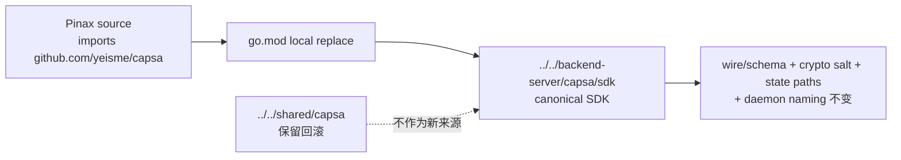

# pinax-capsa-sdk-source-migration Design

## 决策

Pinax 不迁移 import：它始终解析 `github.com/yeisme/capsa`。方案 B 仅把本地 `replace` 的物理来源由 `shared/capsa` 指向 `backend-server/capsa/sdk`，从而消费与 Capsa 后端同仓库维护的 SDK。

## 边界

- 仅调整 `go.mod` 的 local replace；不新增 API、不改 import、不改变 vault 同步、设备和加密。
- SDK public module path 固定为 `github.com/yeisme/capsa`。
- `shared/capsa` 的删除必须由独立 cleanup gate 决定；Scaena 消费必须由独立 consumer change 决定。
- 若本地解析失败，先确认 Capsa 子模块与 `sdk/go.mod`；不得回滚 dirty worktree。

## 风险控制

这是一项源码所有权迁移而非运行时迁移。验证必须确认 wire/schema、crypto salt、state paths 与 daemon naming 不变，不能以修改用户状态、协议或业务代码作为补救。

## Pinax legacy salt 与 re-push

Pinax 需要区分 source migration 与历史对象迁移：前者只变更本地 `replace`；后者可能要求完整本地 vault 以 `capsa-sync-salt-v1` 重新推送。该风险不得改变 wire/schema、state paths 或 daemon naming，也不得通过删除 `shared/capsa` 解决。
