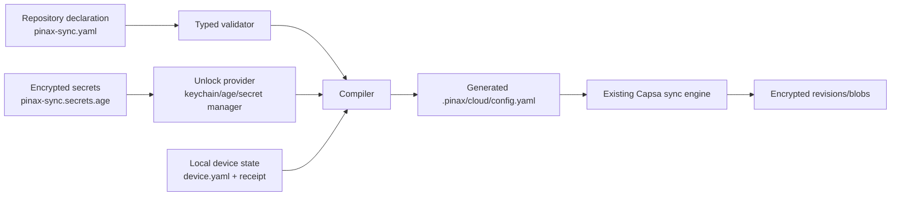

## Context

Pinax 当前把 Capsa 的 transport、workspace、device 和 secret reference 写入本机 `.pinax/cloud/config.yaml`，把 profile 和 secret value 放在用户级配置/secret store。这个模型能支持单机和已配置设备，但新设备、远程开发容器和多平台迁移仍需要重复输入后端参数。直接同步 `.pinax/cloud/config.yaml` 又会把设备运行态、receipt、PID 和本机 profile 语义混在一起。

本变更引入类似 Ansible 的声明式配置层：仓库保存可审查的同步拓扑和密文 secrets，Pinax 在本机解锁后生成现有 Capsa runtime config。已有 manifest、端侧加密、revision CAS、冲突处理和 daemon engine 保持不变。

约束：

- `.pinax/pinax-sync.yaml` 和 `.pinax/pinax-sync.secrets.age` 是 CLI-authored structured assets，不能由业务代码或 agent 直接拼装。
- 明文 credential、token、加密 key、provider payload 不得进入仓库、vault 内容、日志、receipt 或 CLI 输出。
- 本机 runtime config、sync receipt、daemon state 和 device identity 不能作为共享仓库配置。
- 当前变更不提供完整 SaaS tenant authorization；直接 S3/rclone 仍是 provider-credential boundary。

## Goals / Non-Goals

**Goals:**

- 一次初始化后，其他设备可以通过 clone、解锁和 bootstrap 复用同步拓扑。
- 用 typed schema 统一 backend、tenant、app、workspace、device 和 sync policy。
- 将 repository declaration 编译为现有 `.pinax/cloud/config.yaml`，避免重复后端命令。
- 支持 plan/apply/doctor 生命周期，配置变更可审查、可回滚、可发现漂移。
- 新设备默认 pull-only，防止空目录或旧设备误删远端数据。
- 复用现有 user-level profile、keychain、环境变量和 Capsa encryption key 机制。
- 通过 testscript、fixture vault 和 fake backend 验证多平台、多设备和密钥不泄露。

**Non-Goals:**

- 不把完整运行时 config 直接纳入 Git 或 Capsa content manifest。
- 不在本次引入实时协同编辑、CRDT、服务端租户 RBAC、配额、计费或管理后台。
- 不强制采用某个云厂商；S3、rclone、server transport 继续由现有 registry/adapter 提供。
- 不自动轮换远端加密 key；key rotation 需要独立迁移流程。

## Decisions

### 1. 三层配置模型

- **共享声明层**：只包含稳定拓扑、逻辑 credential identity、encryption key identity 和策略。
- **加密 secrets 层**：仓库可提交密文；解锁身份来自本机，解密结果只存在内存或受保护的本机 secret store。
- **设备运行层**：保存 `device_id`、last revision、receipt、daemon runtime 和本地 provider session，永不作为共享声明。

选择三层而非直接同步 `.pinax/cloud/config.yaml`，是为了避免设备状态覆盖和密钥引用错配。选择密文文件而非纯 environment variable，是为了让仓库能够自描述并支持自动 bootstrap；仍保留环境变量作为 CI 和一次性 bootstrap 的兼容入口。

### 2. 采用稳定 logical identity，不跨平台复制 profile 名称

仓库声明使用 `credential_id` 和 `secret_id`，例如 `tencent-cos-pinax`、`personal-sync-key`。每台设备将它们解析到本地 profile、keychain 或 secret manager。profile 名称可以不同，实际 credential value 不能写入仓库。

同一 workspace 的所有设备必须解析到相同的 encryption key identity。若 key ID 与远端 head 不一致，返回既有 `encryption_key_mismatch`，不得自动生成替代 key。

### 3. bootstrap 与 apply 分离

`bootstrap` 面向新设备：读取声明、解锁 secrets、生成 runtime、建立本地 receipt，并默认 pull-only。`apply` 面向已初始化设备：先输出或保存 plan，再应用 runtime 配置；workspace、backend namespace、key identity 和 remote delete policy 变化必须显式确认。

不让 daemon 自动 apply，因为后台进程不应在用户不知情时改变远端目标或加密边界。

### 4. 生成配置使用现有 CLI/service authoring 边界

新增逻辑放在 `internal/app`/`internal/remote` 的 typed service，命令层只负责参数和输出。生成 `.pinax/cloud/config.yaml` 时通过已有 state writer，采用临时文件、权限校验、fsync/rename 和备份 receipt。禁止用 YAML 字符串拼接或手工修改 structured asset。

### 5. 安全默认值

- 新设备无 receipt 时只 pull，不上传本地删除。
- plan 是无写入；apply 是唯一改变本机 runtime 的普通入口。
- secrets 解锁失败、明文字段、路径越界、workspace/key identity 变化均为 fail-closed。
- 生成文件使用用户可读权限；日志只输出 source type、logical ID、digest 和 redacted field path。
- `.pinax/pinax-sync.secrets.age` 可进入 Git，但 key identity/identity file 不进入 Git。

### 6. 命名空间策略

配置支持 `tenant_id`、`app_id`、`workspace_id`，并以显式 workspace 为当前隔离边界。默认 effective namespace 应由稳定字段规范化得到，但不替代服务端授权。多应用或多租户必须使用不同 workspace/prefix/key identity；跨租户授权和审计留给后续 server control-plane change。

## Risks / Trade-offs

- [仓库密文仍可能被删除或回滚] → bootstrap 校验 schema、key identity 和 remote head；提供 secrets 版本/撤销记录，后续再接服务端 KMS。
- [新设备解锁体验仍有一次 bootstrap 成本] → 支持 keychain/age identity/secret manager，并提供明确的 `sync repo unlock` recovery hint；不能为了无感而把密钥写入仓库。
- [配置声明与旧 `.pinax/cloud/config.yaml` 同时存在] → doctor 显示漂移；apply 前生成备份；兼容期明确声明层优先，旧配置仅作为迁移输入。
- [多设备并发 apply] → local lock 和 atomic replace；远端 revision 仍由既有 CAS 保护；不同 device state 不共享。
- [加密库/age 引入供应链和跨平台差异] → 先抽象 `SecretEnvelope`/`UnlockProvider`，使用已审查依赖或系统命令 adapter，加入 deterministic fake provider；不把具体实现绑定到 CLI contract。
- [secret asset 被误纳入 content manifest] → hard-deny protected paths、fixture tree 和上传前断言，覆盖 `.pinax/**` 与 secrets 文件。

## Migration Plan

1. 读取现有 `.pinax/cloud/config.yaml` 和 user-level profile，生成 repository declaration；不删除旧文件。
2. 通过 `pinax sync repo init` 生成声明和 `.gitignore` 保护规则；通过 `pinax sync repo secret import` 创建加密 secrets。
3. 在同一设备运行 `pinax sync repo plan`，确认 namespace、key identity、remote delete policy 不变。
4. 运行 `pinax sync repo apply --yes`，生成 runtime config 备份并写入新的 source marker。
5. 运行 `pinax sync repo doctor`、`pinax capsa doctor` 和一次 pull/push smoke；确认 remote revision、key ID、conflicts 和 local dirty 收敛。
6. 其他设备 clone 后运行 `pinax sync repo bootstrap --device <unique-device>`；首轮 pull 成功后再启用 daemon。

回滚：停止 daemon，使用 apply receipt 恢复上一份 runtime config，继续使用旧 `capsa backend set` 或 `capsa login`；仓库声明和密文文件可保留，旧客户端应忽略未知文件。不得删除远端 revision 或自动重置 encryption key。

## Open Questions

- 第一版加密 envelope 采用 age 原生格式、现有 Pinax envelope，还是 provider-neutral adapter 的哪一个实现？需要在依赖审计后锁定。
- 是否允许一个 repository 声明多个 named profiles，还是第一版只支持一个 active profile？建议先单 profile，避免 merge/selection 复杂化。
- `tenant_id/app_id` 是否在第一版仅作为 namespace facts，还是同步对象路径也立即纳入？建议第一版只验证和展示，避免改变已有 remote layout。
- 是否需要 `sync repo export` 生成可审阅但不含密钥的配置包？可作为后续 onboarding UX。
