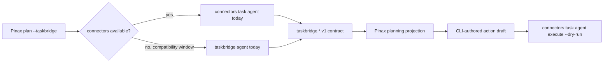

## Context

Pinax 的 `--taskbridge` 规划工作流通过外部 CLI 获取任务事实，并继续使用 `taskbridge.agent-result.v1`、`taskbridge.today.v1` 与 `taskbridge.actions.v1` 作为稳定协议。TaskBridge 的实现已经迁入 Connectors，因此独立 `taskbridge` 仓库不能再作为 Pinax 的首选运行时依赖。

约束包括：不读取 Connectors 或 TaskBridge 的内部存储；不改变现有 Pinax 参数、错误码和已保存资产 schema；外部命令测试必须使用 fake executable；action draft 仍然只建议 dry-run，不能绕过确认门禁。

## Goals / Non-Goals

**Goals:**

- 将 Connectors 设为 Pinax 任务规划的首选外部运行时。
- 保持现有 `--taskbridge` 用户入口、错误码和 schema 兼容。
- 在旧二进制删除前提供有界、可测试的回退路径。
- 确保 action draft 的下一步命令进入 Connectors 且保持 dry-run。

**Non-Goals:**

- 不重命名 `--taskbridge` 参数、领域类型或 `taskbridge.*.v1` schema。
- 不让 Pinax 直接调用 Todo Provider API、读取凭据或承担同步控制面。
- 不在 Pinax 中复制 Connectors 的任务业务逻辑。
- 不把兼容回退视为长期双运行时架构。

## Decisions

1. **按可执行文件存在性选择运行时。** Pinax 先通过 `exec.LookPath` 选择 `connectors`，仅在其不存在时回退到 `taskbridge`。如果 Connectors 已安装但命令失败，Pinax SHALL 直接失败，不静默切换到旧运行时，避免掩盖配置或合同故障。
2. **保持 TaskBridge schema 作为兼容合同。** Connectors 的兼容命令继续输出现有 schema，Pinax 无需解析人类文本或迁移历史 planning assets。替代方案是立即引入新 Connectors schema，但会扩大跨项目破坏面。
3. **建议执行命令只指向 Connectors。** 新生成的 action draft 下一步使用 `connectors task agent execute ... --dry-run`；旧 `taskbridge` 只用于读取回退，不继续出现在新生成的执行建议中。
4. **使用 fake executable 验证进程边界。** 测试分别覆盖 Connectors 首选、旧二进制回退、无运行时失败只读、schema 拒绝和 dry-run 建议，禁止依赖真实网络、Provider 或用户 vault。

## Risks / Trade-offs

- [风险] 用户只安装旧 `taskbridge` 时迁移被中断 → 在兼容窗口内保留读取回退，并在错误提示中优先给出 Connectors 安装与诊断命令。
- [风险] Connectors 已安装但配置错误时旧二进制可能仍可工作 → 不自动回退，明确暴露首选运行时故障，避免产生来源不一致的任务事实。
- [风险] `--taskbridge` 名称继续存在可能造成认知负担 → 将其定义为稳定合同名称，帮助文本明确由 Connectors 提供实现，后续重命名必须单独经过破坏性迁移。
- [风险] action draft schema 仍带 TaskBridge 名称 → 保留 schema 兼容，直到有独立版本化迁移和历史资产升级方案。

## Migration Plan

1. 发布包含 `connectors task agent today|execute|schemas` 的 Connectors 版本。
2. Pinax 切换到 Connectors 优先并保留旧二进制读取回退。
3. 用 fake process 与 Connectors package smoke 证明合同兼容。
4. 根仓库安装脚本改为从 Connectors 构建 `connectors` 和兼容 `taskbridge` 二进制。
5. 删除独立 TaskBridge 子模块后，继续保留 Connectors 内兼容入口；回滚时可恢复旧子模块 gitlink，而 Pinax 无需回滚 schema。

## Open Questions

- `--taskbridge` 参数与 `taskbridge.*.v1` schema 的最终重命名时间不属于本次迁移，需要独立的破坏性合同变更。
