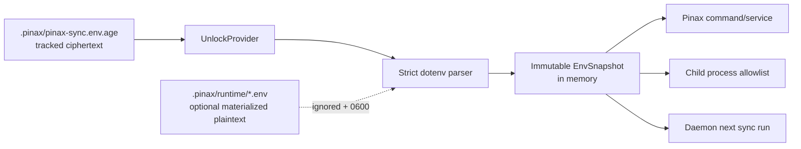

## Context

Pinax 需要同时满足三个互相牵制的目标：配置仓库可 clone 后自举、敏感环境变量不能明文提交、同步进程可以在不重启 daemon 的情况下使用最新配置。直接把解密内容写成仓库根目录 `.env` 会造成误提交；直接依赖 shell `source` 会引入命令执行和跨平台不一致；只依赖当前 shell 环境又无法实现无缝 bootstrap。

本 change 只增加一条受控的 dotenv 运行时通道。它复用上一阶段的 `UnlockProvider`，但不改变 Capsa revision、manifest 或远端对象协议。

## Goals / Non-Goals

**Goals:**

- 允许提交 `.pinax/pinax-sync.env.age` 这样的密文 dotenv 资产。
- 默认在内存中解密，并在命令/子进程边界注入；不默认创建明文 `.env`。
- daemon 在每次 sync run 前按文件 digest/mtime 检查并 reload，单个 run 使用不可变 env snapshot。
- 明文 env 文件默认被 Git 忽略、被 Capsa protected path 排除，并能诊断 Git 已跟踪风险。
- 支持显式 `--materialize` 作为兼容出口，但用 `0600`、受保护目录和自动 cleanup 约束。

**Non-Goals:**

- 不实现 POSIX shell dotenv 全语法。
- 不允许 dotenv 引用其他文件、执行命令、读取任意环境或展开 `${...}`。
- 不将秘密放入 Go 全局变量、长生命周期 daemon 日志或缓存文件。
- 不替代系统级 credential manager；生产环境仍可优先使用 keychain/OIDC/secret manager。

## Decisions

### 1. 密文资产与明文运行态分离



默认文件名固定为 `.pinax/pinax-sync.env.age`，避免用户随意指定任意仓库路径导致路径越界和 protected-path 漏洞。schema 中只保存 provider、ciphertext 和 redacted metadata；明文 key/value 只存在于 `EnvSnapshot`。

### 2. 运行时注入优先于 materialize

每个命令建立一次 snapshot：

```text
explicit flags
  > explicit process environment
  > decrypted Pinax env snapshot
  > project/user config
  > defaults
```

对于外部 provider 子进程，只传 allowlist 中声明的环境变量，不能把完整 `os.Environ()` 复制给子进程。Pinax 自己的服务使用 typed secret resolver，避免把秘密变成全局环境。

`--materialize` 只为不支持内存注入的外部工具提供兼容性：目标固定在 `.pinax/runtime/pinax-sync.env`，写入前检查权限，退出或 `clean` 时删除；daemon 不允许默认 materialize。

### 3. 严格 dotenv 语法

第一版只接受：

```text
KEY=value
KEY="quoted value"
KEY='quoted value'
```

拒绝空 key、重复 key、控制字符、NUL、shell 命令、反引号、`$()`、`${}`、反斜杠命令、文件 include 和多行 heredoc。允许值包含 `=`；不在 parser 层做变量递归展开。错误只返回行号和 key 名，不返回 value。

### 4. 动态 reload 在 run 边界

daemon 监控密文资产的 file identity/digest。发现变化后先在后台解锁和 parse；成功则将新 snapshot 用于下一个 sync run，当前 run 不切换；失败则保留上一份 snapshot，标记 `sync_env_reload_failed`，不把半解析结果用于写入远端。连续失败使用既有 daemon retry/backoff，不刷屏输出明文错误。

### 5. Git ignore 是受管安全基线

`sync env init` 和 vault 初始化都确保一个受管 `.gitignore` block，至少包含：

```gitignore
# Pinax runtime secrets (managed)
.env
.env.*
*.env
.pinax/runtime/
!.env.example
!**/.env.example
```

加密资产 `.pinax/pinax-sync.env.age` 明确重新 include，确保它可以提交。实现必须使用 marker 更新 block，不覆盖用户自定义规则。若 `git ls-files` 发现已跟踪明文 env，doctor 报告 `tracked_secret_env` 并建议 `git rm --cached -- <path>`；不会自动删除工作树内容。

### 6. 两套 secrets API 的边界

- `.pinax/pinax-sync.secrets.yaml`：逻辑值，适合 `personal-sync-key` 这类单项 secret。
- `.pinax/pinax-sync.env.age`：一组 provider/environment 键值，适合 COS、远程服务和工具链环境。

两者可由同一 unlock provider 解锁，但不得互相隐式复制；doctor 只显示 source、identity、digest 和 key names，不显示 values。

## Risks / Trade-offs

- [进程环境可能被同机调试工具读取] → 默认只给必要子进程注入，Pinax 内部优先 typed resolver；文档明确环境变量不是最高安全等级。
- [明文 materialize 文件残留] → 默认关闭、固定目录、0600、cleanup 命令、daemon 禁止默认 materialize，并在 doctor 检测 mtime/权限。
- [`.gitignore` 不能保护已跟踪文件] → doctor 使用 Git index 检测并给出可复制命令，不伪装成已安全。
- [reload 期间配置变化] → snapshot 在 run 边界冻结；解析失败沿用上一份成功 snapshot 并返回结构化 degraded 状态。
- [dotenv 语法与其他工具不兼容] → 明确 strict subset；提供 `.env.example` 作为非敏感模板，不承诺支持任意 shell dotenv。

## Migration Plan

1. 从现有 `PINAX_SYNC_SECRET_*` 或 `.pinax/pinax-sync.secrets.yaml` 显式导入 env identity，生成加密 `.pinax/pinax-sync.env.age`。
2. 运行 `pinax sync env init --vault .`，由 CLI 添加 Git ignore 和 Capsa protected-path 规则。
3. 运行 `pinax sync env doctor --vault . --json`，处理 `tracked_secret_env`、权限和 key mismatch。
4. 通过 `pinax sync repo bootstrap` 或普通 sync 命令在内存加载 snapshot；daemon 从下一次 run 开始动态 reload。
5. 若旧工具强制需要 dotenv 文件，显式运行 `pinax sync env unlock --materialize`，用完运行 `pinax sync env clean`。

回滚：删除或停用 env declaration 后，普通 sync 仍使用旧 profile/显式环境变量；不删除密文资产、不撤销 encryption key、不清理用户已有明文文件。

## Open Questions

- 第一版 CLI 是否允许 `--materialize <path>`，还是只允许固定 `.pinax/runtime/pinax-sync.env`？建议固定路径，降低误写风险。
- 生产 unlock provider 是否与上一阶段 follow-up 一起实现 age/keychain，还是先保持 fake/env provider 仅用于测试和 CI？建议分开依赖审计。
- 是否需要 Linux/macOS/Windows 的 native process environment injection 差异测试？需要，至少覆盖子进程继承和文件权限。
