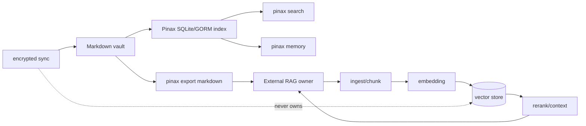

# 设计

## 所有权边界



Pinax 只负责左侧的本地内容和可重建索引。外部 RAG 的数据、凭据、模型、向量和
评测 artifact 不进入 Pinax source tree、receipt、事件日志或同步 namespace。

## CLI 迁移层

`internal/cli/kb_cmd.go` 只保留 Cobra 解析和兼容投影。所有旧命令共享
`kb_decoupled` 错误，并给出两个下一步：

```text
pinax export markdown <output-dir> --vault <vault> --json
pinax search <query> --vault <vault> --json
```

兼容层不导入 `internal/semantic` 或 `internal/app` 的 KB 类型，因此从编译图上
切断 provider/sidecar。

## API 迁移层

旧 review 路径继续注册，以便旧客户端得到可识别响应，而不是 route-not-found：

- GET 返回 HTTP 410；
- `command` 保留原 route capability id；
- `error.code=kb_decoupled`；
- 只返回外部 RAG handoff action，不返回旧 generation、citation 或正文。

Remote capability catalog 保留 capability id 一个窗口，并把错误集合更新为
`kb_decoupled`。下一 major release 再删除 catalog 和 route。

## 配置迁移

`Config`、默认值、环境变量映射、setting projection 和校验中不再出现
`kb.sidecar.*`。`pinax config set kb.*` 明确返回 `config_key_deprecated`；旧 YAML
键在读取时不再映射到运行时配置，也不会触发 sidecar。

## 数据清理策略

代码删除向量服务和构建器；本次迁移同时清理仓库和测试工作区中明确枚举的历史
`.pinax/kb/**` 产物。Markdown vault、`.pinax` 同步配置、加密 vault/revision
和对象存储数据不在清理范围内，同步继续只处理既有加密 vault/revision 语义。

## 回滚

发布前保留上一版 binary 和 commit。若外部 RAG 迁移尚未完成，用户可回滚 Pinax
版本，但已清理的向量 projection 必须由外部 RAG 从 Markdown export 重建。回滚后
应停止新外部 pipeline 写入 Pinax 目录，避免两个 owner 同时变更同一份 artifact。
