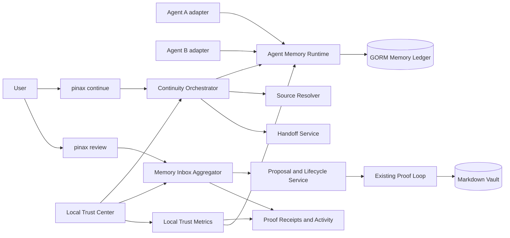
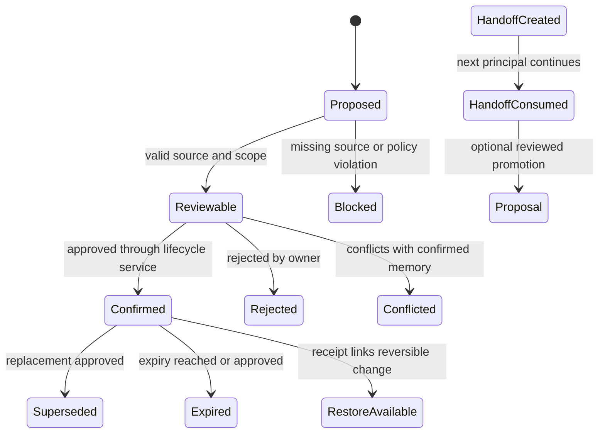

## Context

`pinax-agent-memory-runtime` 已定义 principal、scope、context pack、proposal、handoff、feedback、adapter descriptor 与 additive transport surfaces。现有 Dashboard 是 localhost 只读控制台，Proof Loop 已拥有 plan、snapshot、apply、receipt 和 restore 边界。当前缺口不是新的 memory engine，而是把这些底层能力编排成用户可理解的“继续工作”和“审阅记忆”体验，并提供可观察的信任证据。

本 change 面向同时使用两个以上 Agent、维护长期项目并拥有 Markdown vault 的单一知识资产所有者。首个验证路径只要求 Codex/Cohors reference harness 或等价 fixture 模拟两个 Agent，不在 Pinax 内实现具体 runtime plugin。

## Goals / Non-Goals

**Goals:**

- 用 `pinax continue` 在一次调用中生成 bounded、source-backed、permission-first 的 Continuity Pack。
- 用 `pinax review` 将 proposal、conflict、duplicate、stale、expired 和 receipt 聚合为统一 Memory Inbox。
- 在 Dashboard 提供只读 Agent Trust Center，让用户看见 Agent 读了什么范围、提议了什么、批准了什么、改了什么以及如何恢复。
- 通过 fixture vault 与两个 reference adapter 完成五分钟首次价值和跨 Agent continuation e2e。
- 建立本地、脱敏、可重建的产品指标，验证 continuity 是否真正减少重复解释并提高后续任务复用。
- 保持所有现有 CLI、API、MCP、stored schema 和 proof semantics 兼容。

**Non-Goals:**

- 不新增完整编辑器、聊天 UI、团队 workspace、组织 ACL、云端明文分析或长期 daemon。
- 不自动把 handoff、transcript 或模型总结提升为 confirmed memory。
- 不在 Dashboard 执行 approve、reject、restore 或其他写操作。
- 不把 `pinax continue` 设计为自由聊天或 LLM answer endpoint。
- 不在本 change 删除、重命名、隐藏或弃用现有 `agent`、`memory`、`brain`、`proof` 命令。
- 不承诺新 surface 在本 change 结束时进入 stable；稳定化取决于 dogfood 指标。

## Decisions

### 1. 使用 additive intent facade，而不是重排现有命令树

新增顶层 experimental `pinax continue` 与 `pinax review`，内部调用已有 application services。这样首次体验只暴露两个用户意图，同时保留高级用户和现有消费者依赖的细粒度命令。

替代方案是重命名或移动 `pinax agent`、`pinax memory`、`pinax brain`；该方案会造成 generation-breaking CLI 变化，因此拒绝。

### 2. Continuity Pack 是 runtime context 的产品 projection

Continuity service 只编排 scope resolution、handoff selection、context compilation、source coverage、conflict grouping、budget truncation 和 safe next actions。它不得创建第二套 memory ranking、ledger 或 source resolver。

Continuity Pack 至少包含：objective、current state、decisions、preferences、open commitments、failed attempts、blockers、conflicts、source refs、freshness、truncation、body exposure、handoff facts 和 next commands。完整 note body、完整 transcript、raw prompt 与 provider payload 永不进入默认 projection。

### 3. Memory Inbox 是聚合视图，不是新的 truth store

Inbox item 由现有 proposal、memory lifecycle、feedback、conflict、receipt 和 activity state 投影而成。只有无法从既有状态重建的用户 review decision 才允许进入 additive GORM state；不得复制 proposal body 或 confirmed memory。

分类规则必须 deterministic，并输出 `category`、`reason_codes`、`risk`、`source_coverage`、`suggested_action`。复杂分类、冲突判定、风险与边界判断必须有中文注释，说明为什么进入该分支。

### 4. 所有写操作继续经过现有 proof 与 lifecycle service

`pinax review` 默认列出和解释，不直接修改状态。子命令或显式 action 若批准 proposal、拒绝、supersede、expire 或 restore，必须调用现有 service，要求必要的 `--yes`、plan/snapshot/receipt，并返回 restore hint。

不得在 facade、CLI handler、Dashboard handler 中直接写 Markdown、SQLite、`.pinax/**`、Git、sync 或 remote state。

### 5. Trust Center 只读且复用同源 projection

Dashboard 新区块和 API routes 只接受 GET，任何非 GET 返回 `405`。页面展示 bounded activity、inbox counts、source coverage、adapter health、receipt 和 restore command；不展示完整正文、token、原始 provider 数据或可伪装成已执行的按钮。

未来 Workbench 可以消费这些 routes，但不得复制业务规则或直接读取内部数据库。

### 6. 指标是本地可重建投影

指标从 context receipt、recall feedback、proposal decision、handoff consume、source resolution 和 conflict/stale resolution 事件聚合。默认只保存计数、比例、时间窗口和 redacted IDs，不保存 prompt、正文或完整会话。

首轮门槛：source resolvability ≥95%，cross-Agent continuation success ≥80%，silent promotion = 0；proposal acceptance 与 context reuse 先记录基线，不以优化指标为由自动扩大读取范围。

### 7. 合同采用 experimental expand-then-contract

新增 CLI、JSON、`--agent` keys、event types、HTTP routes 和可选 schema 字段全部 additive，声明 `experimental=true` 和独立 `spec_version`。旧消费者可忽略新字段和事件。无 deprecation window；rollback 是关闭 command/route registration，保留 additive data。

### 8. 证据优先的五分钟 proof flow

E2E fixture 必须模拟：初始化 fixture vault → Agent A continue/context → proposal/handoff → review → approve low-risk proposal → Agent B continue → source/decision/open-task continuity assertions → restore hint 检查。成功和失败都写入 `temp/integration-test-runs/<run-id>/`。

测试 fixture、协议转换、错误恢复和非显然边界必须用中文注释说明构造目的；CLI help、输出、错误和命令示例保持 English。

## Architecture



## State Flow



## Failure And Rescue Map

| Codepath | Failure | Rescue | User sees |
| --- | --- | --- | --- |
| scope resolution | unknown/unauthorized principal or scope | fail closed，不调用 retrieval | stable scope/permission error + next command |
| continuity compile | budget too small | deterministic truncate + omitted counts | partial pack with `truncated=true` |
| source resolution | missing/stale source | retain memory as unresolved evidence | source coverage warning，不伪装为 verified |
| handoff lookup | no matching handoff | degrade to context-only continuity | `handoff_status=missing` |
| inbox aggregation | malformed legacy row | isolate row and report issue count | partial inbox + repair command |
| proposal action | stale proposal/conflict changed | reject apply and require refresh | `plan_stale` or conflict-changed error |
| receipt lookup | receipt unavailable | block restore action | explicit unavailable reason |
| dashboard projection | one upstream projection fails | partial page with section error | bounded error + copyable diagnostic command |
| adapter unavailable | descriptor degraded | continue with generic transport | adapter degraded facts |
| metrics projection | corrupt/rebuild needed | discard projection and rebuild | metrics unavailable, core workflow unaffected |

## Migration Plan

1. 固化现有 `pinax agent`、`memory`、`brain`、`proof`、dashboard 和 output compatibility tests。
2. 在独立 package 中加入 Continuity/Inbox/Trust DTO 与 projection service，不修改旧语义。
3. 注册 experimental CLI 和只读 routes；默认 capability 可通过构建或配置门禁关闭。
4. 如需 persistence，只执行 GORM additive migration，并用旧 vault fixture 验证读取与回滚。
5. 运行 unit、integration、component、e2e、redaction、performance 和 evidence gate。
6. 完成至少两周、10 名目标用户或等价 dogfood 记录后决定继续 experimental、调整 wedge 或进入 stable-from 评审。

Rollback：关闭新 command 和 route registration；Dashboard 隐藏 Trust Center；继续使用现有 `pinax agent context`、`pinax agent memory proposals`、`pinax brain`、`pinax proof`。Additive table/column 不删除，避免 rollback 本身破坏旧数据。

## Product Validation State Machine

```text
code complete
     |
     v
scope freeze -> assisted first-value runs -> seven-day reuse follow-up
                                                   |
                                                   v
                                          metric + failure review
                                                   |
                         +-------------------------+------------------------+
                         |                         |                        |
                         v                         v                        v
                        GO                      ITERATE                    STOP
                         |                         |                        |
        stabilization-only change     top failure-only change   hide experimental facade
```

产品验证不是无限期 dogfood。首轮采用 10 名目标用户、至少两周观察窗口；每名用户只计一个 cohort participant，但可包含多次 run。产品分析必须同时报告 participant-level 和 run-level 分母，避免高频内部用户放大成功率。

决策优先顺序为安全、真实价值、复用、商业信号：

1. `silent_promotion` 必须为 0，permission/redaction/data-loss 问题必须先处理；否则不得 Go。
2. Source resolvability ≥95%，cross-Agent continuation ≥80%，否则只能 Iterate 或 Stop。
3. ≥7/10 无帮助完成首次流程且 ≥5/10 七日内复用，才证明 wedge 可重复。
4. ≥3/10 表达付费或预付意愿只作为早期商业信号；不得用正向访谈替代实际复用。

Iterate 只在失败集中于最多两个可修复阶段时成立。若问题分散、目标用户没有高频切换 Agent 的痛点，或七日复用低于 3/10，应选择 Stop，而不是继续增加功能。

## Follow-up Change Boundaries

- Go 后建议创建 `pinax-agent-continuity-stabilization`，只负责 onboarding、两个 reference adapter、可靠性、合同稳定化和 rollout/rollback；Cloud Sync 仅在用户明确验证跨设备价值且满足现有真实 transport gate 时进入该 change。
- Iterate 后创建 `pinax-agent-continuity-iteration-<failure-class>`，capability 和 owned paths 必须围绕排名第一或第二的失败类别，禁止夹带 publish/share/plugin/team/editor 等领域。
- Stop 后不创建替代 facade；隐藏 experimental command/route，保留 provider-neutral runtime、ledger、proof receipts 和兼容读取合同，并把证据与停止原因写入 closeout。
- Team/company KB、组织 ACL 和协作 SaaS 必须等待单用户 Continuity Go 且另立包含 principal/workspace/source ACL/audit 的架构 change。

## Risks / Trade-offs

- [意图入口与底层命令重复] → facade 只做 orchestration 和 projection，contract test 验证语义等价。
- [Continuity Pack 过载] → deterministic budget、分组上限、source-first 和 drill-down next commands。
- [Memory Inbox 鼓励批量批准] → 默认逐项风险与来源展示，高风险和冲突项禁止 bulk approval。
- [指标驱动扩大数据收集] → 指标只使用本地 redacted receipts，不记录正文和会话。
- [Dashboard 被误解为写控制台] → GET-only、无假按钮、所有写动作只展示真实 CLI command。
- [新顶层命令增加 CLI 面积] → 仅两个 wedge 命令，保持 experimental；其余 CEO 设想的 `capture/ask/remember` 延后。
- [依赖 runtime change 尚未稳定] → 明确最低 capability/version，缺失时返回 degraded next action，不复制 runtime。
- [工程完成被误当作产品成功] → scope freeze、真实 cohort、七日复用和 CEO decision receipt 作为 maturity 前置条件。
- [内部高频 dogfood 扭曲指标] → participant-level 与 run-level 分母分开，重复运行不增加 participant 样本数。
- [商业访谈产生礼貌性正反馈] → 付费意愿只能作为辅助信号，七日复用和重复解释下降优先。

## Open Questions

- `pinax continue` 是否在首次版本支持显式 `--handoff`，还是只按 scope 自动选择最近可消费 handoff？默认建议自动选择并允许 `--handoff` 覆盖。
- `pinax review` 的写 action 是否首版只提供 copyable next commands？默认建议 CLI 可调用现有 lifecycle service，Dashboard 保持纯只读。
- dogfood 稳定化门槛采用两周/10 名目标用户还是延续 runtime change 的四周标准？默认建议本 change 以两周验证 wedge，stable-from 仍遵循四周 runtime 门禁。
