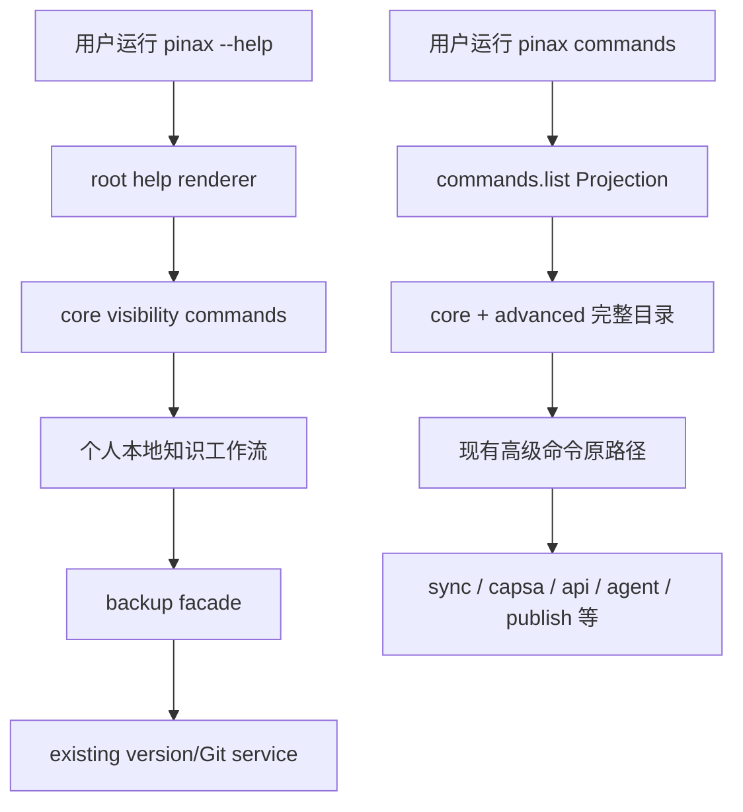

## Context

Pinax 的 Cobra root command 当前注册约 51 个可见顶层命令。虽然这些命令已经按五组渲染，但默认 help 仍把本地笔记、知识图谱、Agent runtime、API、发布、插件、远端 backend、Capsa 和 daemon 放在同一导航层。对个人用户而言，执行 capture、search、project 和 version 工作流前，需要理解大量低频产品域。

本次变更触及稳定 CLI 导航，但不移除或重命名命令，也不改变 JSON envelope、agent key、event type、flags、配置或存储格式。现有命令路径必须继续可执行，因此实现采用 expand-then-contract：先增加可见性元数据和完整目录命令，再收敛默认 help。

## Goals / Non-Goals

**Goals:**

- 默认 root help 只展示个人本地知识工作流需要的核心命令。
- 保留所有现有命令路径、flags 和机器输出兼容性。
- 提供一个明确、可脚本化的完整命令目录，让高级能力仍可发现。
- 让 help、README 和 quickstart 使用相同的 personal-first 心智模型。
- 提供复用现有 Git/version service 的个人备份入口，并把远端同步保留在高级层。

**Non-Goals:**

- 本切片不删除 `sync`、`capsa`、`api`、`agent`、`publish`、`plugin` 或其他高级命令。
- 不修改同步协议、Capsa SDK、凭据、daemon、远端状态或 `.pinax/**` schema。
- 不新增第二套备份引擎、backup schema、daemon 或远端状态。
- 不重排子命令、不改变现有别名或 remote capability registry。

## Decisions

### 1. 使用命令可见性注解，不设置 Cobra `Hidden`

为 root child 增加 `pinax.help.visibility=core|advanced` 注解；默认 root help 仅渲染 `core`。现有命令不设置 `Hidden=true`，避免影响 Cobra completion、remote command coverage、测试枚举和调用方通过命令树进行的能力发现。

备选方案是直接设置 `Hidden=true`。该方案实现更短，但可能让内部 capability audit、completion 和未来命令目录无法区分“兼容隐藏”与“产品高级能力”，因此不采用。

### 2. 核心命令集固定为九个入口

第二阶段核心入口为 `init`、`vault`、`note`、`inbox`、`journal`、`search`、`project`、`backup`、`commands`。它们覆盖初始化、健康检查、capture、日记、检索、项目组织、个人备份和能力发现。`version` 保持可执行，但从默认导航降为 advanced。

`config`、`index`、`repair` 等仍可通过完整目录发现，但不要求新用户先理解维护层。高级命令没有删除计划；后续是否迁移到独立 Capsa 或插件，需要新的 OpenSpec。

### 3. `pinax commands` 使用共享 Projection

`pinax commands` 返回稳定 command `commands.list`，默认输出给人类，`--json`、`--agent`、`--events`、`--explain` 继续从同一 Projection 渲染。`data.commands` 只包含 command、summary、group、visibility 等非敏感元数据，不读取 vault、不访问网络、不加载凭据。

### 4. 兼容期不发弃用警告

本阶段只是导航降级，不宣布命令废弃。旧命令继续工作，不输出 warning，避免污染脚本 stderr。未来真正移除或转发某个高级命令时，必须在新的 OpenSpec 中定义至少一个发布周期的弃用窗口、消费者迁移和回滚。

### 5. 测试采用 root factory，先验证 RED

先修改 `cmd/pinax/cli_output_contract_test.go` 或新增聚焦测试，要求默认 root help 不包含高级命令、`commands` 包含完整目录、旧高级命令 help 仍可调用。确认测试因功能缺失而失败后，才修改生产代码。

### 6. `backup` 只做 facade，不创建第二套备份系统

`pinax backup` 直接调用现有 `VersionStatus`、`VersionSnapshot`、`VersionHistory`、`VersionRestorePlan` 和 `VersionRestoreApply` application service。新的 Projection command 使用 `backup.status`、`backup.create`、`backup.history`、`backup.restore` 和 `backup.restore.apply`，但底层 snapshot、Git adapter、restore plan 与证据文件完全复用。

默认不加入 S3/rclone/Capsa flag，也不自动选择远端。远端备份在 durable write、read-back 和 restore 证据稳定前继续通过 `pinax sync`/`pinax capsa` 的 advanced 路径显式使用。

## Risks / Trade-offs

- [用户误以为高级命令已删除] → 默认 help 明确提示运行 `pinax commands` 查看完整目录，并保持原路径可执行。
- [测试或 completion 依赖可见命令集合] → 不使用 Cobra `Hidden`，只在自定义 root help 过滤；运行 remote coverage 和 completion 聚焦测试。
- [`commands.list` 成为新的稳定机器合同] → 首版只提供必要可选字段，固定 command 名和 envelope，后续只做 additive 扩展。
- [核心命令集仍可能偏多或偏少] → 第一阶段以现有高频本地能力为准；后续依据真实使用记录调整时保持 `commands` 完整索引。
- [当前工作树存在同步和 Agent memory 未提交修改] → 本切片只拥有 `internal/cli/root.go`、新增命令目录文件、相关 root help 测试和 personal-first 文档，不修改重叠文件。
- [`backup` 与 `version` 概念重复] → `backup` 是个人词汇 facade；`version` 保持高级兼容与完整底层命令，不复制 service 或存储。
- [用户误以为 backup 已远端容灾] → help 和文档明确 local Git/version snapshot；不声称 S3/rclone/Capsa 已完成稳定 backup。

## Migration Plan

1. 增加 visibility 注解、`commands.list` Projection 和测试，不改变默认 help。
2. 验证完整命令目录覆盖所有可执行 root child。
3. 切换默认 root help，仅展示 core 命令并增加完整目录提示。
4. 更新 quickstart 和命令索引。
5. 运行 focused tests、`task check` 和 `openspec validate --all`。
6. 新增 `backup` facade，验证 RED/GREEN 后将 `version` 从默认 help 降为 advanced，并更新个人安全文档。

回滚时删除 visibility 过滤和 `commands` 注册，恢复原 grouped root help。由于所有旧命令、flags、输出和存储状态保持不变，回滚不需要数据迁移。

## Open Questions

- 后续是否把 `repair` 或 `template` 提升为 core，需要用真实个人使用频率决定，不在本切片扩大核心集合。
- S3/rclone 是否需要独立的 `backup mirror` facade，等待远端 durable write、read-back 和 restore 证据成熟后再决定；当前不提前扩展。
