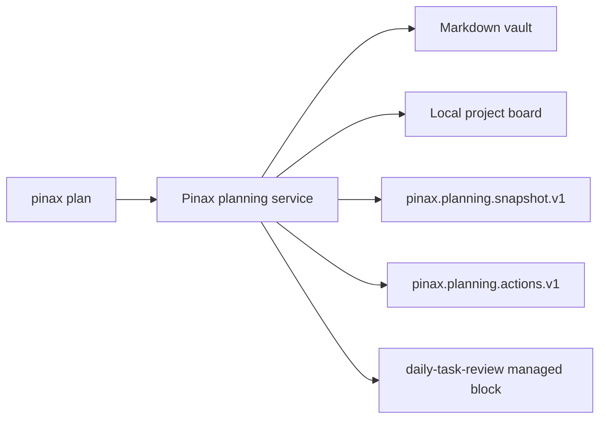

# 设计

## 边界

Pinax 继续负责本地 Markdown vault、项目看板、规划快照和 action 草稿。规划服务只读取 Pinax 自己的 vault/index/project board，不再启动外部任务 CLI，不读取外部任务存储，不处理 Provider 合同，也不生成外部执行命令。

## 变更面

- CLI：删除 `--taskbridge` 及所有隐藏 task runtime wiring；`plan daily|weekly|monthly` 和 `plan actions` 保持本地工作流。
- 应用：删除 `connectors`/`taskbridge` executable probe、外部 JSON envelope、TaskRuntime domain types、外部 source/facts 和 Connector action execute next step。
- 数据：当前新生成 action 草稿使用 `pinax.planning.actions.v1`；旧 `taskbridge.*` 或 `connectors.*` 文件仅作为历史文件，不再被当前规划服务消费。
- 模板：删除由外部任务运行时填充的 `planning-daily` 模板区块；保留本地 `daily-task-review` 区块。
- 文档与规范：更新活跃命令文档、架构边界和 canonical specs；历史 archive 不回写。

## 安全与回滚

没有替代通信/任务 owner，也没有兼容 shim。所有写入仍受现有 `--yes`/`--save` 门禁保护。回滚仅适用于已提交的跟踪文件：使用 `git revert <retirement-commit>`；未提交或未跟踪的 Connectors 依赖内容不提供备份恢复。
