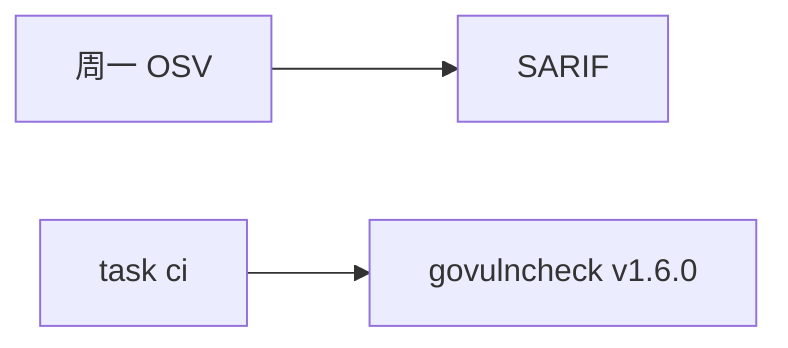

# Design

拷贝根模板，cron `27 4 * * 1`。govulncheck 作为 `task ci` 的依赖，不放进更短的 `task check`，以免拖慢本地迭代。

```mermaid
flowchart LR
  weekly[周一 OSV] --> artifact[SARIF]
  ci[task ci] --> govuln[govulncheck v1.6.0]
```
