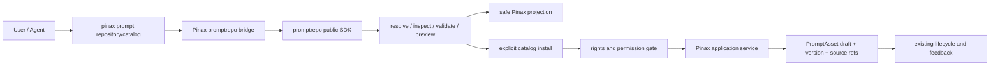

# Context

Pinax 同时具备“Prompt 作者库”和“外部 Prompt Repository consumer”两种角色。必须在命令和状态上区分：

1. `pinax prompt search/show/resolve`：本地 Prompt Vault；
2. `pinax prompt catalog ...`：跨来源外部 catalog；
3. `catalog install`：把有权复制的 verified template 显式转成 Pinax-owned draft。

# Architecture



# Command surface

规划命令：

```text
pinax prompt repository add|list|show|remove|enable|disable|sync|doctor
pinax prompt catalog search|show|resolve|inspect|validate|preview|install
```

这些命令实现前不视为 available。现有命令保持原义：

```text
pinax prompt search [query]
pinax prompt show <id>
pinax prompt resolve <pinax-uri-or-id>
```

External exact identity 使用 `promptrepo://...`；成功安装后的本地 identity 使用 `pinax://prompt/<id>`。两个 URI 不互相伪装，local source refs 保存 exact external address 和 digests。

# Scope and state

- user RepositoryProfile 由 promptrepo shared store 拥有，从其它领域 CLI 添加后 Pinax 可见。
- organization profile/policy 来自 Template Registry service projection。
- vault/project 只保存 selected profile refs、exact pins、policy digest 和 Pinax asset provenance；不得复制 credential 或 source URI config。
- session `--locale`、exact address 或 filters 只影响当前命令。
- Pinax 既有 `.pinax` structured state 继续只由 CLI/application service 写入。

# Install mapping

`catalog install` 必须先完成：exact resolve → contract digest/body binding → rights/permission → input schema compatibility → conflict plan。

允许 import/copy 时，通过现有 PromptAsset service 创建：

- lifecycle=`draft`；
- permission 由 verified contract 映射，未知时保持 `unknown`；
- body 写入 Pinax PromptAssetVersionRecord，机器输出不回显；
- variables/constraints/review guidance 来自 verified TemplateContract；
- source refs 包含 exact address、snapshot/catalog/template/contract digests 与 stage receipt；
- title/tags 优先使用 `zh-CN` localized metadata。

preview-only、no-copy 或 rights unknown 时 install fail closed。用户仍可 search/show/resolve/inspect/validate/preview；Pinax 不创建空 body asset 来绕过现有 schema。

同 ID 冲突必须返回 keep-existing、side-by-side、fork-local 或 reject plan；不得覆盖 current version。首个 slice 可只实现 reject + explicit fork，后续 additive 扩展。

# Output and safety

- `operation_id` 使用公共 `promptrepo.*`；existing `command` 使用 Pinax command identity。
- human/agent/JSON/events 从同一 projection 生成。YAML 只有在 Pinax 统一输出合同正式支持后 additive 加入。
- inspect human table 显示 Field/Required/Default/Example/Current/Allowed/Description；sensitive 字段不显示 default/example/value。
- search/resolve/inspect/validate/preview/install receipt 不输出 body、rendered body、input value、credential、私有路径或 provider payload。
- preview 固定 `provider_calls=0`、`durable_writes=0`；install 是显式本地 durable write，但不会调用 provider、Git push、远端 mutation 或 lifecycle promotion。

# Integration boundary

Pinax bridge 依赖 public SDK optional interfaces，不 import Template Registry `internal/**`，不自行解析 Git/S3，不直接操作 promptrepo store 文件。CLI handler 只验证参数和调用 application service；PromptAsset 持久化继续使用现有 GORM repository。

# Rollout

1. public promptrepo v0.3 可匿名下载。
2. 实现 bridge + file repository focused fixture。
3. 加 repository/catalog read-only commands 和 body leak tests。
4. 加 rights-gated install → local draft。
5. 加 Git/GitHub/S3 fixtures、scope/policy conformance、testscript user flow。

# Risks

- 本地 `prompt search` 与外部 `prompt catalog search` 容易混淆。通过 help、summary 和 next action 明确 Local Prompt Vault/Federated Catalog。
- Pinax 存正文，而其它 owner 多为 refs-only。只有 Pinax 是显式 Prompt Vault；必须以 rights gate、draft lifecycle 和 source provenance限制。
- shared state 并发写风险由 promptrepo writer lease/atomic commit 处理，Pinax 不实现第二把锁。
