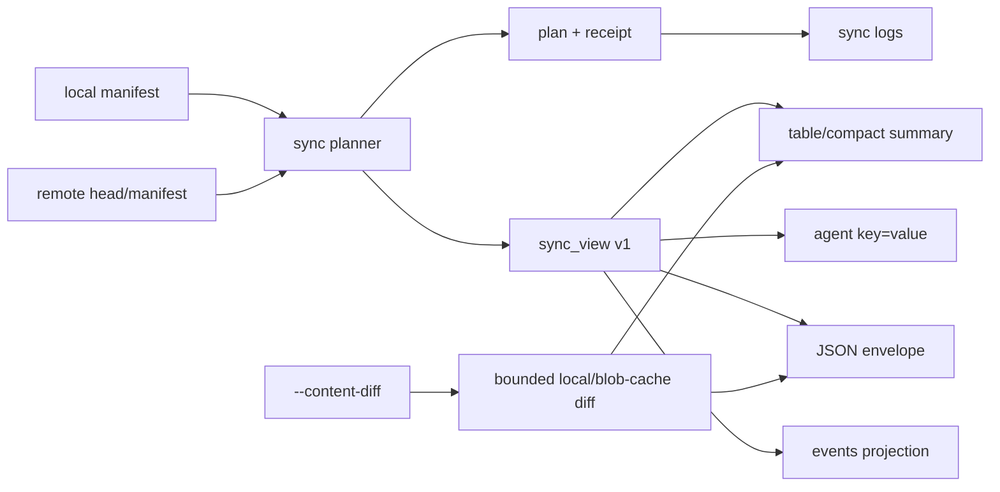

## 设计

同步服务先生成现有 `syncplan.Plan`，再由 `buildSyncOutputView` 从 plan 与 manifest 派生 `pinax.sync.output.v1`。旧的 `data.plan`、receipt 和 machine facts 保持不变；renderer 只读取 `sync_view` 做展示。

### 输出边界

- 默认人类输出：stdout 最终摘要，stderr 阶段进度；TTY 使用单行刷新，非 TTY 使用阶段行。
- JSON：只写一个 envelope，不写 ANSI、表格或实时进度；完整 `data.plan` 保留。
- agent：稳定排序的 `fact.*` 与最多 10 个 `change.N.*`，不输出正文行。
- events：stdout 仅 NDJSON；正文 diff 不进入任何事件。
- explain：只输出范围、scope、统计、写入结论、风险和下一步，不输出正文或内部推理。

### 有界正文 diff

正文 diff 仅在显式 `--content-diff` 时构建；每个文件最多 64 KiB，每次运行最多 256 KiB、最多 10 个文件。敏感键值行替换为 `[REDACTED]`，路径继续遵守 `--path-policy`。结果只作为当前 projection 的 `content_diff`，不持久化。

### 兼容性

新增字段均为 optional/additive。旧消费者可继续读取 `plan.operations`、receipt、`operation_status`、`path` 和 `path_hash`。`sync.all` 在本地聚合 pull/push 视图和 receipt operations，不改变两个子操作的执行顺序。
