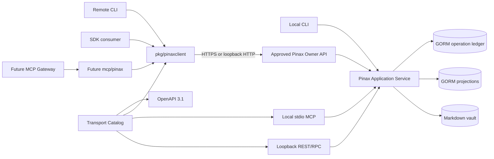
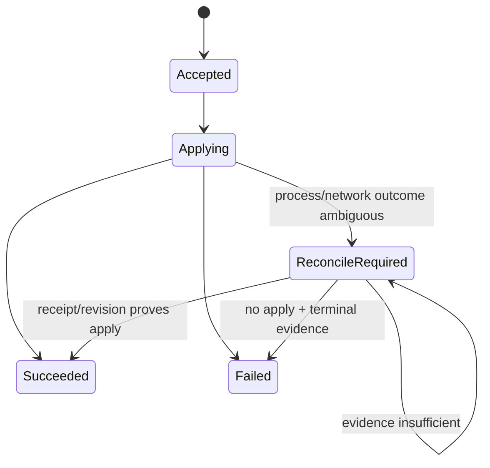
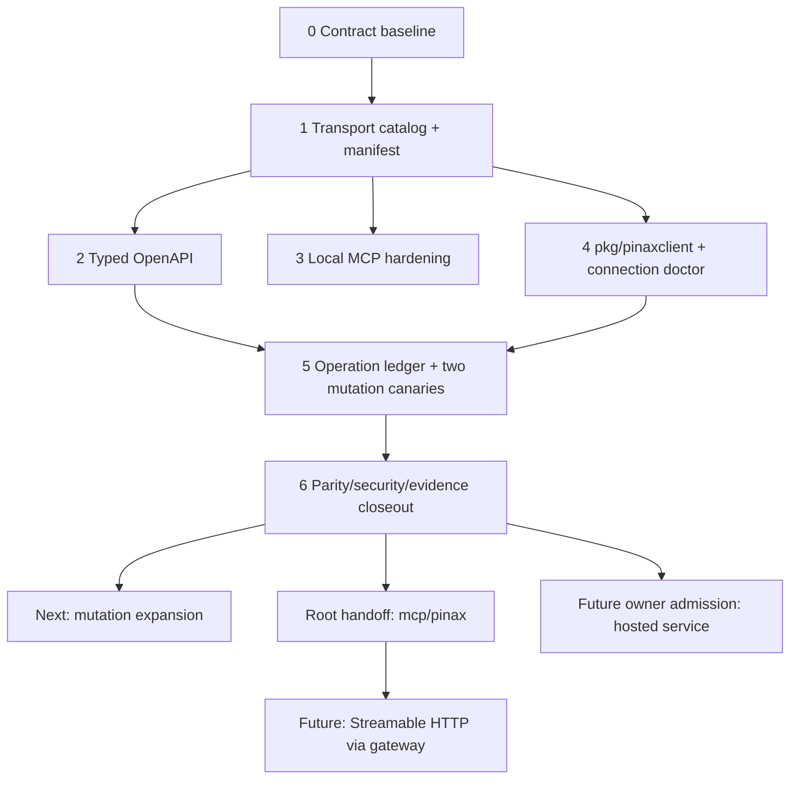

## Context

Pinax 当前的多入口能力是逐步叠加形成的：Cobra CLI 直接调用 application service，`pinax mcp serve` 提供本地 stdio MCP，`pinax api serve` 提供 loopback REST/RPC，普通 CLI 可通过 `--api-url` 转发到该服务，`pinax api schema export` 再从 route registry 导出 OpenAPI 3.1。方向正确，但“领域能力、计划支持、真实 binding、当前 readiness”仍混在同一组字段里。

2026-08-24 的基线审计记录如下，数字只用于冻结本 change 的调查证据，后续验收以自动 conformance 结果为准：

| 面 | 审计观察 | 主要问题 |
| --- | ---: | --- |
| REST/RPC route | 89 | route 已有真实 handler，但 capability 与 route 的关系仍由人工声明。 |
| capability | 81 | `surfaces` 同时表达意图与可用性，存在 MCP mutation 被声明但未出现在真实 MCP discovery 的情况。 |
| OpenAPI path | 39 | path/method 来自 route registry，但 request/response/security schema 仍不足以生成可靠 typed client。 |
| MCP tool | 20 | 当前以只读/plan 为主；部分 input schema 为空，未形成完整 `resources/read` 与闭合输出 schema。 |

另外存在两个容易导致真实接入失败的合同问题：服务端 `api serve --token-file` 读取的是 hashed token store，客户端 `--api-token-file` 读取的是 plaintext bearer secret，现有示例却容易让用户把两者指向同一文件；现有 backend/storage `profile` alias 也没有参与 Remote API Mode，不应被静默 repurpose 成 API connection profile。

2026-08-25 的协议复核发现 MCP 当前规范已更新为 `2026-07-28`：current 版本使用每请求 `_meta` 与 mandatory `server/discover`，而 `2025-11-25` 及以前属于 initialize-based legacy。官方兼容说明允许 dual-era server 同时支持两类客户端。因此本 change 不再把“能回应 initialize”描述为完整 current MCP 支持；local stdio MCP 首先实现 dual-era discovery/version gate，并保留旧 initialize allowlist。证据：[MCP Versioning](https://modelcontextprotocol.io/specification/versioning)、[2026-07-28 Versioning and Compatibility](https://modelcontextprotocol.io/specification/2026-07-28/basic/versioning)、[stdio](https://modelcontextprotocol.io/specification/2026-07-28/basic/transports/stdio)。

本设计参考下列 Anatomia 经验，但只迁移可复用的边界，不复制视频领域或其状态：

- typed owner HTTP API/SDK 是 canonical backing；MCP adapter 不读取 owner DB、项目目录或 provider secret。
- 远程 endpoint 只允许 HTTPS；HTTP 仅限 loopback；redirect 被拒绝。
- token file 使用 regular file、owner、0600、no-symlink/descriptor recheck 等安全检查。
- mutation 在 ambiguous acceptance 后只读取同一 operation，不生成新 operation 或盲目重复提交。
- readiness 分别报告 contract、transport、auth、owner/canary 与 production，不把 fixture success 当成生产可用。

## Product Scope

### Target Users

- 在同一台机器上用 CLI、编辑器、桌面客户端或 Agent 操作个人 Pinax vault 的单用户。
- 在受控主机上运行 Pinax owner service，并从另一台机器通过 CLI/SDK 调用的高级用户。
- 后续为 Pinax 构建 sibling MCP 或私有自托管服务的开发者。

### Job To Be Done

调用方能够先发现“当前真实可执行”的 capability、schema、权限门禁与 readiness，再用同一套 versioned projection 通过本地或远程入口完成操作；远程写入断线后能够恢复同一 operation，而不是猜测是否成功或重复写入。

### Narrow First Slice

本 change 的首个可交付切片只要求：

1. authoritative transport manifest 与 conformance tests；
2. typed OpenAPI 3.1 和 hardened local stdio MCP；
3. strict `pkg/pinaxclient` 与 connection inspect/doctor；
4. `inbox.capture` 的 idempotent create 与 `folder.rename` 的 expected-revision mutation recovery；
5. 现有入口和旧字段继续兼容。

其他 mutation 只在 manifest 中报告 recovery readiness，不因为共享 dispatcher 存在就自动升级为可安全重试。

## Owner Fit And Capability Ledger

| Capability | Admission | Canonical owner | 本 change 状态 | Handoff / constraint |
| --- | --- | --- | --- | --- |
| vault/domain/application/projection | fit | `cli/pinax` | required | 仍是所有本地入口的唯一业务路径。 |
| local CLI embedded invocation | fit | `cli/pinax` | required | 现有行为保留。 |
| loopback REST/RPC | fit | `cli/pinax` | required | HTTP 只绑定 loopback；不升级为公网 server。 |
| local stdio MCP | fit | `cli/pinax` | required | 只读/plan；不发布 direct apply tool。 |
| typed owner HTTP client SDK | fit | `cli/pinax/pkg/pinaxclient` | required | future sibling MCP 只能消费 public SDK/API。 |
| remote CLI over HTTPS | fit | `cli/pinax` client side | required | server side 可为未来批准的 owner deployment。 |
| sibling MCP stdio adapter | split-owner | future `mcp/pinax` | retained-next | 独立 submodule/OpenSpec；stateless remote backing。 |
| Streamable HTTP MCP | split-owner | `mcp/gateway` + future `mcp/pinax` | retained-next | session、Origin/Host、TLS、rate limit 由 gateway owner。 |
| hosted multi-user service | split-owner | future root-approved backend | retained-next | 不得把 `cli/pinax` 静默变成云笔记后端。 |
| organization identity/RBAC/billing/operations | reject-now | future identity/backend owners | out of scope | 需要独立产品 admission 与信任边界设计。 |

用户要求的多种调用方式全部保留在 capability ledger 中。范围收敛只调整交付顺序和 owner，不删除远程 API、remote MCP 或 self-hosted 目标。

## Goals / Non-Goals

**Goals:**

- 让 discovery 只把真实 binding 报告为 available，并能解释 planned、blocked、local-only 或 future-owner。
- 为本地与远程调用提供同一 versioned request/response/error schema 和 projection boundary。
- 建立 `local-vault`、`remote-service`、`self-hosted-service` 的明确模式与安全不变量。
- 提供可供 remote CLI 和 future sibling MCP 共同使用的 strict Go HTTP client。
- 让本地 stdio MCP 完成可验证的 protocol lifecycle、typed discovery 和 resource read。
- 让首批远程 mutation 具备 idempotency、revision、operation、receipt 和 reconcile。
- 通过 additive schema、alias 和 deprecation window 保持现有消费者可运行。

**Non-Goals:**

- 不让 `api serve` 监听非 loopback，不在本 change 添加 TLS termination、CORS 或公网部署模板。
- 不创建 `mcp/pinax`、不实现 Streamable HTTP、不修改 `mcp/gateway`。
- 不创建多用户 Pinax SaaS，不实现组织 RBAC、OAuth、rate limit、billing 或 provider bridge。
- 不把现有 backend/storage `profile` 命令 repurpose 成 API connection profile。
- 不在 MCP 发布 folder/inbox/memory direct mutation tool；MCP write surface 需要独立 owner、scope 与审批 change。
- 不承诺所有 CLI command 在本 change 达到 remote parity。
- 不删除 `--token-file`、legacy capability `surfaces`、现有 routes/tools 或 direct local execution。

## Invocation Model

连接模式描述“状态 owner 在哪里、由谁运营”；transport 描述“本次请求怎么到达 owner”。两者不得混为一个 enum。

| Connection mode | 允许的 transport | Owner location | Auth/TLS | 当前交付 |
| --- | --- | --- | --- | --- |
| `local-vault` | `embedded`、`stdio`、`loopback-http` | 当前机器的 Pinax application service | embedded/stdio 不需要 bearer；loopback 可 temp token、token store 或显式 no-auth | 已有，合同加固 |
| `remote-service` | `https` | 产品/服务 operator 管理的 owner endpoint | HTTPS + scoped credential；禁止 redirect | client contract first-support；deployment future-owner |
| `self-hosted-service` | `https`，同机时可 `loopback-http` | 用户或组织自管的 owner endpoint | 非 loopback 同样必须 HTTPS + scoped credential | client contract first-support；deployment future-owner |

`remote-service` 与 `self-hosted-service` 共享 wire contract，不因 operator 不同而放宽 transport、scope、redaction 或 recovery。非 loopback endpoint 不得仅凭 hostname 推断为 self-hosted；调用方应通过 additive `remote.mode` / `--connection-mode` 明确选择。为保持现有 `--api-url` 消费者兼容，缺少 mode 的既有 non-loopback 配置暂按 `remote-service` compatibility default 解析，同时输出 `mode_source=legacy_default`、readiness `degraded` 和显式迁移 next action；该 fallback 至少保留两个 minor release，未来是否改为必填必须另立 change。未配置 endpoint 时默认 `local-vault`；loopback `--api-url` 仍归类为 `local-vault + loopback-http`。

### User Entry Matrix

| Entry | Backing | 适用场景 | 状态 |
| --- | --- | --- | --- |
| `pinax <command>` | embedded application service | 本地交互与自动化 | mature baseline |
| `pinax mcp serve` | local stdio → application service | 本地 MCP host 读取/plan | first-support hardening |
| `pinax api serve` | loopback REST/RPC → application service | 本机客户端、受控测试 | first-support hardening |
| `pinax --api-url ...` | `pkg/pinaxclient` → owner API | 跨进程/跨机器 CLI | first-support |
| Go `pkg/pinaxclient` | owner API | SDK、future adapters | new experimental v1 |
| future `pinax-mcp` stdio | `pkg/pinaxclient` → owner API | 远程 MCP host | retained-next split-owner |
| future Streamable HTTP MCP | gateway → sibling adapter → owner API | 网络 MCP client | retained-next split-owner |

## Architecture



future hosted deployment 可以组合不同的 Pinax domain owner，但必须另立根级 product admission，不能从本图推导出 `cli/pinax` 自动拥有云端多人状态。

## Decisions

### 1. 领域 capability 与 transport binding 分离

新增 `internal/transportcatalog`，将当前混合的声明拆成：

- `CapabilityDefinition`：领域 id、稳定性、readonly/body exposure、approval/snapshot policy、request/response schema refs、stable errors。
- `TransportBinding`：`transport`、`binding_id`、`capability_id`、`availability`、handler/tool/resource backing ref、method/path 或 protocol name、readiness facts。
- `TransportManifest`：按 capability 聚合真实 binding，输出 `available_surfaces`、bindings、blockers、schema refs 和 compatibility metadata。

REST route、RPC dispatcher、MCP server、remote CLI mapping 分别注册自身 binding。Catalog compiler 只聚合已经注册的对象；任何 planned capability 必须显式 `availability=planned|future_owner|blocked`，不得进入 `available_surfaces`。

现有 `RemoteCapabilities()` 和 `surfaces` 先保留为 legacy declared-intent projection。新增：

```text
pinax api manifest --vault ./my-notes --json
GET /v1/manifest
RPC Pinax.Transport.Manifest
```

新消费者使用 `pinax.transport_manifest.v1`。`pinax api routes` 与 `/v1/capabilities` 可以 additive 返回 manifest ref/summary，但不得重解释旧 `surfaces`。至少两个 minor release 后，只有独立 removal change 才能删除 legacy 字段。

**备选方案：** 直接修正 `surfaces`。拒绝，因为它会改变稳定字段语义，也无法区分 declared、available 与 blocked。

### 2. OpenAPI 从真实 REST binding 和 versioned schema registry 生成

OpenAPI 继续 runtime 生成，不维护第二份 YAML route table。新增受控 schema registry，把 Go request/response DTO 映射到 versioned JSON Schema，并输出：

- `components.schemas`：request、projection、error、operation、readiness、manifest。
- `components.securitySchemes`：Bearer auth；明确 loopback no-auth 仅为 server composition，不是远程安全方案。
- 每个 operation 的 `operationId`、path/query/header/requestBody、success/error responses。
- `x-pinax-capability-id`、`x-pinax-write-gate`、`x-pinax-readiness`、`x-pinax-stability`、`x-pinax-body-exposure`。

OpenAPI path/method 只能来自 REST binding；RPC-only、CLI-only、MCP-only 或 planned capability 不得伪造 HTTP path。Schema registry 必须有 deterministic golden/semantic tests，避免 Go reflection 的非确定性直接成为公开合同。

**备选方案：** 从 capability 的 `RequestSchema` 字符串生成空 object。拒绝，因为不能支撑 typed SDK，也掩盖 route 参数和 body 差异。

### 3. local stdio MCP 保持 read/plan，但完成真实协议闭环

`internal/mcpserver` 继续由 `cli/pinax` 持有，因为它是本机 vault 的 thin transport adapter。它必须：

- 作为 dual-era stdio server：current `2026-07-28` 请求必须携带每请求 `_meta`，支持 mandatory `server/discover`；`2025-11-25`、`2025-06-18`、`2025-03-26`、`2024-11-05` 继续走 initialize allowlist。
- current 请求版本不支持时返回 `UnsupportedProtocolVersionError`（`-32022`）及 supported/requested；legacy initialize 版本不支持时返回 `-32602`，不得 echo 任意版本假装协商成功。
- `tools/list` 只列真实 tool registry；tool 必须有非空 closed input schema。
- 协议支持 `outputSchema` 时提供 closed output schema；兼容协议至少返回 versioned `structuredContent` 与 result schema ref。
- current `resources/list` 只列 concrete resource，`resources/templates/list` 单独列 URI templates；legacy list 保留现有兼容 projection。所有 advertised resource 必须可通过 `resources/read` 返回对应 bounded projection。
- stdout 只含 MCP JSON-RPC；diagnostics、startup、shutdown 和 error detail 只写 stderr。
- tool/resource handler 只调用 application service，不直接访问 `.pinax/**`、SQLite、Git、provider 或 remote write。
- 当前 mutation capability 即使 legacy `surfaces` 含 `mcp`，也不能进入 authoritative MCP bindings，直到独立 write-surface change 获批。

Process e2e 至少固定验证两条路径：current `server/discover → tools/list → tools/call → resources/list/templates/list → resources/read → close`，以及 legacy `initialize → initialized → tools/list → resources/read → close`；两者都要校验 catalog、discovery 和实际 call 三方一致。

**备选方案：** 现在把 local MCP 迁到 `mcp/pinax`。拒绝，因为本地 stdio 与本地 vault application service 已有低延迟边界；future sibling MCP 的职责是 remote-backed stateless adapter，不应阻塞当前合同修复。

### 4. 新 public client SDK 承接 remote CLI 与 future sibling MCP

新增 `pkg/pinaxclient`，现有 `internal/remoteapi` 逐步变为该 SDK 的内部实现或 compatibility facade。SDK v1 负责：

- strict base URL validation：absolute URL、无 userinfo/query/fragment；HTTP 仅 loopback；redirect 一律拒绝。
- bearer token 只放 `Authorization` header；限制 request/response bytes、timeout 和 error body。
- secure token file：absolute regular file、拒绝 symlink/unsafe ancestor、current-user owner、0600、open 后 inode recheck；跨平台无法表达 Unix owner/mode 时使用等价 owner-only policy。
- typed discovery/readiness/operation methods与首批业务 methods；保留受控 generic RPC 方法用于已有 remote CLI，但 generic call 不能绕过 manifest/write gate。
- 校验 projection schema、operation identity、capability id、resource ref 和 body exposure；malformed 2xx 返回 `upstream_invalid_response`。
- typed error 包含 `code`、`http_status`、`retryable`、`required_action`、`request_id`、`operation_ref`、`reconcile_required`。

现有 `--api-token` 继续兼容且不持久化；非 loopback 推荐并在 doctor 中要求 token file 或用户级 secret ref。是否在未来禁止 non-loopback raw flag 必须另立 breaking change。

**备选方案：** future MCP 直接复制 HTTP client。拒绝，因为会再次产生 URL、redirect、token、redaction 和 reconcile 漂移。

### 5. Connection descriptor 先统一解析，不 repurpose backend profile

新增内部 `ConnectionDescriptor`：

```text
schema_version, mode, transport, endpoint, endpoint_source,
credential_source, workspace, timeout, tls_required, redirect_policy,
requested_capabilities, manifest_ref
```

解析继续遵循既有 endpoint precedence：explicit flag、environment、project config、user config、empty/local。新增 additive `remote.mode` 和 `--connection-mode` 在 non-loopback endpoint 时区分 `remote-service|self-hosted-service`；未显式选择时使用至少两个 minor release 的 `remote-service + legacy_default` compatibility path，并通过 doctor/deprecation metadata 提示迁移，不按域名猜测 self-hosted operator。

新增只读入口：

```text
pinax connection inspect --json
pinax connection doctor --json
```

`inspect` 只报告解析后的非敏感 descriptor；`doctor` 可以执行 manifest/auth/readiness probe，但不得执行 mutation。现有 `pinax profile` 是 backend/storage alias，命令名、schema 与行为全部保留，不参与 API connection resolution。本 change 不引入持久化 API profile 管理；若 dogfooding 证明需要命名 connection profile，再立 additive change。

### 6. Readiness 是分层投影，不是单个 ready 布尔值

`pinax.connection_readiness.v1` 固定以下层级：

| Layer | 证明内容 |
| --- | --- |
| `contract` | manifest/schema version 可解析，capability binding 自洽。 |
| `transport` | endpoint 可达或 local process lifecycle 可用。 |
| `auth` | credential 被接受且 scope 足够；不回显 secret。 |
| `owner` | 目标 capability 有真实 application-service backing。 |
| `mutation_recovery` | idempotency、operation status、receipt/reconcile 对目标 mutation 可用。 |
| `production` | owner 自己声明的部署、备份、监控、rate limit、运营门禁已满足。 |

每层状态为 `ready|degraded|blocked|not_configured|not_applicable`，并包含 `maturity=exploratory|first-support|mature`、blocker、next action 和 evidence refs。顶层可以提供 summary，但不得把较低层 ready 推导成 production ready。

`cli/pinax` 对 future hosted owner 只能透传 owner-signed/owner-returned production facts；本地 fixture、loopback smoke 或 SDK test 不得合成 production readiness。

### 7. 服务 token store 与客户端 secret file 使用不同 canonical 名称

服务端 canonical flag 改为 additive `pinax api serve --token-store <path>`，其内容为 hashed token registry。现有服务端 `--token-file` 作为兼容 alias：

- 与 `--token-store` 互斥；
- 首次发布后至少保留两个 minor release；
- human stderr 输出一次脱敏 deprecation warning 和可运行迁移命令；
- machine stdout 不混入 warning；
- 移除需要独立 OpenSpec 和 named release。

客户端 `--api-token-file` 继续表示只含一个 plaintext bearer token 的 owner-only local file；文档、help、tests 必须明确它不能作为 server token store。真实 token 不得写入 project config、logs、events、receipts 或 evidence。

### 8. Remote mutation 使用 client-generated operation identity 和 server-side GORM ledger

首批支持 `inbox.capture` 与 `folder.rename`。客户端在提交前生成稳定 `operation_id` 和 `Idempotency-Key`：

- `operation_id` 是 opaque ref，用于 status/reconcile；不得含 vault path、title 或 token 信息。
- idempotency binding 至少包含 principal/scope、method/binding、canonical request digest 和 operation id。
- 同 key 同 digest 返回原 operation/result；同 key 不同 digest 返回 `idempotency_conflict`。
- `folder.rename` 要求 `expected_revision` 或现有 snapshot/restore precondition；不匹配返回 `revision_conflict`，不得执行写入。
- server 在调用 application service 前通过 GORM 写入 accepted record，在成功后原子记录 bounded result/receipt/revision；handler 不直接写 SQLite 或 JSON。

新增 projection 与入口：

```text
GET  /v1/operations/{operation_id}
POST /v1/operations/{operation_id}:reconcile
RPC  Pinax.Operation.Get
RPC  Pinax.Operation.Reconcile
pinax operation show <operation-id> --api-url <url> --json
pinax operation reconcile <operation-id> --api-url <url> --json
```

Operation state：



Client recovery rule：mutation request 在 transport error、timeout 或 malformed 2xx 后，不得生成新 operation 或直接 replay；先读取同一 `operation_id`，必要时调用 reconcile。只有 status 明确 `failed` 且 `retryable=true`、`replay_safe=true` 时，才允许使用同一 idempotency binding 重试。

Operation ledger 使用 application-owned GORM repository，建议路径 `.pinax/api/operations.sqlite`；它保存 redacted request digest、状态、refs、timestamps 和 bounded result，不保存 note body、raw prompt、Authorization header、token、provider payload 或 full chain-of-thought。复杂状态转换、crash window、revision 判断和 reconcile fixture 必须写中文注释。

**备选方案：** 对所有 mutation 自动 HTTP retry。拒绝，因为 create/rename 等操作在响应丢失时可能已经生效。

### 9. Future sibling MCP 只能做 stateless owner adapter

后续 `mcp/pinax` handoff 必须满足：

- 只依赖 `pkg/pinaxclient` 或稳定 HTTPS owner API；不得 import Pinax internal package。
- 不读取 vault、`.pinax/**`、SQLite、Git、provider config 或 token store。
- stdio 先行；Streamable HTTP 由 `mcp/gateway` 组合。
- discovery 根据 principal scope、manifest 和 readiness，只发布真实 backed tool/resource。
- operation/resource ref 是恢复、审计与 resource URI 的唯一身份，不暴露 host path。
- remote mutation tool 需要独立 scope/approval/operation change；本 change 不授权。

这一路由参考 `mcp/anatomia-video`，但 Pinax tool taxonomy、body exposure 和 vault scope 仍由 Pinax owner contract 决定。

## Package And File Boundaries

| Package | Responsibility | Must not own |
| --- | --- | --- |
| `internal/transportcatalog` | capability、binding、manifest、schema refs、conformance | handler business logic、credential plaintext |
| `internal/api` | loopback REST/RPC、auth middleware、operation endpoints | direct vault/DB writes、public Internet policy |
| `internal/mcpserver` | local stdio lifecycle、tool/resource schema、JSON-RPC | remote hosted transport、direct mutation |
| `pkg/pinaxclient` | public strict HTTP client、typed DTO/errors、reconcile | owner DB、vault paths、provider secret |
| `internal/remoteapi` | legacy remote CLI facade/migration shim | new independent contract truth |
| `internal/operation` | GORM operation ledger、state transition、reconcile repository | HTTP rendering、raw SQL in service/handler |
| `internal/app` | capability use cases、write orchestration、receipt/revision proof | transport framing、secret logging |
| `internal/cli` / `internal/output` | command flags、connection inspect/doctor、projection rendering | domain mutation semantics |

## Contract Evolution

| Surface | Classification | Compatibility policy |
| --- | --- | --- |
| `pinax.transport_manifest.v1` | new additive | authoritative for new consumers；legacy capability output remains. |
| OpenAPI components/security/metadata | additive enrichment | existing paths/methods remain；no planned/fake path added. |
| MCP `resources/read` and typed schemas | additive protocol completion | existing tool names/results remain compatible. |
| `pkg/pinaxclient` | new experimental public Go surface | v1 DTO/error contract tests；additive fields only. |
| `remote.mode` / `--connection-mode` | additive | non-loopback 可显式选择；缺省时保留至少两个 minor 的 legacy default；local behavior unchanged. |
| `connection inspect/doctor` | additive | read-only. |
| `--token-store` | additive canonical alias | old server `--token-file` deprecated for at least two minor releases. |
| legacy capability `surfaces` | additive migration | preserved as declared-intent；new consumers use manifest；removal not approved. |
| operation/status/reconcile | additive | only two first-slice mutations advertise recovery ready. |
| existing CLI/REST/RPC/MCP | unchanged | no removal、rename、repurpose or optional→required；missing remote mode 使用 compatibility default。 |

## Trace, Audit And Evidence

允许记录：request/operation id、capability id、binding id、HTTP method/path template、status、duration、principal/scope digest、auth source type、readiness layer、error code、revision/receipt/resource refs 和 retry/reconcile facts。

禁止记录：raw URL query、Authorization/Cookie、token/token file contents、note body、raw prompt、provider payload、private tool arguments、absolute vault path、hidden system prompt 或 full chain-of-thought。

Integration/component/e2e 入口必须写入 `temp/integration-test-runs/<run-id>/`，至少包含 `summary.json`、`command.txt`、`stdout.log`、`stderr.log`、`env.json`、`artifacts/`。MCP process transcript 只能保存脱敏 JSON-RPC fixture；远程 API evidence 使用 fake loopback server 或 disposable fixture vault，不访问真实公网、真实 token 或用户 vault。

## Verification Strategy

- Unit：catalog compiler、binding uniqueness、schema determinism、connection resolution、URL/token safety、operation state machine、idempotency digest、revision precondition、redaction。
- Integration：application service + real GORM operation ledger + fixture vault；REST/RPC handlers 与 MCP handlers 都不得绕过 service。
- Component：OpenAPI semantic validation、SDK against fake owner server、auth/token alias、MCP process lifecycle、legacy/new manifest compatibility。
- E2E：local CLI、loopback API、remote CLI、Go SDK、stdio MCP 对同一 read projection 的 parity；`inbox.capture` timeout/reconcile；`folder.rename` revision conflict/reconcile。
- Security：non-loopback HTTP rejection、redirect rejection、unsafe token file、secret leakage、scope denial、malformed 2xx、oversized response。
- Performance：catalog/schema generation 不扫描 vault；manifest/OpenAPI 可缓存；operation lookup 按 operation/idempotency key 建索引，不做全表扫描。

## Delivery Plan And Change DAG



本 change 完成后才允许启动：

- `pinax-remote-mutation-expansion-v1`：逐能力扩展 operation recovery。
- 根级 `pinax-sibling-mcp-owner-handoff-v1`：冻结 sibling tool/resource/SDK contract 与 submodule owner。
- future `mcp/pinax` 本地 OpenSpec：实现 stateless stdio adapter。
- future hosted service proposal：先做 `fit|split-owner|reject-now` 产品 admission，再决定 backend owner 和数据真源。

## Migration Plan

1. 先新增 transport catalog、manifest 和 conformance tests，不改变旧 capability projection。
2. 让 OpenAPI 和 MCP discovery 读取真实 binding；旧 routes/tools 保持名称和行为。
3. 新增 `pkg/pinaxclient`，remote CLI 在 contract tests 通过后逐步切换；保留 `internal/remoteapi` shim。
4. 新增 connection inspect/doctor 与 `--token-store`；更新 help/docs，服务端旧 `--token-file` 输出迁移 warning。
5. 新增 GORM operation ledger，只对 `inbox.capture`、`folder.rename` 开启 recovery capability。
6. 完成 process e2e、remote mutation failure/reconcile 和 integration evidence 后，才将对应 readiness 标记为 `first-support/ready`。

### Rollback

- 禁用新 manifest/operation binding 时，旧 `pinax api routes`、REST/RPC、local CLI 与现有 MCP tools 继续工作。
- remote CLI 可暂时回到 `internal/remoteapi` compatibility path；SDK additive package不影响旧 binary consumer。
- operation ledger/table 保留不删除；对应 mutation 可回退为现有显式 `yes/dry-run/snapshot` 行为，但 manifest 必须标记 `mutation_recovery=degraded|blocked`，不得假装可恢复。
- `--token-store` 出现问题时旧 `--token-file` alias 仍可读取同一 hashed store；客户端 `--api-token-file` 不受影响。
- OpenAPI enrichment 可以回退到旧 schema exporter，但 route path/method 不得改变；回退必须在 readiness 中标记 schema degraded。

## Risks / Trade-offs

- [Catalog 变成新的大一统 registry] → 只持有稳定 metadata 和 binding refs；handler 继续由各 adapter owner 注册，catalog 不编排业务。
- [OpenAPI schema 与真实 DTO 漂移] → deterministic schema registry、semantic validator、request/response fixture contract tests。
- [旧 `surfaces` 长期误导] → 新 manifest 明确 authoritative，旧字段带 legacy/deprecation metadata，文档和 SDK 只使用 manifest。
- [operation ledger 在文件写入后、状态提交前崩溃] → `applying/reconcile_required`、receipt/revision inspector、禁止 blind replay。
- [严格 token file 检查影响非 Unix 平台] → 定义等价 owner-only policy 和平台测试，不用跳过安全检查伪装成功。
- [future hosted owner 侵入 local-first domain] → 根级 admission gate；本 change 只冻结 client/owner contract，不批准状态迁移。
- [MCP output schema 与旧 protocol 不兼容] → 按 negotiated protocol 暴露 output schema，始终保留 versioned structured content。
- [首切覆盖太窄] → 选择 create + revisioned rename 两类 canary；通过后再按 capability ledger 扩展，不用万能 retry middleware。

## Open Questions

- future hosted owner 的项目名、数据真源和单用户/多人定位必须由根级产品 admission 决定；`backend-server/pinax-service` 仅是候选名，不是本 change 的创建授权。
- future Streamable HTTP 是否由 gateway 直接托管 adapter process，还是由 sibling MCP 提供独立 HTTP runtime，由 `mcp/gateway` owner change 决定。
- 命名 connection profile 是否有足够 dogfooding 需求；本 change 先交付 resolver + inspect/doctor，不创建第二套 profile registry。
