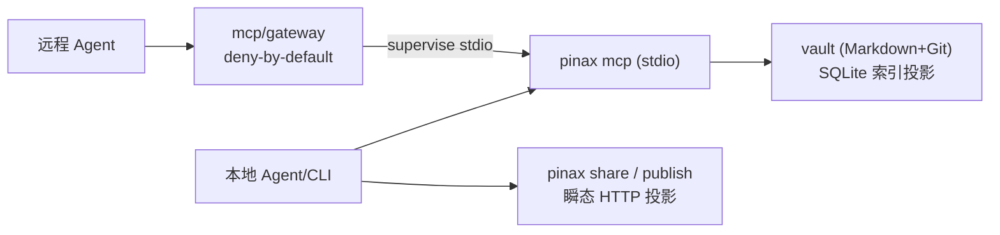

# Pinax 本地异步基座设计

## 服务化路径：本地优先边界

- 不存在常驻 daemon；`pinax mcp` 由 gateway 或用户显式启动，stdin EOF 即退出。
- share/publish 是显式动作产生的瞬态投影（token 门），不是服务面扩张。

## SQLite 统一 DSN 与池界

- 现状：`operation`、`promptasset`、`agentmemory`、`memory` 各自 `sqlite.Open(裸路径)`，无 pragma、无池界。
- 目标：统一 helper（如 `internal/…/sqlitedsn.Open(path)`）产出 `path?_pragma=busy_timeout(5000)&_pragma=journal_mode(WAL)&_pragma=foreign_keys(1)`，读池 `SetMaxOpenConns(4)/SetMaxIdleConns(4)`；对齐 sonora `internal/store/store.go` 已验证模式（WAL N 读者 + 1 写者，写经 busy_timeout 串行）。
- 语义：单写者语义保留（不加分布式锁），MCP server 与 CLI 并发读不串行、不踩 `SQLITE_BUSY`。

### WAL sidecar 生命周期（实现期发现，sonora 场景差异）

- Pinax CLI 是短生命周期进程且命令退出不显式关连接；WAL 下未 checkpoint 的 `-wal` 可能包含全部数据页（含头页），主文件近空，且残留 `-wal/-shm` 会污染 vault 文件树、掩盖主文件损坏。
- 退出契约：`sqlitedsn` 登记全部打开的连接池，`main()` 退出前调用 `sqlitedsn.CloseAll()`——最后一个连接关闭时 SQLite 自动 checkpoint 回主文件并删除 sidecar。被 SIGKILL 残留的 sidecar 由 SQLite 下次打开自动恢复；vault `.gitignore` 白名单本身不追踪这些运行时产物。
- 损坏检测独立于 sidecar 状态：`index.Diagnose` 先做主文件 SQLite 头校验（前 16 字节魔数），热 WAL 不能掩盖主文件被截断/覆盖。

## sync/delivery job 投影

- 复用既有 event JSONL + receipt 模型，新增投影：
  - `status`：从 event JSONL 汇总（accepted/progress/terminal），幂等可重放。
  - `cancel`：置 cancel 标记（结构化资产，CLI-authored），执行器在项边界检查后停止；已完成项 receipt 保留。
  - events：对齐 `--events` NDJSON 事件模型（accepted/progress/terminal），本地消费者用 CLI 流、MCP 消费者用只读 resource/工具投影。
- 单执行器原子 claim：同一 sync/delivery 作用域只允许一个执行器（本地文件 claim，幂等抢占），不引入租约心跳（无 daemon 场景不需要）。

## MCP 生命周期

- `pinax mcp` stdin EOF → 排空输出 → 退出；崩溃重启后 registry/resource 投影一致（投影源于 vault 状态，无进程内可变缓存）。
- 六层 readiness 与 lifecycle 事实一并投影到 `pinax://readiness`。

## 非目标

- 不做远程写入直通（远程 mutation 仍走 gateway 审批 + 本地 CLI-authored 结构化资产，遵守 AGENTS.md「不绕过 app service 让 MCP 直接写 vault」）。
