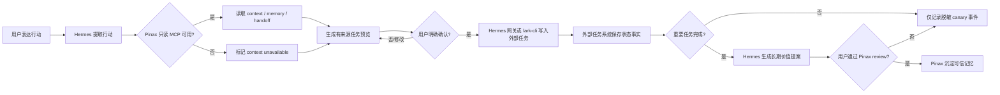

## Context

`pinax-agent-continuity-experience` 已完成十个独立真实任务的首次 proof flow，并在第 13 天完成 10/10 七日复用；来源解析为 20/20、continuation 为 10/10、silent promotion 为 0。CLI 生成的 CEO receipt 位于 `temp/continuity-dogfood-decisions/20260810T021721Z-3240325/artifacts/decision.json`，决策为 `iterate`：核心价值、安全和任务级复用均通过，但样本仍是单一 operator，付费意愿未测量。

当前可用能力已经足够搭建 canary：Pinax 提供 bounded Agent context、memory recall、handoff read 和 proposal/review；Hermes 支持本地 MCP、Skills、工具白名单、记忆写入审批与飞书网关；外部任务也可由 `lark-cli` 管理。主要风险不是缺少连接器，而是职责重叠、未确认写入、双重记忆事实源，以及因缺少指标而把偶发成功误判为持续需求。

## Goals / Non-Goals

**Goals:**

- 让用户通过 Hermes 完成“表达行动 → 有来源预览 → 明确确认 → 外部任务写入”的个人闭环。
- 保持 Pinax 为可信个人记忆与项目上下文事实源，并让完成经验经过 proposal/review 后再沉淀。
- 在不记录敏感内容的前提下，得到两周 canary 的预览质量、来源、延迟、安全、主动使用和结果沉淀证据。
- 修复真实 Hermes 标准 MCP 客户端所需的协议兼容问题，同时保留旧 Pinax MCP consumer 的字段投影。

**Non-Goals:**

- 不在 Pinax 实现飞书 SDK、任务连接器、TaskBridge、task ID 镜像或双向同步。
- 不默认自动创建、分配、关闭任务或确认记忆。
- 不新增稳定 `intent=action_capture` API、provider-specific schema 或跨平台客户端。
- 不先做团队协作、日报仪表盘、编辑器、发布分享或插件平台。
- 不把 Hermes 原始会话、完整提示词、provider payload、私有工具参数或完整执行日志写入 Pinax 或 canary evidence。

## Decisions

### 1. 使用三段式所有权，不建设 Pinax 办公集成层

Pinax 只负责可信上下文、来源、长期记忆、handoff 和审阅；Hermes 负责交互、预览、确认和编排；外部任务工具负责创建、负责人、提醒和状态。这样可以让任务系统继续成为状态事实源，同时避免 Pinax 同时拥有知识和执行状态。

替代方案是把飞书 connector 或 task mirror 放进 Pinax。该方案会引入 provider payload、凭据、状态同步和冲突解决，直接违反当前 CEO receipt 的 scope freeze，因此拒绝。

### 2. Canary 通过用户级 Hermes Skill 和最小 MCP 工具集运行

Hermes profile 只启用 `pinax.agent.context`、`pinax.agent.memory_recall`、`pinax.agent.handoff_read`，Skill 固定预览格式、fallback 标签、确认门禁和完成后 proposal/review 规则。该配置属于个人 canary，不成为 Pinax 稳定 API 或 runtime-specific plugin。

替代方案是新增 Pinax 顶层 action-capture 命令。现阶段没有足够采用证据证明需要稳定 surface，新增命令会把实验编排固化在错误所有者中，因此延期。

### 3. MCP 兼容采用 additive standard projection

Pinax MCP stdio 同时返回标准 JSON-RPC/MCP 字段与原有顶层投影：标准客户端读取 `result.tools`、`inputSchema`、`content` 和 `structuredContent`；旧 consumer 继续读取原有 `tools`、`resources` 和业务结果字段。通知不返回 frame，request ID `0` 必须保留，错误码使用标准整数并在 `error.data.legacy_code` 保留旧语义。缺省 workspace 解析为 `default`。

替代方案是直接替换旧 wire shape。该方案会破坏已有 consumer，不符合 additive experimental 兼容策略，因此拒绝。

### 4. Canary evidence 由 Hermes 侧 recorder CLI 生成

Recorder 位于个人 Hermes skill 的 `scripts/`，通过子命令创建 canary、追加 preview/create/completion/review event 并生成 report。事件只存离散指标、时间和不可逆 digest；不存任务标题、正文、完整 task ID 或会话。Pinax 不读取该事件库，也不把它作为业务状态。

替代方案包括手写 JSONL、把 telemetry 放进 Pinax vault 或复用飞书任务镜像。手写结构化资产违反 CLI-authored constraint；写入 Pinax 会污染记忆事实源；任务镜像会扩大 provider 边界，均拒绝。

### 5. 记忆事实源按内容类型切分

Hermes memory 只保存交互偏好、使用习惯和工具路由，并启用写入审批；项目决定、执行经验、约束与重要结果以 Pinax 为准。任务完成后，Hermes 先区分执行噪声与长期价值，再显示 proposal，最终仍由 Pinax review 决定是否沉淀。

### 6. 决策使用预先登记门槛，不以集成数量代替价值

两周报告同时给出分母、活跃日期、已知偏差和未测指标。全部门槛达到才允许创建新的接口固化 change；有复用但质量不足只修 Pinax retrieval/review；没有持续复用则停止集成扩张。飞书 task 数、命令调用数或一次成功不作为北极星指标，北极星保持“每周完成并沉淀为可信记忆的行动闭环数”。

## Risks / Trade-offs

- [Hermes 一次性模型调用超时导致看似不可用] → 分离验证 MCP transport、Skill discovery、LLM inference 和外部 task writer；超时不得归因到 Pinax 或触发 provider 扩张。
- [Hermes 与 Pinax 形成双重长期记忆] → 限制 Hermes memory 范围并启用写入审批；项目决定和执行经验只通过 Pinax review 沉淀。
- [来源可解析但与行动不相关] → recorder 同时记录来源可打开率和预览修改次数；后续只根据失败证据优化 retrieval/ranking。
- [确认语义模糊导致误写] → 修改请求永远不算批准；只有明确确认短语才能进入外部写工具，未确认写入必须为 0。
- [外部工具重试产生重复任务] → 失败时保留预览并要求复核，recorder 记录 duplicate/error；不在 Pinax 建同步引擎解决该问题。
- [单一 operator 数据继续被过度外推] → 报告分别展示 participant-level 与 task-level 分母，并把 external validity 保留为已知偏差。
- [本地 canary recorder 被误认为产品 telemetry] → 数据只留在用户级 Hermes profile，默认不联网、不上传、不进入 Pinax 稳定合同。

## Migration Plan

1. 保持 `pinax-agent-continuity-experience` 为 experimental，并用 CLI 生成七日指标与 `iterate` receipt。
2. 部署 additive MCP compatibility 修复，运行 Pinax package tests、标准 Python MCP SDK 调用和 `hermes mcp test pinax`。
3. 在用户级 Hermes profile 注册 Pinax stdio MCP，收窄为三个只读工具，安装 action-capture skill 和本地 recorder，启用 Hermes memory 写入审批。
4. 先执行不写外部任务的预览 smoke；只有用户在真实对话中明确确认时才允许 Hermes 网关或 `lark-cli` 写入。
5. 连续两周生成本地 report，再按 spec 门槛创建 stabilization、quality-only iteration 或 Stop closeout。

回滚时运行 `hermes mcp remove pinax`，禁用或删除用户级 `pinax-action-capture` skill，并保留已生成的脱敏 evidence 供审计。Pinax MCP 修复为 additive compatibility，若必须代码回滚也不需要数据迁移；外部任务系统中的既有任务不由 Pinax 修改或删除。

## Open Questions

- 两周个人 canary 之后，是否邀请额外目标用户进入独立 profile，以补齐 external validity，而不是继续增加同一 operator 的任务样本？
- 付费信号应以直接付费意愿访谈、持续使用承诺还是为该闭环替换现有工具的成本作为最小可接受证据？
- 只有全部 canary 门槛通过时，`intent=action_capture` 是否值得成为 `pinax.agent.context` 的新实验视图，还是继续由 Hermes 组合现有通用字段即可？
