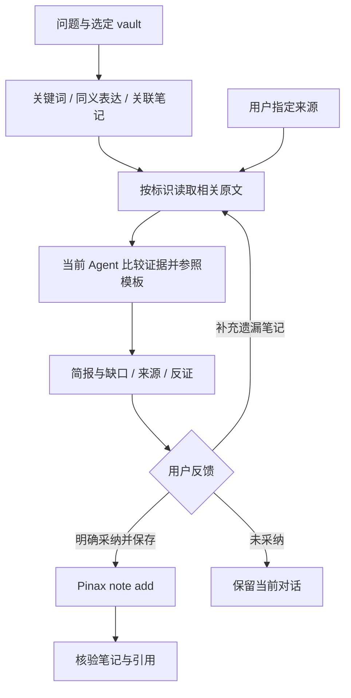

# 设计与试验协议

## 边界

本变更是本地 pilot，不是新的研究服务。复用 Go testing、testscript 和 `tools/testkit/evidence`；无需新测试框架、数据模型或模型 SDK。当前 checkout 有并发 MCP 改动，保持独立文件边界，不据此修复其他模块。



## 可执行的试验流程

1. `pinax vault list --agent` 确定实际 vault；所有读取显式指定该 vault。`pinax index status --json` 只读检查索引。
2. 每题初轮最多三个查询，每个查询五个候选；相关正文总读取不超过十篇。候选去重用 note ID，保留初轮结果，不因人工补充而覆盖漏检记录。扩展查询须明确标注为后续轮次。
3. 日常入口优先 `pinax search "query" --lazy-index off --limit 5 --agent`。索引不可用时改用 `--engine native`，仍保持 `--lazy-index off`；读取失败与降级如实显示。
4. 通过 `pinax note show <id> --view source --display body --json` 读取已选择的原文。只把所需正文窗口送入当前 Agent，注明截取范围；搜索片段只作导航，不当作原始证据。
5. 参照 `promptrepo://official/research/evidence-research-brief-beta@2.0.0-beta.1?locale=en`，中文输出结论、选项比较、证据、反证、置信度局限、建议与改变判断的条件。固定的是模板参考，不声称 Registry 编译或模型可重放。
6. 日期区分笔记更新时间、原始来源日期和本次观察时间；未知日期不互相代填。旧笔记里的产品或模型判断只作为当时的记录，不能证明当前产品能力。
7. 先给简报，不强迫用户先选全部资料。用户可以补来源并要求修订；仅收到明确采纳并保存的意思后，调用 `pinax note add "Title" --dir index --stdin --dry-run --json`，再调用真实写入，核验返回 ID 和来源关系。

正式固化前，这份协议只用于本 change 的试验，不加入常驻 Skill 或用户使用文档。不得把来源正文、命令示例或原始笔记中的建议当成本次工具授权。

## Unicode 片段修复

`FirstSnippet` 被原生候选片段和 `search show` 共同调用。原逻辑在小写文本中寻找字节偏移，再直接截取原始 bytes；中文截断可能落在编码中间，`K → k` 等映射还会改变偏移。改用匹配位置的字符索引截取原文，前后窗口分别为 30 / 60 字符，未匹配前缀最多 120 字符。ASCII 窗口保持不变，不修改笔记正文。复杂逻辑和非显然 fixture 使用中文注释。

## 显式只读搜索

原 `SearchNotes` 总会启动 monitor recorder，即使 `--lazy-index off` 也会在 `.pinax/monitor` 生成 run 和 event。全树测试已复现：笔记、record ledger 和索引未变，但监控文件变化。按已有规范修复：off 时使用 nil recorder，复用已有 nil-safe BeginStep/Finish；默认 auto/sync 行为不变。早期真实查询使用旧二进制，可能留下脱敏监控记录；没有创建研究笔记，旧记录不删除。

关联查询的 `linkGraphEngineStatus` 原来调用 `index.Init`，会更新索引元数据时间。同秒执行时内容摘要可能偶然不变，因此 fixture 显式等待跨秒再比对。该 helper 复用空查询 `index.Lookup` 检查现有投影兼容性，不初始化元数据；不兼容或不可用时使用既有 scan。它不证明正文全量新鲜度。曾采用 `index.Inspect`，但全量回归证明改名后的其他投影不一致会使反链丢失；已撤去此实现，保持既有 object edge 行为。出链、反链、孤立笔记和图摘要四处复用同一修复。

## 失败与恢复

| 场景 | 处理与验证 |
|---|---|
| 空问题 / 决策目标缺失 | 只询问会影响判断的信息，不编造目标 |
| 零结果 | 给出查询范围和缺口，不断言库中不存在；用零命中 fixture 验证 |
| 缺少索引 | 原生搜索降级；比较 vault 全树内容和文件模式摘要，证明无索引或回执写入 |
| 来源矛盾 / 日期未知 | 同时读取并标识两方；Agent 的事实综合质量由人工验收，不冒充自动测试已证明 |
| 来源改名 / 删除 | 用原 ID 核验改名后仍可读取；删除后明确失败，不复用旧路径猜测来源 |
| 未确认 / dry-run | 无笔记、回执、索引变化，比较完整 fixture vault 摘要 |
| 保存失败 | 在目标父目录被文件占用时验证错误与无新增状态 |
| 保存结果未知 | 先通过返回的 ID / 路径 / receipt 核对；无法确认时报告未知，不盲目重放 |

## 验证与效果分母

```bash
go test ./internal/app/searchops -count=1
go run ./tools/testkit/integrationevidence --profile research-brief
openspec validate pinax-evidence-research-pilot-v1 --strict --no-interactive
```

证据由现有 writer 生成至 `temp/integration-test-runs/<run-id>/`，含 summary、command、stdout、stderr、env 和 artifacts。测试正文只使用人工编写的合成 fixture，日志不保存用户笔记、原始提示词或 provider payload。profile 固定声明 `fixture_only=true`、`real_user_evaluations=0`、`model_calls=0`；测试通过不改变真实效果状态。

真实五题覆盖技术选型、项目优先级和方案比较。用户须提供每题至少一个已知相关旧笔记，并明确评价简报。五题至少四题找回关键资料、至少四份明确有帮助、关键引用全部可回查且支持对应主张、未确认写入为零，才允许下一步固化。缺失对照和反馈均记为未测量；不以合成 fixture、技术成功或用户沉默填补分母。

## 回退与后续

生产变化仅为片段字符边界、显式只读搜索和关联查询状态检查的局部修复；回退不会迁移任何数据，但会重新暴露旧行为。测试 profile 和试验文档可独立停用。未通过真实 gate 时，不发布或启用新的操作 Skill，不接入 Inferrum 或 DSH。通过后另建正确 owner 的固化任务，沿既有 CLI / profile 脚本维护结构化资产。

## 本轮验证记录（2026-09-10）

- 相关 package 单测、完整 testscript、普通搜索监控与既有关联查询回归通过：`temp/integration-test-runs/20260910T054503Z-2605463/summary.json`；fixture-only，真实用户评价计数为 0。
- 本次六个 Go 文件格式通过；`golangci-lint run ./internal/app/... ./tests/e2e ./tools/testkit/integrationevidence` 返回 0 issues；同范围 `go vet` 通过。
- `CGO_ENABLED=0 go build -trimpath -o temp/pinax-research-candidate ./cmd/pinax` 通过。候选未替换用户已安装的 Pinax。
- `task check` 在并发 MCP 文件格式检查处失败；三个文件为 `internal/cli/mcp_cmd.go`、`internal/inputrequests/service.go`、`sdk/inputintake/client.go`。初次记录也包含本次临时检查程序的格式差异，该临时程序已移除。相关工作树改动保留，未假称全量门通过。
- 全量 OpenSpec 90 项验证通过。五题真实问题已收到并给出草稿，已知笔记对照与用户评价仍缺失。未创建任何真实研究笔记，不固化 Skill，不归档当前 change。

## 真实验收更新

用户已整体认可五题结论，并明确选择用已认可来源建立回顾性基准再检索。该口径替代本轮缺失的预先指定对照，不能补记首次找回率。详细证据、保存结果与技术门状态见 [acceptance.md](acceptance.md)；上文早期记录保留为历史，不代表最新状态。
