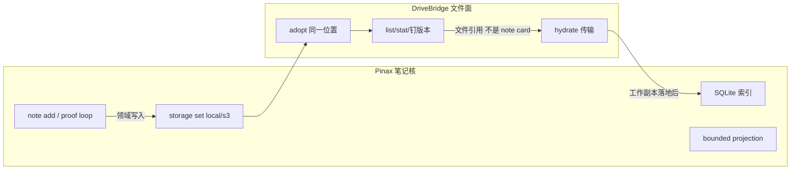
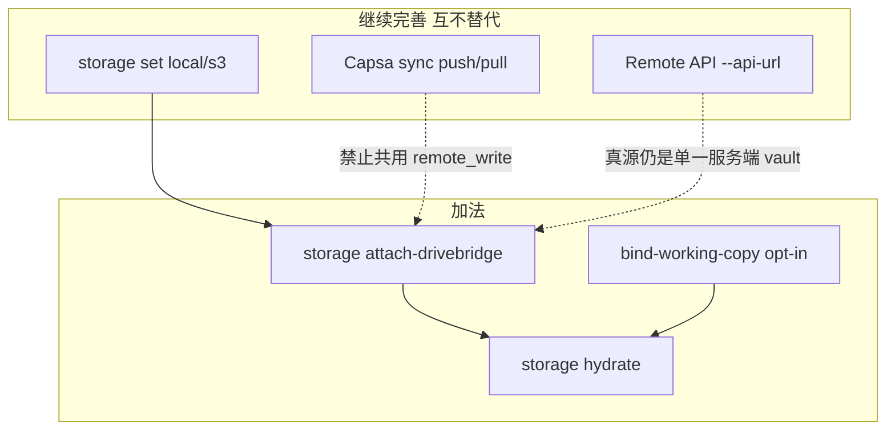
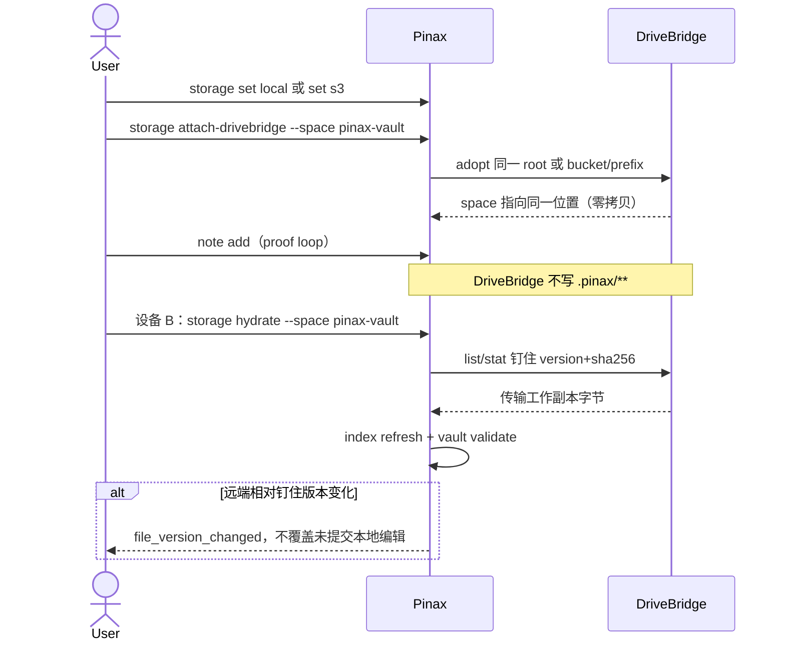
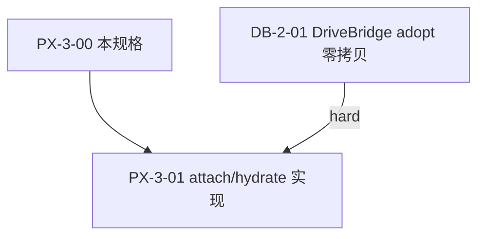

## Context

Pinax 已经有完整的本地笔记核和三条互不相同的远程路径：

| 模式 | Canonical 入口 | 真源 | `remote_write` |
| --- | --- | --- | --- |
| 主存储 | `pinax storage set local\|s3` | vault 目录或已配置 S3 前缀 | 不适用（配置写入 `.pinax/storage.json`） |
| Capsa Cloud Sync | `pinax capsa backend set` + `pinax sync push\|pull` | 每机本地 vault + 密文 revision | 仅在耐久 revision commit 后为 `true` |
| Remote API Mode | `pinax --api-url` / `PINAX_API_URL` | 服务端 `api serve` 附着的那一个 vault | 走 API 写入门，不是 Capsa `remote_write` |

`docs/architecture/cloud-sync-design.md` 把 A/B 分开，且明确 rclone OneDrive **不是** DriveBridge 明文工作副本。根包 `drivebridge-consumer-binding-v1` 要求增加 **Pattern C**：零拷贝 attach 已有存储，让 DriveBridge 浏览/钉版本/换机 hydrate，但不接管笔记核。

当前 `pinax storage` 只管理 `pinax.storage.v1` profile（local root 或 S3 bucket/region/prefix/profile），doctor 只检查缺字段，不连接网络，也不知道 DriveBridge。本设计把 attach 做成该命令组的加法，而不是新存储栈。

根推进图中本 change 是 PX-3-00（规格）；实现是 PX-3-01，硬依赖 DriveBridge adopt（DB-2-01）。

## Goals / Non-Goals

**Goals:**

- 把根合同落成 Pinax 命令名、错误码、doctor 事实、CLI-authored 记录和任务切分。
- 第一路径：attach **现有** `storage set local` 根或 `storage set s3` 前缀，零拷贝，不新开 DriveBridge 桶。
- doctor/status 能区分：未 attach、adopt 本地、adopt 同一 S3、明文网盘工作副本、Capsa 密文前缀（`opaque_encrypted`）。
- 换机 hydrate 钉住文件版本并重建 Pinax 索引；冲突交给既有 repair，不让 DriveBridge 合并正文。
- 附件若已是 `drivebridge://` 版本引用，可被 Scaena 等消费者绑定，但不共享笔记身份。

**Non-Goals:**

- 本切片不改 Go/runtime、不实现 attach/hydrate、不接真实网盘账号。
- 不删除或冻结 `storage set local|s3`、`capsa backend set`、`backend add`。
- 不把字节先拷进 DriveBridge 再给 Pinax 用。
- 不让 DriveBridge 索引笔记、跑 proof loop 或拥有 note projection。
- 不把 DriveBridge 空间默认为 Capsa blob 存放处（除非未来独立 change 明确声明）。
- 不把本机 local 路径伪装成远端 MCP 可读文件。

## Decisions

### D1 原命令继续是 canonical 写入路径

`pinax storage set local|s3` 仍写 `.pinax/storage.json`（`pinax.storage.v1`），语义与现网一致。`pinax capsa backend set` 仍配置密文同步传输。`pinax backend add s3|rclone` 仍配置附加 blob 浏览后端。Attach 是加法：没有 DriveBridge 时这些命令必须可运行。

拒绝的替代：删除 owner S3、改让用户只配 DriveBridge 桶。

### D2 Attach 挂接「同一位置」，不新开存储

```text
pinax storage set local --root <abs> --vault <vault>
pinax storage set s3 --bucket <b> --prefix <p> --region <r> --profile <id> --vault <vault>
pinax storage attach-drivebridge --space <space> --vault <vault> --json
```

`attach-drivebridge` 读取 **当前** storage profile，请求 DriveBridge adopt 同一绝对目录或同一 `bucket/prefix`。Pinax 不复制笔记字节，不要求新 bucket。location 与 profile 不一致则失败为 `drivebridge_location_mismatch`，不写部分 attach 记录。

解除：

```text
pinax storage detach-drivebridge --vault <vault> --json
```

Detach 只撤 Pinax attach 记录并请求 DriveBridge 解除 adopt；`.pinax/storage.json`、Capsa 配置和笔记文件保持不动。

### D3 明文网盘工作副本必须显式 opt-in

Pinax 原本没有 OneDrive/Google Drive 主存储。把可见工作副本放到这两家网盘，必须走单独命令，禁止 `init` / `note add` / `storage set` 静默上传整个 vault：

```text
pinax storage bind-working-copy --provider onedrive|gdrive --space <space> --vault <vault> --json
```

doctor 对此报告 `drivebridge_content_mode=provider-plaintext`，不得报 `opaque_encrypted` 或 Capsa encrypted。Capsa `backend set rclone --remote onedrive:...` 仍是密文协议，与明文工作副本不是同一模式。

### D4 文件面 vs 笔记核



DriveBridge `list` 到 `.md` 只是文件引用，不含完整正文承诺，不得渲染为 Pinax `note.card` / `note.detail` / `note.context`。新增或修改笔记必须经 Pinax 命令（含 snapshot/proof 门）。

### D5 写入围栏与 attach 记录所有权

| 路径 | DriveBridge | Pinax |
| --- | --- | --- |
| `.pinax/**`、SQLite/WAL、token、Capsa 信封/清单 | 拒绝写 `owner_protected` | 全权；由 CLI/service 写 |
| 笔记 Markdown、附件字节 | 可 list/stat/transfer | 领域创建与语义变更仍走 Pinax |
| Capsa 密文对象 | 不透明 list/stat，不解密 | Capsa 协议 |

Pinax attach **不得**请求 DriveBridge 写 `.pinax/**`。Owner 侧记录由 Pinax 写入：

```yaml
# .pinax/drivebridge-attach.yaml  由 pinax storage attach-drivebridge 写入
schema_version: pinax.drivebridge_attach.v1
consumer: pinax
space: pinax-vault
kind: local   # local | s3
purpose: vault
location:
  root: /abs/vault          # kind=local
  # bucket: notes           # kind=s3
  # prefix: pinax/
connection_id: ""           # 可选
idempotency_key: "..."
content_mode: adopt_local   # adopt_local | adopt_s3 | provider-plaintext
```

Agent 不得手写该文件。凭据只引用已有 `profile` / `secret-ref`，输出只显示 configured，不回显密钥。

### D6 三种模式不得混写 `remote_write`



- Capsa 成功不得把 DriveBridge 标成已同步；反之亦然。
- DriveBridge attach / hydrate / 文件上传成功 **SHALL NOT** 发出 Capsa `remote_write=true`。
- `pinax --api-url` 仍指向单一服务端 vault，不因 attach 变成多设备文件同步。
- `storage attach-drivebridge` / `hydrate` / `bind-working-copy` 与现网 `capsa`、`sync` 同属本地控制面：配置了 `remote.api_url` 时仍操作本机 vault，不转发、不返回 `remote_command_unsupported`。

### D7 Hydrate 是第二设备重建，不是 Capsa pull



规则：

1. 本机 `kind=local` adopt 只在能看见该目录的机器上可管理；设备 B 若看不到该路径，hydrate 失败为 `drivebridge_local_unreachable`，并提示改用已 attach 的 S3 或显式 `bind-working-copy`。
2. Hydrate 钉住观察到的 file id/version/sha256；中途变化 → `file_version_changed`，不静默用新字节覆盖未提交本地编辑。
3. 落地后由 Pinax 重建索引；笔记 id 仍由 Pinax 管理。
4. 正文冲突走既有 `pinax sync conflicts` / `repair`，DriveBridge 不自动合并。

### D8 命令、事实与错误码（英文协议）

加法命令（均在 `pinax storage` 下，避免新的顶层组）：

| 命令 | 作用 | 写入 |
| --- | --- | --- |
| `storage attach-drivebridge --space <space>` | adopt 当前 local/S3 位置 | `.pinax/drivebridge-attach.yaml` |
| `storage detach-drivebridge` | 解除 attach | 删除上述记录；不改 storage profile |
| `storage bind-working-copy --provider onedrive\|gdrive --space <space>` | 明文工作副本 opt-in | attach 记录 `content_mode=provider-plaintext` |
| `storage hydrate --space <space>` | 第二设备重建工作副本 | 工作副本文件 + 索引；`remote_write` 不因本命令为 true |

`storage status` / `storage doctor` / `vault doctor` 加法英文 facts（缺省表示未 attach）：

| fact | 值 |
| --- | --- |
| `drivebridge_attached` | `true` / `false` |
| `drivebridge_space` | space id 或空 |
| `drivebridge_kind` | `local` / `s3` / `onedrive` / `gdrive` |
| `drivebridge_content_mode` | `none` / `adopt_local` / `adopt_s3` / `provider-plaintext` / `opaque_encrypted` |
| `drivebridge_location_match` | `true` / `false` |
| `capsa_sync_configured` | `true` / `false` |
| `remote_api_configured` | `true` / `false` |

稳定错误码：`drivebridge_not_installed`、`drivebridge_not_attached`、`drivebridge_location_mismatch`、`drivebridge_working_copy_opt_in_required`、`drivebridge_local_unreachable`、`file_version_changed`、`owner_protected`。未 attach 且未请求 attach 时，**不得**因为本机没有 DriveBridge 二进制而让 `storage set|status|doctor` 失败。

人读摘要用中文 chrome；`--json` / `--agent` / `--events` 保持英文协议字段。实现 attach/hydrate 状态机、location 核对、`file_version_changed` 与三模式隔离时，非显然边界必须写中文注释。

### D9 实现依赖与调用方式

Pinax 通过 DriveBridge CLI（`drivebridge storage adopt` 及 list/stat/transfer）编排文件面，不把 DriveBridge 源码或平台 CAS 卷嵌进 Pinax。凭据优先复用 Pinax 已有 `profile` / `secret-ref`。



Go 实现任务在 tasks.md 中写清，但勾选前必须能对 DB-2-01 的 adopt 合同做夹具测试。本 change 可以在 adopt 落地前保持实现项未勾选。

### D10 文档归属

- 实现期更新 `docs/commands/storage.md`（中文说明 + 英文命令）和 `docs/architecture/cloud-sync-design.md`：增加 Pattern C，并强调与 Capsa rclone OneDrive 的区别。
- 不把 DriveBridge 写成 Capsa transport，也不把 Capsa 写成网盘绑定。

## Risks / Trade-offs

| 风险 | 选择 | 回滚 |
| --- | --- | --- |
| 用户以为 DriveBridge 上传即笔记保存 | 规格禁止；list `.md` 不是 note 投影 | Pinax proof/repair |
| Local adopt 被当成远端可读 | `drivebridge_local_unreachable`；要远程则 attach S3 或 bind-working-copy | 不假装 MCP 能读客户端磁盘 |
| Capsa rclone OneDrive 与明文工作副本混淆 | doctor 分 `opaque_encrypted` vs `provider-plaintext` | 两条 status 分开 |
| S3 凭据双份 | 共用 credential_ref / profile | 旧 profile 仍可用 |
| 双控制面写坏 `.pinax` | 围栏 + Pinax 只经 CLI 写 metadata | detach 后 owner 命令不受影响 |
| 实现早于 DriveBridge adopt | 任务硬依赖 DB-2-01 | 本切片只交规格 |

## Migration Plan

- 纯加法：旧 vault 无 attach 记录时行为与现网完全一致。
- Attach 失败或 DriveBridge 未安装：不改 storage profile，不改笔记。
- Detach / 回滚：删除 `.pinax/drivebridge-attach.yaml`，DriveBridge 解除 adopt；`storage set`、Capsa、backend 仍可用。
- 不迁移 Capsa 密文前缀为明文工作副本。

## Open Questions

- DriveBridge CLI 的 adopt 参数以 DB-2-01 落地名为准；Pinax 适配层映射 `--space` / location，不在本切片臆造 DriveBridge flag。
- attach 记录文件名锁定为 `.pinax/drivebridge-attach.yaml`；若与未来通用 binding registry 合并，须另开 additive change，不得打断本命令。
- 附件 `drivebridge://` 引用的 Pinax manifest 字段形状与 Scaena 消费对齐，在双方实现期用同一根绑定合同，本切片只要求「版本引用 + 不共享笔记身份」。

## 验证策略

本切片：

```bash
cd /workspaces/yeisme-agent/cli/pinax
openspec validate pinax-drivebridge-remote-notes-v1 --strict --no-interactive
```

实现期（PX-3-01，不在本切片宣称完成）：

```bash
go test ./internal/app ./cmd/pinax -run 'AttachDrivebridge|StorageDoctor|Hydrate|WorkingCopy' -count=1
pinax storage set s3 --bucket notes --region us-east-1 --prefix pinax/ --vault ./my-notes --json
pinax storage attach-drivebridge --space pinax-vault --vault ./my-notes --json
pinax storage doctor --vault ./my-notes --json
```
