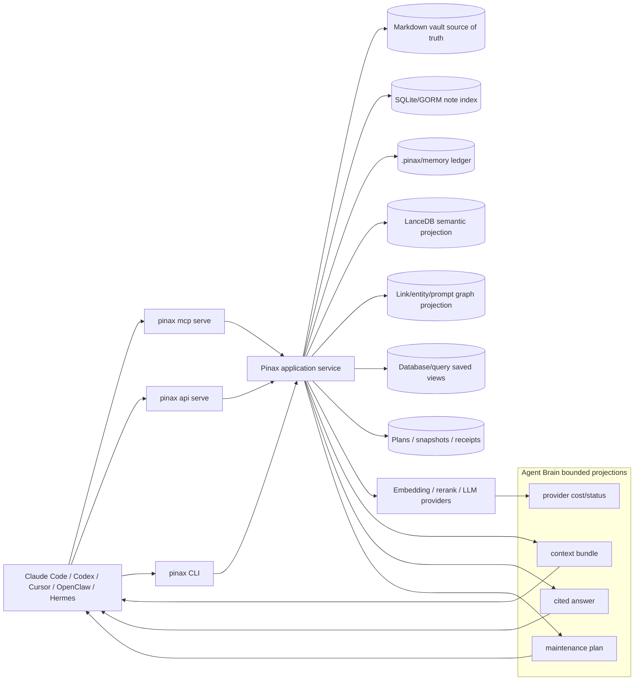

# Pinax Agent Brain Layer 设计

## 目标

Pinax Agent Brain Layer 的目标是把本地 Markdown vault、结构化 memory、semantic KB、关系图谱、query/database views、project board、briefing/proof receipts 和 MCP/Local API 能力组织成一个 agent 可消费的长期知识层。它不是一个新笔记 App，也不是 hosted brain；它是 Pinax 现有 local-first 控制平面的上层合同。

用户应该能让 agent 问：

- “明天见 Alice 前我需要知道什么？”
- “这个项目为什么卡住？”
- “Acme AI、Bob 和上一轮会议有什么关系？”
- “哪些记忆过期、矛盾或缺少引用？”
- “可以安全执行的下一步是什么？”

Pinax 的回答不能只是搜索结果列表，也不能是无来源 LLM 摘要。它必须返回 cited answer、evidence refs、freshness、confidence、open tasks、risk、cost/provider 状态和真实 next command。

## 架构



## 能力分层

| 层级 | 能力 | 当前基础 | 本计划输出 |
| --- | --- | --- | --- |
| Ingest | Markdown import、capture、journal、inbox、future email/calendar/webhook intake | `import markdown`、`note add`、`inbox`、`journal` | 统一 ingestion receipt、source identity、dedupe plan、权限/正文暴露边界。 |
| Memory | typed facts、decisions、events、tasks、lifecycle、source citation | `pinax memory` | Agent Brain context bundle 的结构化 memory 子集和 freshness/supersession 规则。 |
| Semantic KB | embeddings、provider status、semantic context、local/remote provider | `pinax kb`、LanceDB sidecar、provider doctor | provider/cost 可见、rerank/answer synthesis 输入边界。 |
| Graph | notes、links、backlinks、prompt graph、future people/company/entity graph | `note links/backlinks/orphans`、`graph query` | entity resolution plan、relationship evidence、anti-hairball bounded expansion。 |
| Answer | synthesis、citations、confidence、staleness、open tasks | 当前无正式 answer contract | 新增 `answer.synthesis` 合同和测试计划，先不强行实现。 |
| MCP/API | stdio MCP、Local REST/RPC、future HTTP/OAuth/team scopes | `mcp serve`、`api serve`、token/profile | 工具分组、scope、rate/cost metadata、只读默认和 write gate。 |
| Maintenance | dream cycle、entity merge、citation repair、memory compression、contradiction detection | `proof loop`、repair/organize plan | 所有维护先生成 reviewable plan，不静默改写正文。 |

## 核心合同

### Answer synthesis

`answer.synthesis` 是未来能力，必须以 additive 方式加入 CLI/API/MCP。第一版可以是 plan-only 或 preview-only：

```bash
pinax brain answer "what should I know before meeting Alice?" --vault ./my-notes --json
```

如果后续决定不新增 `brain` 顶层命令，也可以把能力落在 `pinax kb answer` 或 `pinax memory brief`，但必须先更新本 OpenSpec 或后续 OpenSpec，不能在实现时临时决定。

最小输出字段：

| 字段 | 说明 |
| --- | --- |
| `schema_version` | `pinax.agent_brain.answer.v1`。 |
| `answer` | 短综合答案；不得包含完整 note body。 |
| `claims[]` | 每条结论的 `text`、`confidence`、`freshness`、`evidence_refs[]`。 |
| `sources[]` | note path、memory id、graph edge、query row、receipt id、provider-safe citation。 |
| `open_questions[]` | 证据不足、冲突、过期或权限不足的项目。 |
| `next_actions[]` | 真实 `pinax ...` 命令，例如 `pinax index refresh --vault ./my-notes --json`。 |
| `cost` | provider/model、local-only、network call、estimated cost class。 |
| `body_exposure` | `none|snippet|context|explicit_body`；默认不得是 full body。 |

### MCP / HTTP exposure

P0 保持 stdio MCP 只读；P1 可以增加 answer/context tools；P2 才考虑 HTTP MCP、OAuth、scope 和 rate limiting。

工具分组建议：

| 分组 | MCP tools | 默认权限 |
| --- | --- | --- |
| Search | `pinax.search`、`pinax.kb.context`、`pinax.memory.context` | read-only |
| Graph | `pinax.note.links`、`pinax.note.backlinks`、`pinax.vault.graph_summary`、future `pinax.entity.context` | read-only |
| Answer | future `pinax.brain.answer`、`pinax.brain.sources` | read-only、cost visible |
| Maintenance | future `pinax.brain.maintenance_plan` | plan-only |
| Apply | future write tools | disabled by default；必须 explicit scope、snapshot 和 approval |

### Dream cycle / maintenance

GBrain 的 dream cycle 在 Pinax 中不能是后台黑箱。它应该落为：

```bash
pinax brain maintain --vault ./my-notes --dry-run --json
pinax brain maintain --vault ./my-notes --save-plan --json
pinax proof loop run --vault ./my-notes --json
```

维护任务类型：

- entity merge candidates
- broken citation repair
- memory duplicate/supersession plan
- stale fact review
- contradiction report
- summary compression candidate
- source freshness and provider-cost audit

所有 apply 必须延后到 proof loop 或专门 apply command，且需要 `--yes`、snapshot、receipt、restore hint。

## 数据与权限边界

- Markdown vault 是内容真源；`.pinax/**`、SQLite/GORM、LanceDB、events、receipts 和 memory ledger 是 CLI-authored structured assets。
- Agent、MCP、Web 和 Local API 默认只能消费 bounded projection。
- 团队/公司知识库场景不能默认读取所有人的资料；P2 之前只定义 scope model，不实现 hosted permission backend。
- Provider credentials 不进入 vault、docs、fixtures、screenshots、events、receipts、stdout/stderr 或 MCP payload。
- Embedding/rerank/LLM 调用必须显示 provider/model/source type；涉及付费或网络调用时必须有 cost class 或 user-visible next action。

## 兼容性策略

本计划涉及稳定合同面，但要求全部 additive：

- 新命令只能新增，不能重命名或删除现有命令。
- JSON/agent 输出只能新增 optional fields/keys，不能删除或改义现有字段。
- MCP tools 只能新增，不能改变现有 tool 的 read-only 和 body exposure 语义。
- API routes 只能新增或增加 optional metadata，不能改变现有 path/method/status。
- DB/GORM 只能 expand-first：新增 nullable table/field/index；不得在同一变更中 drop/rename/narrow。

## 阶段

| 阶段 | 目标 | 交付 |
| --- | --- | --- |
| P0 Agent Brain MLP | 用现有 `memory`、`kb context`、search、graph、MCP 和 proof loop 形成可验证闭环。 | docs、capability matrix、focused tests、MCP/read-only context bundle。 |
| P1 Answer + maintenance preview | 增加 answer synthesis preview 和 maintenance plan，不自动 apply。 | `answer.synthesis` projection、`maintenance.plan` projection、cost/provider metadata。 |
| P2 Team/HTTP/scopes | 设计并实现 team/company KB 的 scope、HTTP MCP/OAuth/rate limit。 | 独立 hosted/team OpenSpec 或 gateway/backend owner handoff。 |

## 风险与缓解

| 风险 | 缓解 |
| --- | --- |
| Answer hallucination | claims 必须有 evidence refs；证据不足进入 `open_questions`。 |
| 私密正文泄漏 | 默认只允许 bounded snippets；MCP 不提供 full body；contract tests 递归扫描 body sentinel。 |
| Provider 成本失控 | provider/cost metadata 必须出现在 plan/answer；缺配置返回 doctor next action。 |
| Maintenance 静默改写 | dream cycle 只生成 plan/receipt；apply 走 proof loop。 |
| 公司知识库权限越界 | P2 先定义 scope model；无 scope proof 时只能 local single-user。 |
| 与 Web/Open Design 重叠 | 本变更只定义 brain projection；未来客户端仍由独立 client subproject 实现。 |

## 验证策略

- OpenSpec: `openspec validate pinax-agent-brain-layer --strict && openspec validate --all --strict`。
- P0 focused tests: memory/kb/search/graph/MCP/read-only output contract。
- P1 focused tests: answer claims evidence、cost metadata、body redaction、provider fake。
- P2 focused tests: auth/scope/rate-limit fake server、HTTP MCP compatibility、integration evidence under `temp/integration-test-runs/<run-id>/`。
