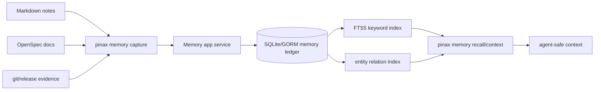

## Design

Pinax agent memory ledger 是一个非向量、local-first 的结构化记忆投影。Markdown vault 和 OpenSpec 文档继续是真源；`.pinax/memory/` 下的 SQLite 数据库是可重建、可审计的本地 projection。agent 通过 `pinax memory recall/context` 获取带来源引用、状态、置信度和召回原因的上下文，而不是直接读取散落文件或依赖 embedding similarity。



## Data Model

第一版以新增 GORM model 表达，不改既有表：

- `memory_records`：记忆主表，字段包含 `id`、`type`、`subject`、`predicate`、`object`、`body`、`status`、`confidence`、`source_uri`、`source_span`、`created_at`、`updated_at`、`expires_at`、`supersedes_id`。
- `memory_entities`：规范化实体表，字段包含 `id`、`kind`、`name`、`canonical_key`。
- `memory_record_entities`：record 与 entity 的多对多关系。
- `memory_sources`：来源引用表，记录文件路径、OpenSpec change id、git commit、release run id 或 command evidence path。
- `memory_fts`：FTS5 projection，只索引非敏感字段：subject、predicate、object、body 摘要、entity names。

状态枚举：

- `draft`：候选记忆，未确认，默认不进入 agent context。
- `confirmed`：可召回记忆。
- `superseded`：被新记忆替代，默认不召回，但可通过 `--include-superseded` 查看。
- `expired`：过期记忆，默认不召回。
- `rejected`：显式拒绝的候选记忆。

## Recall Policy

召回排序先不使用向量：

1. `project` / vault scope 精确匹配。
2. `type`、`entity`、`status` 过滤。
3. FTS5 BM25 分数。
4. recency、confidence、source authority 加权。
5. supersession 和 expiry 过滤。

`pinax memory context` 必须返回 `recall_reason`，说明每条记忆为什么进入上下文，例如：`entity_match:pinax + type:decision + source:openspec + confidence:confirmed`。

## CLI Contract

第一版命令规划：

```text
pinax memory capture --type fact --subject pinax --predicate release_workflow --object "tag push triggers GitHub Actions" --source docs/operations/release-packaging.md --vault ./my-notes --json
pinax memory list --type decision --entity pinax --vault ./my-notes --json
pinax memory recall "release workflow" --entity pinax --vault ./my-notes --json
pinax memory context "prepare next release" --entity pinax --limit 12 --vault ./my-notes --agent
pinax memory link <record-id> --entity pinax --kind project --vault ./my-notes --json
pinax memory prune --expired --dry-run --vault ./my-notes --json
pinax memory stats --vault ./my-notes --json
```

稳定输出原则：

- `--json` 使用现有 Pinax envelope，不新增顶层 envelope 字段。
- `--agent` 输出只新增 `fact.memory.*` key，不移除任何既有 key。
- stdout 不输出 raw prompts、provider payload、Authorization header、cookies、secret 或完整隐私正文。

## Safety Boundaries

- `.pinax/memory/` 是 CLI-authored structured asset，只能由 Pinax service 写入。
- `capture --dry-run` 只返回计划，不写 SQLite、Markdown、receipt 或索引。
- 默认不自动确认 LLM 推断；自动提取只能生成 `draft`，需要显式 `confirm` 或 `capture` 写入 confirmed。
- `context` 输出必须有 token/record limit，默认排除 `draft`、`superseded`、`expired`、`rejected`。
- Cloud Sync 同步 Markdown vault 真源；memory ledger projection 可从 notes/OpenSpec/evidence 重建，不作为远端权威数据。

## Rollback

本 change 只新增命令和 schema。若实现后出现问题，可在一个 patch release 中隐藏 `pinax memory` 命令入口并停止写入 `.pinax/memory/`，既有 vault Markdown 不受影响。SQLite projection 是可删除重建的本地 artifact；删除 `.pinax/memory/` 不应破坏 notes、KB、sync 或 release workflow。

## Verification Evidence Plan

- `go test ./cmd/pinax -run 'TestMemory' -count=1`：验证 CLI 合同、dry-run、agent/json 输出和错误码。
- `go test ./internal/memory ./internal/app -run 'Memory' -count=1`：验证 GORM repository、FTS recall、状态过滤和 source citation。
- `go test ./internal/output -run 'Memory|Agent|JSON' -count=1`：验证输出 envelope 和 agent facts。
- `task check`：全量质量门禁。
- `openspec validate --all --strict`：OpenSpec 严格校验。
