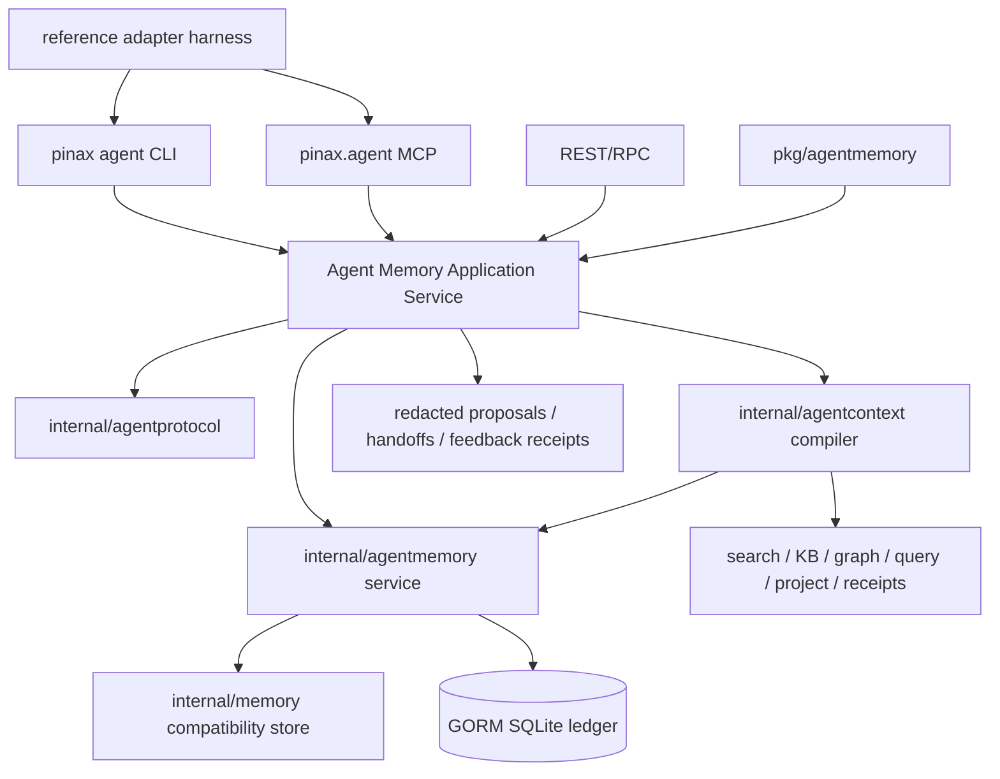
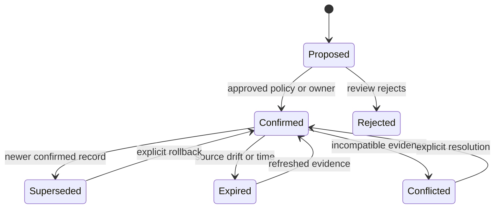

## Context

Pinax 的 `internal/memory` 已支持 fact/decision/event/task、source citation、lifecycle、FTS 和 deterministic multi-signal ranking；`internal/app/agent_context.go` 与 `pinax-agent-brain-layer` 已能组合 bounded refs；`internal/mcpserver` 已公开 read-only brain tools。这些能力是通用 Agent memory runtime 的基础，但还缺少统一 actor/scope、proposal review、handoff、feedback、permission-first context compiler 和 provider-neutral adapter descriptor。

直接重写 `memory` 或 `brain` 会破坏当前 CLI、MCP、Remote API 和 stored ledger 消费者。本设计采用 expand-then-contract：新增独立包和 `pinax agent` facade，内部逐步复用旧 service；在两个 reference adapter 和真实 dogfooding完成前，不删除旧入口。

## Goals / Non-Goals

**Goals:**

- Pinax 成为 canonical Agent memory state owner。
- 提供 provider-neutral core schema 和 transport parity。
- 在 retrieval 前执行 principal/scope/permission/lifecycle/freshness/conflict/budget。
- 通过 proposal 和 review 防止 Agent 自动污染 confirmed memory。
- 支持 bounded cross-Agent handoff 和 recall feedback。
- 保持现有 memory/brain/MCP/API/stored rows 兼容。
- 用 Codex + Cohors adapter harness 证明 runtime portability。

**Non-Goals:**

- 不实现完整 Codex plugin、Cohors runtime integration 或通信 provider bridge。
- 不建设公网 memory backend、组织 ACL 和团队 SaaS。
- 不把向量数据库设为 memory truth。
- 不同步明文 memory body 到 Capsa。
- 不保存完整 transcript、raw prompt、provider payload、private tool arguments、hidden system prompt 或 full chain-of-thought。
- 不在本 change 弃用旧命令、字段、MCP tool 或 API route。

## Architecture





## Package And File Boundaries

| Package | Responsibility | Must not own |
| --- | --- | --- |
| `internal/agentprotocol` | versioned DTO、validation、stable errors、capability descriptor | GORM、CLI rendering、runtime-specific hooks |
| `internal/agentmemory` | memory lifecycle、scope、source、proposal、feedback、store repository | stdout/stderr、MCP framing、provider SDK |
| `internal/agentcontext` | permission-first context compilation、ranking merge、budget | direct DB migrations、runtime rendering |
| `internal/app` | use-case orchestration、receipt、compatibility facade | raw SQL、provider-specific event parsing |
| `internal/cli` / `internal/output` | Cobra args、projection rendering、machine output modes | business lifecycle、secret handling |
| `internal/mcpserver` / `internal/api` | transport adapters and capability discovery | direct `.pinax/**` or DB access |
| `pkg/agentmemory` | additive Go client/domain facade for embedded consumers | internal store details、runtime installation |

复杂 lifecycle、scope inheritance、permission、conflict、ranking merge、migration 和 adapter conversion 必须添加中文注释；CLI help、output、errors、schema keys 和 code identifiers 保持 English。

## Core Contracts

### Principal and scope

`Principal` 包含 `principal_id`、`runtime`、`agent_id`、`owner_id`、`workspace_id`、capabilities 和 trust level。`runtime` 只用于 adapter metadata，不参与 memory identity。

Scope 支持 owner → workspace → project → repository → session → task。Request 必须显式 scope；缺省值只能由已注册 profile/application service 补齐，不能由 command 层猜测。

### Memory record

在现有 `internal/memory.Record` 之上引入 canonical runtime view，增加 kind、scope、source refs、creator、supersedes/conflicts、expiry 和 schema version。现有 fact/decision/event/task rows 保持可读；新增 preference/procedure/failure 采用 additive enum/string values，旧消费者应把未知 kind 当通用 record 而不是失败。

### Context request and pack

Context request 固定 principal、scope、task、intent、entities、kind filter、freshness 和 budget。Compiler 分阶段执行：

1. capability/permission；
2. scope inheritance；
3. lifecycle/source visibility；
4. exact entity/project/repository；
5. confidence/freshness/source authority；
6. task fitness 和现有 semantic/keyword projections；
7. conflict grouping；
8. deterministic budget truncation；
9. safe next actions。

Context pack 分 facts、decisions、preferences、procedures、open_tasks、failed_attempts、conflicts 和 source refs，不输出完整 note body。

### Proposal, handoff and feedback

Proposal 保存 candidates、reason、requested status、source refs、risk、principal 和 scope。Review service 运行 validate/dedupe/conflict/policy，返回 stable status。

Handoff 保存 bounded working state，不等同于 confirmed memory；可由后续 review 转成 proposal。

Feedback 独立记录 useful/irrelevant/stale/incorrect/missing/completed/scope-too-wide 等结论，不静默改写 memory content。

## Persistence And Migration

- 使用 GORM additive migration：新增表、nullable columns 或 safe default；不得 rename/drop/narrow 现有 schema。
- 旧 `.pinax/memory/ledger.sqlite` rows 自动映射到 default local principal 和 vault/project scope view，但不静默写回新字段。
- 首次需要持久化新 runtime state 时，由 application service 运行 migration 并写 schema receipt。
- FTS raw SQL 继续集中在 repository internals，仅用于 SQLite virtual table；业务 service 不拼 SQL。
- Migration 失败返回 stable error，不损坏旧 ledger；rollback 是继续使用现有 `pinax memory`/`pinax brain` read path。

## CLI And Output

新增 experimental command tree：

```text
pinax agent runtime register|list|show|remove
pinax agent context
pinax agent memory recall|propose|proposals|review|approve|reject|supersede|expire
pinax agent handoff create|list|show
pinax agent feedback add|list
pinax agent status
```

所有命令共享 projection，支持 default、`--agent`、`--json`、`--events`、`--explain`。写命令必须有 `--dry-run` 或 plan；confirmed mutation 要求 `--yes` 和 receipt。Command help 和 errors 保持 English。

## MCP, API And SDK

MCP 新增 `pinax.agent.context`、`pinax.agent.memory_recall`、`pinax.agent.sources`、`pinax.agent.handoff_read` 只读工具；proposal/feedback 写工具只有在 capability registry 明确启用并返回 approval facts 时才出现。

REST/RPC 和 Go SDK 共享 application service DTO；transport 不直接读 ledger。Capability discovery 必须标记 `experimental=true`、schema version、read/write、approval、body exposure 和 scope。

## Adapter Boundary

Reference adapter harness 只验证：descriptor negotiation、context request rendering、proposal/handoff conversion、failure isolation。Codex/Cohors 特有 hook、config、team run、trace path 和 plugin packaging 不进入 core packages。

Adapter 不可用时返回 degraded status，不阻塞其他 transport。Core 不把 runtime name 写入 memory ID 或 lifecycle decision。

## Compatibility And Evolution

- Change class：新增 CLI/MCP/API/DB/public Go/config surfaces，全部 additive。
- Existing surfaces：`pinax memory`、`pinax brain`、`pinax.brain.*`、existing REST/RPC 和 stored rows 保留。
- New surfaces：标记 `experimental` / schema `v1` with pre-stable release note；stable-from 需两个 adapter + 四周 dogfooding + contract parity。
- Deprecation window：本 change 不启动。
- Rollback：关闭 agent runtime capability/commands，继续使用旧 memory/brain path；additive tables/columns 保留不删除。

## Verification Strategy

- Unit：protocol validation、scope、lifecycle、ranking、budget、policy、redaction。
- Integration：service + real GORM SQLite + existing projection dependencies。
- Component：CLI/MCP/API/SDK parity 和 compatibility。
- E2E：Codex harness producer/consumer、Cohors harness producer/consumer、cross-adapter handoff。
- Evidence：每次 integration/component/e2e 写 `temp/integration-test-runs/<run-id>/` 标准资产。
- Performance：10k memories、100k source refs、bounded context，禁止每次 request 全表/全 vault scan。

## Delivery Order

1. 等 `pinax-identity-first-note-kernel-v2` 完成共享文件 closeout，或将前两 lane 限制在新包和合同文件。
2. Protocol + compatibility tests。
3. Additive store/lifecycle。
4. Context compiler read path。
5. Proposal/handoff/feedback。
6. CLI/output。
7. MCP/API/SDK。
8. Reference adapter harness 和 dogfooding。
9. Stable-from decision；不自动进入旧面 deprecation。

## Risks / Trade-offs

- 过度抽象：只实现两个 reference harness 所需扩展点。
- Store migration 风险：additive migration、真实旧 ledger fixture、rollback 保留旧 path。
- Context 过载：deterministic budget 和 drill-down。
- 自动污染：proposal-first、no direct confirmed mutation。
- 现有 identity change 冲突：新文件优先，共享文件任务显式依赖 closeout。
- Public SDK 过早稳定：初期标记 experimental，API signature contract test 固定 additive evolution。
