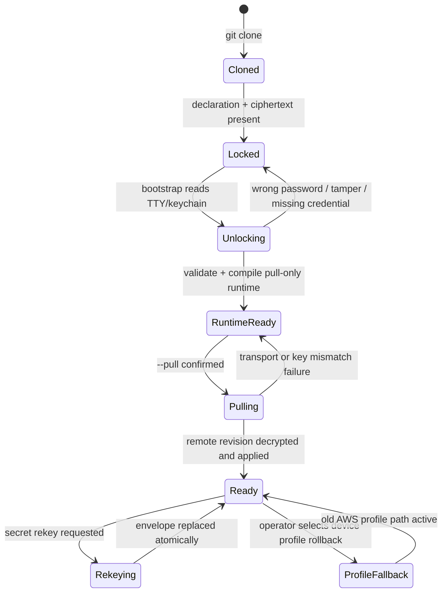
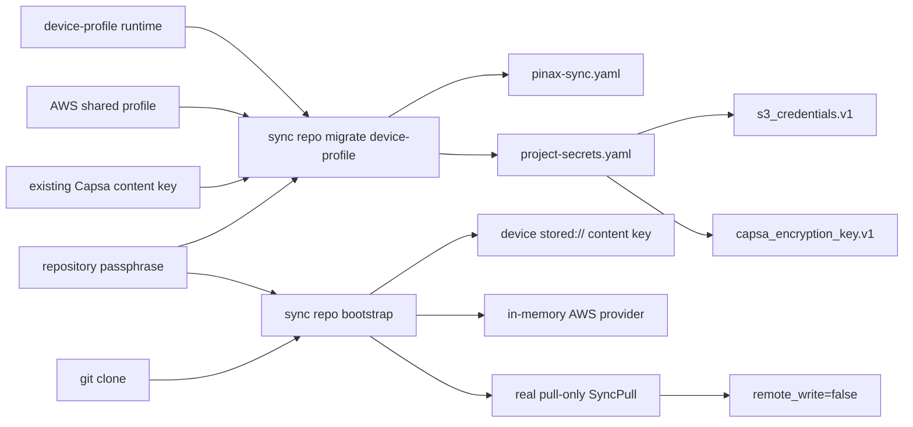
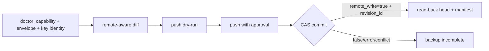
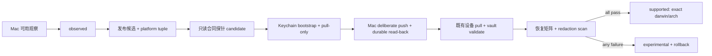

## Context

Pinax 当前已经具备三层声明式同步模型：仓库声明 `.pinax/pinax-sync.yaml`、credentialctl 仓库密文 `.pinax/project-secrets.yaml` 和本机运行态 `.pinax/cloud/`。历史 `.pinax/pinax-sync.secrets.yaml` 继续只服务旧 fake/env logical secret 兼容路径，不承载本变更的 S3 credential bundle。direct S3 transport 原先通过 AWS SDK default credential chain 或 shared profile 获取凭据，因此仓库虽然能够描述 bucket、endpoint、workspace 和 logical identity，却还不能让普通用户在新 Mac 上只凭 vault 口令完成完整的 pull、push 和后台同步生命周期。

根级 `openspec/changes/portable-encrypted-project-bootstrap/` 规定通用 envelope、passphrase/Keychain、rekey 和 cross-language execution boundary 由 `cli/credentialctl` 所有。Pinax 是第一 canary，只实现 Pinax-specific secret schema、Capsa runtime compiler、S3 adapter injection、pull-only bootstrap、doctor 和 evidence；不得复制公共 crypto 或 Keychain adapter。

本变更不复制整个 `~/.aws/credentials` 文件，也不把 AWS 配置文件作为普通 vault 内容同步。它把 S3/COS credential 作为 typed secret bundle 加密后提交，由 Pinax 在命令边界解锁并直接注入 AWS SDK。这样既保留“类似 Ansible Vault 的密文随 Git”体验，也避免路径、profile 合并、重复 section 和明文 materialize 问题。

## Product Scope

### Target User

- 已有私有 Git vault 和 S3/COS Capsa remote，希望在新 Mac 上低门槛恢复笔记的单用户。
- 需要在多台个人设备之间共享同一 vault，但不希望逐台手工维护 `~/.aws/credentials` 的开发者。

### Job To Be Done

用户 clone 私有 vault 后，输入一次独立 vault 解锁口令，即可验证仓库密文、生成本机 pull-only runtime、连接 S3/COS、拉取并解密笔记；整个过程不把真实 credential 或 passphrase 写入 Git、CLI 输出和运行证据。

### MVP Goals

- 支持 `passphrase-v1` 和 macOS Keychain 两种生产 unlock 路径。
- 支持 repository-encrypted S3/COS static credential bundle。
- 支持新设备 `bootstrap --pull`，默认 pull-only，禁止首次 remote delete/push。
- 支持 password rekey，不旋转 Capsa 内容加密 key。
- 保留现有 AWS profile 模式，并提供可逆迁移。

### Non-Goals

- 不提交或自动合并完整 `~/.aws/config`、`~/.aws/credentials`。
- 不在本变更实现 AWS STS/OIDC 登录、云 KMS、组织级 RBAC、多人密钥共享或服务端 secret escrow。
- 不自动轮换 COS SecretId/SecretKey，也不自动轮换 Capsa 内容加密 key。
- 不让 daemon 在没有 Keychain/secret manager 的情况下弹出交互式口令提示。
- 不改变远端 object layout、encrypted manifest、blob envelope 或 revision CAS 协议。

## User Workflow And State Transitions



推荐的新设备命令：

```bash
git clone https://github.com/yeisme/yeisme-notes.git yeisme-notes
cd yeisme-notes
pinax sync repo bootstrap \
  --device "$(scutil --get LocalHostName)" \
  --unlock prompt \
  --remember-keychain \
  --pull \
  --yes \
  --json
```

`--unlock prompt` 从 controlling TTY 读取且关闭 echo；prompt 不进入 stdout。`--json` stdout 始终只包含一个 JSON envelope。无 TTY 时命令返回 `sync_repo_unlock_required`，并提示使用 Keychain ref 或 passphrase file，而不是从 stdin 猜测输入来源。

## Decisions

### 1. 复用现有 secrets asset，而不是提交 AWS 文件

新增并统一使用 credentialctl 管理的 `.pinax/project-secrets.yaml` 保存 repository-encrypted typed entries；历史 `.pinax/pinax-sync.secrets.yaml` 保持原 schema 和读取行为，不迁移、不扩展为 S3 credential 容器。两类资产不得写入同一 logical identity，也不得在 runtime resolution 中互相 fallback。

S3 credential bundle 的解密后逻辑结构为：

```json
{
  "access_key_id": "<redacted>",
  "secret_access_key": "<redacted>",
  "session_token": "<optional-redacted>"
}
```

整个 JSON payload 作为单个 secret entry 加密。结构校验只报告缺失字段名和 credential kind，不回显值。声明层只保存 `credential_id` 和 credential mode，不保存 credential value。

### 2. Passphrase envelope 由 credentialctl 提供

Pinax 通过 versioned `credentialctl/pkg/projectsecrets` API 读取、写入、解锁和 rekey repository envelope。Argon2id、XChaCha20-Poly1305、随机 DEK、associated data、minimum KDF threshold 和 tamper error taxonomy 由 credentialctl change 定义并测试。

Pinax 只传入稳定的 `project_id=pinax`、repository id、entry name、identity、kind、format 和 capability grant，并把公共 resolver 的 redacted result 映射到 Pinax projection。错误口令、metadata 损坏、cross-repository copy 或 authentication failure 均由公共 owner fail-closed；Pinax 不捕获后自行生成替代 key。

### 3. Keychain 是 credentialctl unlock source，不是仓库资产

在 macOS 上，`--remember-keychain` 调用 credentialctl Keychain adapter，将 unlock secret 写入 repository-scoped account。仓库只保存非敏感 keychain account hint/digest，不保存 Keychain value。

- Keychain 写入必须由用户显式批准。
- `doctor` 只报告 `configured=true|false`、service、account digest 和可访问性，不显示值。
- daemon 只能使用已配置 Keychain/secret manager；不得打开 TTY prompt。
- Keychain 不可用时，交互式命令可以回退到 prompt；非交互命令安全失败。

### 4. S3 credential 直接注入 AWS SDK

`S3BackendOptions` 增加可选 credentials provider。repository-encrypted mode 下，应用服务在单次命令或 sync run 开始时解锁 bundle，构造 AWS SDK `StaticCredentialsProvider`，并把 provider 传给 `config.LoadDefaultConfig`。

明文 credential 的生命周期被限制在不可变 runtime snapshot 和 AWS SDK provider 中：

- 不设置全局 `AWS_ACCESS_KEY_ID` 环境变量。
- 不生成 `~/.aws/credentials`。
- 不写入 `.pinax/cloud/config.yaml`、stored secret YAML、receipt 或 daemon log。
- run 结束后释放引用；Go 无法保证即时物理清零，因此不得创建额外字符串副本或 debug dump。

### 5. Credential mode 与兼容优先级

声明增加可选 `credential_mode`，值为：

- `device-profile`：默认值，保持现有行为，通过 endpoint/profile 或 AWS default chain 解析。
- `repository-encrypted`：必须从声明引用的 encrypted credential bundle 解析；缺失或解锁失败时不得静默回退到本机其他 AWS credential。

显式选择 `repository-encrypted` 后，profile query 仅作为非敏感 provider hint，不作为隐式 credential fallback。这样可以避免新 Mac 恰好使用错误 AWS account。

旧 `pinax capsa backend set s3 --profile ...`、现有 config 和 `fake`/`env` provider 全部保持工作。迁移采用 expand-then-contract，不重命名或删除旧字段。

### 6. Bootstrap 保持 pull-only 和原子性

`bootstrap --pull` 分成四个提交点：

1. 只读加载并验证 declaration、secrets envelope、Git ignore 和 protected paths。
2. 解锁 secrets，验证 encryption key identity 与 credential bundle。
3. 原子生成本机 runtime config/source marker，标记 `new_device_mode=pull-only`。
4. 在用户提供 `--yes` 时执行 pull；只有远端 revision 解密并成功应用后才写成功 receipt。

任何阶段失败都不得 push、remote delete、替换远端 head 或生成新的内容加密 key。runtime 已生成但 pull 失败时，状态保持可诊断的 `runtime_ready`，用户可以修复网络后重试 pull。

### 7. 安全输入与 CLI 兼容

新增安全输入面：

```bash
pinax sync repo credential set s3 \
  --name tencent-cos-pinax \
  --provider passphrase-v1 \
  --stdin \
  --vault ./yeisme-notes \
  --json
```

stdin payload 使用严格 JSON object，仅接受 allowlisted fields；交互模式可以分别 prompt `SecretId`、`SecretKey` 和 vault passphrase。现有 `sync repo secret set --value` 保留兼容，但 human help 和文档不再推荐；从首个实现版本开始输出一次脱敏 deprecation warning，至少保留两个 minor release，最早不早于 `v0.4.0` 移除。

新增和扩展的 CLI surface 均为 additive：

- `pinax sync repo credential set|list|remove`
- `pinax sync repo secret rekey`
- `pinax sync repo bootstrap --unlock --unlock-ref --passphrase-file --remember-keychain --pull`

现有 command、flag、JSON envelope 和 `--agent` key 不删除、不重命名。新 facts 必须是 optional，并保持 `spec_version=1.0`，除非输出合同评审要求 minor bump。

## Trace, Audit And Evidence

每次 bootstrap/rekey/credential mutation 生成 redacted projection 和本机 receipt，允许记录：

- command、status、error code、provider、credential kind、workspace、device、repository digest。
- `unlock_source=prompt|keychain|file|env`，但不记录 ref value 或文件内容。
- `credential_source=repository-encrypted|device-profile`。
- `pull_only=true`、planned/applied file counts、remote revision id、`remote_write=false`。
- envelope schema/KDF profile id 和 key id digest，不记录 salt、wrapped key、ciphertext 或 plaintext。

所有 integration/component/e2e 入口必须把脱敏证据写入 `temp/integration-test-runs/<run-id>/`，至少包含 `summary.json`、`command.txt`、`stdout.log`、`stderr.log`、`env.json` 和 `artifacts/`，失败时保留原 exit code。

## Compatibility, Migration And Rollback

### Contract Classification

| Surface | Classification | Policy |
| --- | --- | --- |
| CLI commands/flags | Additive | 保留现有命令与 flag；新 facts optional。 |
| secrets asset | Additive v1 metadata | 旧 `fake`/`env` envelope 继续可读；新 provider 需要支持该 capability 的 Pinax 版本。 |
| sync declaration | Additive optional key | `credential_mode` 默认 `device-profile`。 |
| credentialctl library/CLI | New experimental dependency | Pinax 声明支持的 project-secrets contract range；不复制实现。 |
| S3 adapter API | Internal additive | options 增加 provider，不改变既有 constructor。 |
| AWS profile workflow | Unchanged | 继续作为兼容和 rollback path。 |

### Migration

1. 在已有设备读取当前 S3 profile 和 Capsa encryption key reference，但不输出明文。
2. 使用安全 stdin/prompt 写入 repository-encrypted S3 credential bundle，并用同一 repository unlock provider 加密既有内容加密 key。
3. 将 declaration 的 `credential_mode` 切换为 `repository-encrypted`，先运行 plan/doctor。
4. 在第二台 fixture/Mac 上 clone，执行 `bootstrap --pull`，验证笔记数量、revision 和 key identity。
5. 第二设备验证成功后才提交并推广新的 onboarding；旧 AWS profile 暂不删除。

### Deprecation Window

`--value` 至少保留两个 minor release，最早 `v0.4.0` 才能移除；移除前必须有独立 OpenSpec、consumer inventory 和 release note。本 change 不移除它。

### Rollback

- 将 declaration 的 `credential_mode` 恢复为 `device-profile`。
- 使用现有 `pinax capsa backend set s3 --profile <name> ...` 重新生成本机 runtime config。
- 保留原 Capsa encryption key，继续读取同一远端 revision；不回滚或删除远端对象。
- 仓库密文 bundle 可以保留但不再引用，或通过 Pinax CLI remove 后提交；不得手工编辑 envelope。

## 实现补全（2026-07-28）

实际审计发现原 bootstrap 仅记录 `pull_planned=true`，且 repository envelope 只承载 S3 credential，无法在全新设备恢复 Capsa 内容密钥。本轮按原安全边界补全：



bootstrap 现在只读取一次 prompt/file/env/Keychain secret，并在一次命令内复用于双 entry 校验、可选 Keychain remember 和 pull transport。runtime 编译成功但 pull 失败时返回 `status=partial`、`runtime_ready=true` 和可执行重试动作；空远端被视为零文件成功 pull。

## 设计补强（2026-07-30）

### 8. Repository unlock 必须覆盖完整同步生命周期

`bootstrap --pull` 只解决新设备首次恢复，不能代表 S3 备份闭环已经完成。repository-encrypted 模式下，所有需要读取远端 head、manifest、blob 或提交 revision 的命令都必须通过同一 resolver：

```text
explicit --unlock/--unlock-ref/--passphrase-file/--env-var
    > repository-scoped Keychain default
    > fail closed
```

不得回退到 AWS shared profile、default credential chain 或进程中偶然存在的另一组 AWS 环境变量。以下命令面保持对称：

```bash
pinax sync diff --target capsa --unlock keychain --json
pinax sync pull --target capsa --unlock keychain --yes --json
pinax sync push --target capsa --unlock keychain --dry-run --json
pinax sync push --target capsa --unlock keychain --yes --json
```

`diff` 和 push dry-run 必须读取真实 remote head；若只使用本地 cache，输出必须显式标记 `remote_checked=false`、`diff_scope=cached`，且不得作为备份前检查通过。daemon 不接受 prompt；launchd/systemd 只能使用 Keychain、0600 file 或显式 secret manager ref。credential 无法解锁时进入 `degraded`，跳过 Pull/Push，并报告可执行恢复动作。

### 9. S3 备份成功是 revision commit，不是对象上传

真实备份流程分为五个安全门：



只有同时满足以下事实才能声明备份完成：

- `remote_write=true`；
- `revision_id` 非空且不同于需要推进的旧 head；
- manifest commit 完成，而不只是 blob 上传成功；
- read-back 得到相同 remote head 和 manifest digest；
- receipt 与 evidence 通过 secret scan。

若没有内容变化，允许返回 `remote_write=false`，但必须明确 `up_to_date=true` 且 read-back head 与本机 trusted base 一致；不能把普通 `remote_write=false` 推断为成功。

### 10. 旧二进制必须通过 capability gate fail closed

仓库声明增加 additive `requires.capabilities`，迁移命令至少写入：

```yaml
requires:
  capabilities:
    - repository-encrypted-s3-v1
    - capsa-remote-commit-v1
    - pull-only-bootstrap-v1
```

支持该字段的新版本在 compile、doctor、diff、pull、push 和 daemon 启动前验证能力集合；缺失时返回 `sync_capability_unsupported`、`remote_write=false` 和真实升级动作。旧版本因 strict YAML unknown-field validation 直接拒绝 declaration，同样保持 fail closed。版本号只用于展示，安全 gate 依据 capability，不依赖 `dev` 或 prerelease 字符串比较。

### 11. Device-profile migration 必须可计划、原子且可重入

`sync repo migrate device-profile` 在写入前先生成 plan，验证 runtime、AWS profile、Capsa 内容密钥、目标 envelope 状态和 Git protected paths。apply 使用同目录临时文件、fsync 和 atomic rename 提交 declaration/envelope；任一步失败时旧 runtime、旧 declaration 和旧 envelope 继续可用。

重复执行时：

- 相同 credential/content-key identity 返回 `already_migrated=true`，不重建 DEK、不改变 ciphertext、不写远端；
- 检测到 identity 或 remote namespace 不一致时返回 `migration_conflict`，要求显式 rotate/reconcile；
- 不允许覆盖一个无法用当前口令验证的既有 `.pinax/project-secrets.yaml`；
- migration receipt 必须保持 `remote_write=false`、`key_rotated=false`。

### 12. 发布与 Mac restore gate

该 capability 在以下证据齐全前保持 `experimental`：

1. 从发布候选二进制执行 migration，而不是使用工作树内 `go run` 代替发布验证；
2. 现有设备使用 repository Keychain 完成 remote-aware dry-run 和一次 deliberate push，得到 durable commit 或可信 `up_to_date=true`；
3. 一台真实 macOS 设备从私有 Git clone，仅凭 repository passphrase bootstrap，写入 Keychain 并 pull；
4. Mac 再新增一篇 canary note，使用 Keychain push，原设备 pull 后内容和 revision 一致；
5. evidence 中无 passphrase、SecretId、SecretKey、Authorization、解密 note body 或 Keychain value。

### 13. macOS 支持从“可用观察”毕业为可承诺合同

2026-08-09 已收到运营者的正向观察：一台 Mac 可以使用当前流程。这足以启动 support graduation，但不足以把 capability 或所有 Mac 架构写成 `Supported`。发布二进制能构建 `darwin/amd64` 和 `darwin/arm64` 也只是分发前提，不能替代真实 Keychain、S3/COS 和跨设备验证。

支持状态按实际平台元组声明，而不是按笼统的“Mac”声明：

| 状态 | 含义 | 可以对外表述 |
| --- | --- | --- |
| `observed` | 一台真实 Mac 的正向使用报告，尚未有完整可复核 evidence。 | “已在一台 Mac 上观察到可用”，不可写为 stable/support。 |
| `candidate` | 发布候选二进制在指定 `darwin/<arch>`、精确 macOS 版本与安装渠道上完成只读版本/命令合同探针；真实 bootstrap、双向 sync 与恢复 stage 显式为 `not_run`。 | “该平台正在发布候选验证”。 |
| `supported` | 同一发布候选完成 inbound 与 outbound 双向 round-trip、恢复矩阵和 secret scan；evidence 可复核。 | “Pinax repository-encrypted S3/COS sync 支持该 `darwin/<arch>` 元组”。 |
| `unverified` | 没有对应证据的 macOS 架构、版本或安装渠道。 | 仅可说明发布 artifact 存在，不可承诺 workflow 支持。 |



发布候选合同 runner 必须复用项目的 `temp/integration-test-runs/<run-id>/` 合同，并由 CLI/testkit 生成 `summary.json`、`command.txt`、`stdout.log`、`stderr.log`、`env.json` 和 artifacts。它在 `artifacts/platform-support.json` 记录 release provenance、`GOOS`/`GOARCH`、精确 macOS 版本、安装渠道和 contract stage；不得记录 hostname、绝对 vault 路径、Keychain account/value、passphrase、S3/COS credential、Authorization header 或 note body，且不打开 vault 或调用远端。后续真实 dogfood receipt 才记录经过脱敏的 revision identity 和 recovery class。现有 `task integration:sync-real` 可继续作为真实 transport smoke 的补充，但不能单独证明 macOS Keychain 与双向支持。

外部写入仍保持人工授权：只有完成 Mac 的 `doctor`、remote-aware `diff` 和 push dry-run 后，operator 才能执行 deliberate push。任何 `remote_write=false` 都不能单独作为成功结论；新设备 bootstrap 必须保持 `pull_only=true` 与 `remote_write=false`，而有变化的 Mac push 必须返回 `remote_write=true`、非空 `revision_id` 和 read-back 一致性。失败时立即停止双向写入，撤销 canary credential，并从最后 trusted revision 或 device-profile rollback 路径恢复。

## Risks And Open Decisions

- Argon2id 参数在低内存机器上的可用性需要 benchmark；参数可以写入 envelope，但最低安全阈值不能被仓库配置降级。
- Keychain CLI adapter 需要处理无 GUI session、锁定 keychain 和 codesign 差异；失败必须可区分为“不可用”而非“credential 错误”。
- Git 历史会永久保留旧 ciphertext；rekey 后旧 passphrase 仍可能解开旧 commit，因此高风险 credential rotation 必须同时撤销旧 COS key。
- 单用户 shared passphrase 不等于多人授权。多人/设备撤销、每设备 recipient 和硬件密钥属于后续 age/X25519 capability。
- `yeisme-notes` 迁移必须在真实 COS 上做第二设备 restore evidence，但真实 secret 不得进入 evidence bundle。
