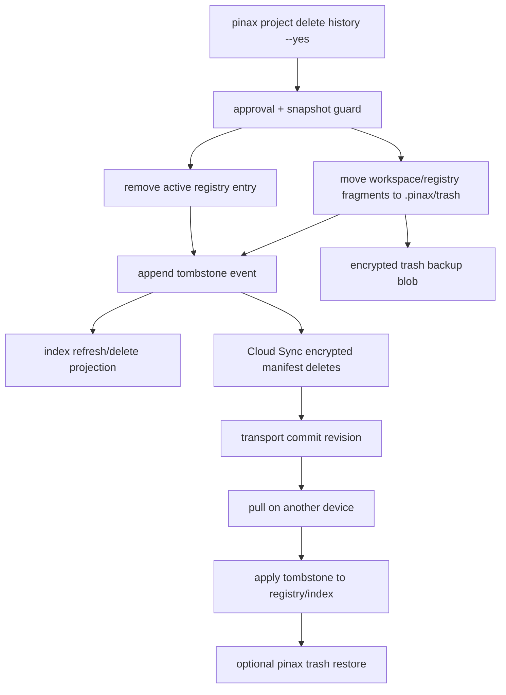

## Context

Pinax 的 Markdown vault 是真源，`.pinax/**` 是 CLI-authored structured assets。当前 note 删除已具备两层保护：默认移动到 `.pinax/trash/YYYYMMDD/...`，hard delete 需要 `--hard --yes`，record ledger 已有 note lifecycle 和 tombstone。project/subproject workspace 没有对应删除命令，导致旧 project slug 仍存在于 `.pinax/projects.json`，即使对应内容目录为空，`pinax project subproject list history` 仍然成功。

Cloud Sync 目前基于 encrypted manifest entries 同步存在的内容文件。这个模型无法单独表达“用户删除了某个文件/registry entry”，也无法保证其他设备把删除同步到本地 index 和 registry。必须加入 delete marker/tombstone，而不是用“manifest 不包含某路径”推断删除。

## Goals / Non-Goals

**Goals:**

- 为 project/subproject 等结构化对象提供 CLI-authored 删除、恢复、清理路径。
- 删除时同步更新 registry、record/tombstone、回收站和 index projection。
- Cloud Sync 传输 encrypted tombstone，并同步 encrypted trash backup，保证其他设备知道“这是删除”，同时还能恢复误删。
- 保持现有 CLI 输出、schema、note delete 行为兼容；新增字段可选、命令 additive。

**Non-Goals:**

- 不在本变更中实现自动冲突合并或跨设备智能恢复。
- 不把 `.pinax/index.sqlite`、本地 cache、raw provider payload、secret 或完整 note body 写入未加密远端证据。
- 不要求所有历史结构化 delete 命令一次性改完；MVP 先覆盖 project/subproject，并定义其他对象接入同一 trash service 的方式。

## Decisions

### 1. 删除统一为 `trash` 优先，hard delete 作为显式危险路径

默认删除命令只移动内容和 registry entry 到回收站，并写 tombstone。hard delete 必须带 `--hard --yes`，且只能清理已经进入 trash 的对象或空对象；直接 hard 删除 active project/subproject 必须失败并提示先 trash 或 snapshot。

可运行命令：

```bash
pinax project delete history --vault /workspaces/yeisme-agent/data/yeisme-notes/ --yes --json
pinax project subproject delete history-learning history-info --vault /workspaces/yeisme-agent/data/yeisme-notes/ --yes --json
pinax trash restore project/history --vault /workspaces/yeisme-agent/data/yeisme-notes/ --json
pinax trash list --vault /workspaces/yeisme-agent/data/yeisme-notes/ --json
```

替代方案是直接从 `.pinax/projects.json` 删除旧 project。这个方案被拒绝，因为它绕过 CLI-authored structured asset 规则，无法同步 tombstone，也无法恢复误删。

### 2. Tombstone 是删除事实，trash backup 是恢复材料

Tombstone 记录对象身份、kind、old path、registry path、content hash、deleted_at、deleted_by_device、source command、trash path、expires_at、sync revision evidence。Trash backup 保存可恢复内容：Markdown 文件、workspace 目录、registry fragment、board config fragment。

Tombstone 不保存明文 note body；trash backup 在本地是 vault 内 `.pinax/trash/**`，通过 Cloud Sync 上传时必须作为 encrypted blob/manifest entry。这样同步层能传播删除事实，同时保留误删恢复材料。

### 3. Project registry 采用 expand-then-contract

`.pinax/projects.json` 当前 schema 是 `pinax.projects.v1`。MVP 不改名、不删除既有 fields，只新增 optional fields：`deleted_projects` 或 `tombstones_ref`，并让 `projects[]` 默认只保留 active project。为避免旧 reader 重现已删除对象，`project delete` 会从 active `projects[]` 移除目标，同时把完整对象写入 trash/tombstone。恢复时再放回 `projects[]`。

### 4. Subproject workspace 删除不丢用户内容

Subproject 删除会移动整个 `notes/projects/<project>/<subproject>/` 到 `.pinax/trash/YYYYMMDD/projects/<project>/<subproject>/`，移动 `.pinax/project-workspaces/<project>/<subproject>.json` 到 trash registry backup，并清理 board config/current workspace 中指向该 workspace 的活跃引用。非空 workspace 需要 `--yes` 和近期 snapshot；没有 snapshot 时返回 `snapshot_required`。

### 5. Cloud Sync manifest 增加 optional delete entries

`pinax.cloud.manifest.v1` 保持 schema_version 不变但新增 optional 字段，旧客户端可忽略：

```json
{
  "entries": [],
  "deletes": [
    {
      "path_hash": "path_...",
      "object_kind": "project",
      "object_id": "project/history",
      "tombstone_id": "trash_...",
      "deleted_at": "2026-06-27T00:00:00Z",
      "trash_blob_id": "blob_..."
    }
  ]
}
```

`path_hash`、`object_id` 和 `trash_blob_id` 不含明文路径或内容。直接对象存储和 server transport 都只看到 encrypted manifest/blob。Pull 时先应用 delete marker，再写入远端 entries；如果本地对象有未同步修改，保留本地冲突副本并把删除 marker 放入 conflict queue。

### 6. 索引以 tombstone 收敛，不靠缺文件猜测

`index refresh` 读取 record ledger 和 trash tombstones：active 查询默认排除 trashed/deleted；`--include-trash` 或专门 `trash list` 才显示。删除 project 后，`pinax project list` 不再显示旧 slug，`pinax project show history` 返回 `project_not_found` 并给出 `pinax trash restore project/history ...` 的 next action。

## Mermaid Flow



## Risks / Trade-offs

- **旧客户端忽略 `deletes`** -> 保持 additive 字段，但 sync status/doctor 要提示 `remote_client_requires_trash_sync`，同一 workspace 中旧客户端可能无法正确收敛删除。
- **删除与远端修改冲突** -> pull 不覆盖本地未同步内容，生成 conflict copy 和 tombstone conflict，要求用户通过 sync conflicts 命令处理。
- **回收站无限增长** -> MVP 只实现 list/restore/purge 命令，不自动清理；后续可加 policy，但必须先有用户可见 dry-run。
- **registry 和文件移动部分成功** -> 删除操作必须通过 service 事务式步骤和 rollback best-effort；失败 projection 要列出已完成步骤和恢复命令。

## Migration Plan

1. 新增 trash/tombstone domain 类型和 service，不改变现有 note delete 输出。
2. project/subproject delete 先进入 trash service，添加 CLI/contract tests。
3. index refresh/rebuild 读取 tombstone 并排除 trashed/deleted。
4. Cloud Sync manifest 添加 optional `deletes`，push 上传 encrypted trash backup，pull 应用 tombstone。
5. 更新 README/docs 命令示例和 `--help`，全部显示真实 `pinax` 命令。

Rollback：如果新删除路径出问题，禁用新增 project/subproject delete 命令或回滚实现；已有 tombstone/trash entry 可通过 `pinax trash restore ...` 恢复 active registry。Cloud Sync 若发现 manifest delete 不兼容，保持 `remote_write=false` 并要求升级或禁用 delete sync。

## Open Questions

- 回收站默认保留期是否设为无限期，还是后续引入 `pinax trash purge --older-than 30d --dry-run`？MVP 建议无限期。
- `database view delete`、`template delete` 是否在同一个实现批次迁入 trash？MVP 建议只接入 project/subproject，其他命令只在 spec 中要求未来复用 trash service。
