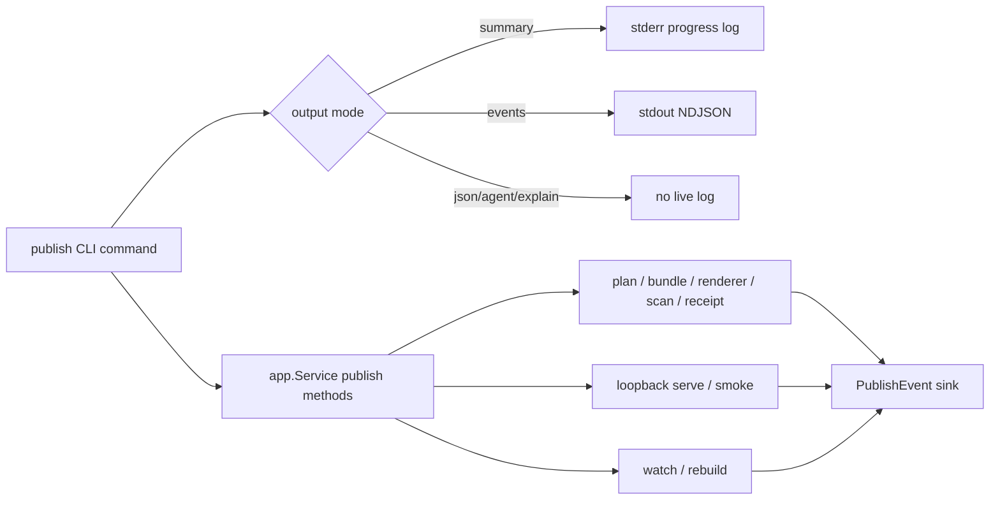

# Pinax 发布预览日志设计

## 总体架构

## 设计原则

1. **服务层只发结构化事实**：`internal/app` 通过 `PublishRequest.LiveEvents` 回调发事件，不直接写 stdout 或 stderr。
2. **命令层决定输出面**：`internal/cli/publish_cmd.go` 根据 output mode 把事件渲染为人类日志或 NDJSON。
3. **机器输出保持纯净**：`--json`、`--agent`、`--explain` 不接 live sink；stdout 只包含对应 projection。
4. **兼容演进**：新增事件类型和字段是 additive；旧事件、envelope、agent keys 不变。
5. **日志脱敏**：事件字段只记录 profile、target、renderer、相对 evidence、URL、计数和状态，不记录 vault 绝对路径或正文。

## 事件合同

新增 publish 事件统一包含：`spec_version`、`mode=events`、`command`、`type`、`seq`、`status`。可选字段包括 `profile`、`target`、`renderer`、`url`、`out`、`selected_count`、`scan_findings`、`receipt`、`duration_ms`。

新增事件类型：`profile_ready`、`plan_checked`、`bundle_written`、`renderer_started`、`renderer_completed`、`scan_completed`、`receipt_written`、`serve_ready`、`smoke_completed`、`watch_started`、`change_detected`、`rebuild_started`、`rebuild_completed`、`rebuild_failed`、`preview_approved`。

## 文件影响

- `internal/app/publish.go`：新增 `PublishEvent` / `PublishEventSink`，并在 publish 关键阶段 emit。
- `internal/cli/publish_cmd.go`：新增 live sink 渲染和 `--events` 专用 start/end/error 输出。
- `cmd/pinax/publish_command_test.go`：新增 publish logging contract tests。
- `docs/commands/publish.md`：补充事件和人类日志说明。
