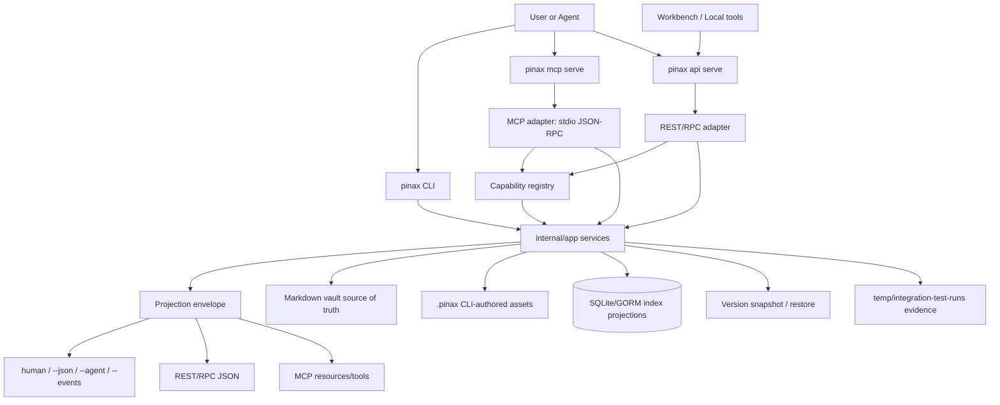

# 设计：发布版 Agent 交互面收敛

## 产品收敛

发布版 Pinax 只承诺一个主路径：**安全地让 agent 使用真实 Markdown vault**。所有能力围绕五段 proof loop 组织：

1. Capture：把用户或 agent 输入收进本地 vault。
2. Retrieve：建立索引，返回 bounded context、memory、KB、graph、database view。
3. Diagnose：发现 broken links、orphan notes、metadata drift、stale context、manual review items。
4. Plan：生成 repair/organize/maintenance plan，不直接修改正文。
5. Apply safely：snapshot、approval、apply、receipt、restore。

首发不把高级能力放在主路径里竞争注意力。Cloud Sync、publish、plugin runtime、realtime daemon、provider-backed answer synthesis、desktop/workbench shell 都是高级或未来路径；它们不能成为 proof loop 的前置条件。

## 架构原则

- CLI 是产品真源：稳定命令、projection envelope、output mode、docs、tests 都先以 CLI 为准。
- `internal/app` 是能力真源：Cobra command、Local REST/RPC、MCP、Workbench 只做参数转换、auth/transport、projection rendering。
- Capability registry 是发现真源：`pinax api routes --json`、OpenAPI export、Workbench capability explorer、Remote API Mode 和 agent docs 使用同一份 registry。
- Projection 是数据真源：CLI JSON、`--agent`、RPC body、REST response、MCP tool result 必须复用同一 bounded projection 字段。
- Write gate 是安全真源：任何写入都要保留 dry-run/plan、approval、snapshot requirement、receipt、restore path；MCP 默认不写。



## 发布版能力矩阵

| 场景 | CLI 必须项 | API/RPC 派生 | MCP 派生 | 发布标签 |
| --- | --- | --- | --- | --- |
| Vault bootstrap | `init`, `vault validate`, `vault stats` | readonly status/routes | vault resource | mature |
| Capture | `note add`, `inbox capture`, `journal daily append`, `import markdown --dry-run/--yes` | write disabled by default; allow-write requires `yes=true` | no direct write; return next command | mature/first-support |
| Retrieve | `index refresh`, `search`, `note show --display card`, `memory context`, `kb context`, `graph query`, `database view render` | readonly projections | readonly tools/resources | mature/first-support |
| Diagnose | `vault doctor`, `asset doctor`, `proof loop run` | readonly health projections | readonly health/context tools | mature |
| Plan | `repair plan --save`, `organize plan --save`, `brain maintain --save-plan` | plan/dry-run only by default | plan preview only | mature/preview |
| Apply safely | `version snapshot`, `repair apply --yes`, `organize apply --yes`, `version restore apply --yes` | only explicitly registered gated writes | no direct write in release | mature for CLI |
| Discover | `api routes`, `api schema export`, `mcp serve`, command docs | `/v1/capabilities`, OpenAPI | `tools/list`, `resources/list` | mature |

## Agent 体验规格

### 1. Discover

Agent 首先读取能力目录，而不是猜命令：

```bash
pinax api routes --vault ./my-notes --json
pinax api schema export --format openapi --vault ./my-notes --json
pinax mcp serve --vault ./my-notes
```

每个 capability 必须暴露 `command`、`capability_id`、`readonly`、`body_allowed`、`approval_required`、`snapshot_required`、`local_only_reason`、`copy_command` 和稳定错误码。OpenAPI export 只导出真实 REST route，不为未来能力虚构路径。

### 2. Inspect bounded context

Agent 默认读取 card/detail/context projection，不读取完整正文：

```bash
pinax search "Alice" --vault ./my-notes --json
pinax memory context "prepare for Alice meeting" --entity alice --limit 12 --vault ./my-notes --agent
pinax kb context "prepare for Alice meeting" --limit 8 --vault ./my-notes --json
pinax graph query --kind person --match alice --vault ./my-notes --json
```

完整正文只能由显式 body display 命令返回，并且本地输出要保留 `body_exposure=explicit` 或等价 projection fact。

### 3. Plan before write

任何维护动作先返回计划：

```bash
pinax proof loop run --vault ./my-notes --json
pinax repair plan --vault ./my-notes --save --json
pinax organize plan --vault ./my-notes --save --json
```

API/MCP 对写入请求默认返回 `write_disabled`、`approval_required`、`snapshot_required` 或可复制 CLI next action，不静默修改 vault。

### 4. Apply through CLI proof loop

发布版真实写入路径是 CLI：

```bash
pinax version snapshot --vault ./my-notes --message "before agent maintenance"
pinax repair apply --vault ./my-notes --plan repair-abc123 --yes --json
pinax version restore notes/example.md --revision HEAD --plan --vault ./my-notes --json
pinax version restore apply --vault ./my-notes --plan restore-abc123 --yes --json
```

写入 receipt 必须记录 plan id、snapshot ref、changed paths、local/remote write facts、manual review skips 和 redacted event reference。

### 5. Verify and audit

发布版 agent 测试必须证明：stdout/stderr 分离、token/Authorization/Cookie/provider payload 不泄露、MCP 默认只读、API readonly 不写、allow-write 仍需 `yes=true`，失败也保留 redacted evidence。

## API/MCP 边界

### Local API / RPC

- `pinax api serve` 默认 loopback、readonly、temp token 或明确 `--no-auth`。
- Handler 只做 transport、auth、route selection、status mapping，不直接读写 Markdown、`.pinax/**`、SQLite、Git 或 provider。
- Remote API Mode 只转发 registry 支持的命令；不支持的命令必须返回 `remote_command_unsupported`，不能 fallback 到本地执行。
- `--allow-write` 只打开已注册 mutation route；高风险写入仍需要 approval 和 snapshot。

### MCP

- 发布版 MCP 默认 stdio、local vault、read-only。
- MCP tools/resources 只能返回 bounded projections、plan previews、next command，不直接写 vault。
- Future HTTP MCP、OAuth、team/company permission、rate limits 归属 `mcp/gateway` 或后续 owner，不在 `cli/pinax` 静默实现。

## 发布版门禁

- `task check` 必须通过。
- `openspec validate --all` 必须通过。
- 至少一条 process e2e/testscript 覆盖五分钟 proof loop。
- 至少一条 Local API component/e2e 覆盖 route discovery、readonly request、write_disabled、allow-write approval gate。
- 至少一条 MCP frame/e2e 覆盖 `tools/list`、bounded read tool、write rejection 或 plan-only response。
- 所有 integration/component/e2e 入口写入 `temp/integration-test-runs/<run-id>/`，包含 `summary.json`、`command.txt`、`stdout.log`、`stderr.log`、`env.json`、`artifacts/`。

## 迁移与文档策略

- README、quickstart、command map 第一屏只讲 proof loop 和 agent-safe boundary。
- 高级路径移动到 “Advanced workflows”：Cloud Sync、publish、plugin、provider-backed brain、realtime daemon、Workbench shell。
- `docs/overview/product-positioning.md` 和 `docs/product/mvp-scope.md` 保留定位，但要与本 spec 的发布版能力矩阵一致。
- `docs/interfaces/remote-api-contract.md` 和 `docs/commands/mcp.md` 继续作为接口细节文档，本 spec 只定义发布版收敛与验收。
