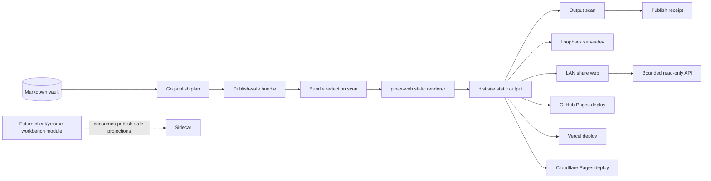

# Pinax 静态发布 Renderer 与部署设计

## 总体架构



## 设计原则

1. **本地闭环先于云部署**：`publish build`、`publish serve` 和 preview approval 必须先可靠，云平台只消费已经扫描并预览确认的 `dist/site/`。
2. **同一份产物部署多平台**：GitHub Pages、Vercel、Cloudflare Pages 不拥有 Markdown 语义，只是 deploy adapter。
3. **Go sidecar 拥有安全边界**：selection、body policy、private/draft filtering、secret scan、receipt、target safety 和 deploy confirmation 都在 Go service。
4. **前端 renderer 只吃 bounded bundle**：renderer 不读取 vault、不读 `.pinax/**`、不读 SQLite、不读 token、不调用网络。
5. **Workbench 延后但不返工**：renderer fixture 和数据合同必须足够稳定，未来 `client/yeisme-workbench` Pinax 模块能消费同源 projection，但 renderer 本身不实现内部页面。
6. **内网分享显式开启**：现有 `api serve`、`publish serve` 默认仍绑定 loopback；内网暴露走新增 `share start`，必须显式 `--allow-lan` 和只读 scope。

## 代码归属与文件结构

### Pinax Go 后端与 CLI

- `internal/cli/publish_cmd.go`：新增 `publish dev`，扩展 target enum help 为 `local|github-pages|vercel|cloudflare-pages|github-wiki|github-gist|http`。
- `internal/app/publish.go`：实现 `PublishBuild`、`PublishServe`、`PublishDeploy` 编排；保持命令层只解析参数。
- `internal/app/publishops/bundle.go`：生成 publish-safe bundle，包含 manifest、notes、assets、graph、taxonomies、search-index、build metadata。
- `internal/app/publishops/scan.go`：递归扫描 bundle 和 output，拒绝 token、Authorization/Cookie、provider payload、绝对本地路径、`.pinax` internals 和 private body sentinel。
- `internal/app/publishops/renderer.go`：Go 到 renderer 的 adapter，负责调用本地 renderer command、收集 stderr、校验输出路径和 renderer manifest。
- `internal/app/publishops/deploy_github.go`：GitHub Pages 部署，使用 git/gh 可用性诊断，写入独立 repo 或 branch。
- `internal/app/publishops/deploy_vercel.go`：Vercel 部署，调用系统 `vercel` CLI，不保存 token。
- `internal/app/publishops/deploy_cloudflare.go`：Cloudflare Pages 部署，调用系统 `wrangler pages deploy`，不保存 token。
- `internal/cli/share_cmd.go`：新增 `pinax share` 命令族，负责 LAN share flags、scope、auth、host gate 和输出投影。
- `internal/app/share.go`：组合 publish-safe static output、read-only API route group、auth middleware 和 HTTP server lifecycle。
- `internal/app/shareops/scope.go`：定义 `published`、`vault-readonly` scope 与 route/body exposure 策略。
- `internal/app/shareops/auth.go`：实现 share token 校验、one-time access code 或 token-file 引用，不输出 token 值。
- `internal/domain/publish.go`：新增 target、renderer/build/deploy receipt 数据结构，保持 additive evolution。
- `internal/domain/share.go`：新增 share projection、scope、auth mode、route exposure 和 receipt 数据结构。
- `cmd/pinax/publish_command_test.go`：命令级 contract tests，覆盖 build/serve/dev/deploy target gates。
- `cmd/pinax/share_command_test.go`：命令级 contract tests，覆盖 loopback/LAN/auth/scope gates。

### 前端 renderer 包

- `web/pinax-web-renderer/package.json`：静态 renderer 包，使用 TypeScript 和 Vitest；不包含 Vite/React 页面入口。
- `web/pinax-web-renderer/src/render-static.ts`：静态渲染入口，读取 publish-safe bundle，写 `index.html`、`notes/**/index.html`、`tags/**/index.html`、assets、`pinax-data/**`。
- `web/pinax-web-renderer/src/markdown.ts`：Markdown pipeline，支持 GFM、frontmatter metadata、wikilink tokens、safe attachment placeholders、code highlighting placeholder。
- `web/pinax-web-renderer/src/render-static.ts`：直接生成 publish-safe static HTML，包括 layout、note page、tag page、search data bootstrap。
- `web/pinax-web-renderer/src/sanitize.ts`：HTML sanitize 和 URL/path safety，禁止 script/import/network execution。
- `web/pinax-web-renderer/fixtures/`：renderer fixture，覆盖 wikilink、frontmatter、managed block placeholder、dataview result、attachment、private redaction marker。
- `web/pinax-web-renderer/tests/`：Vitest contract tests，对同一 bundle 校验 HTML output 和 semantic manifest。

### 构建与质量入口

- `Taskfile.yml`：新增 renderer 相关任务，如 `task publish:renderer:test`、`task publish:renderer:build`、`task publish:smoke`，并接入 `task check`。
- `docs/commands/publish.md`：更新真实命令，包括 local/dev/GitHub Pages/Vercel/Cloudflare Pages。
- `openspec/specs/static-site-publishing/spec.md`：本变更落地后归档到 live spec。

## 前端构建设计

静态 renderer 是 Pinax 发布功能的一部分，不是完整客户端或内部 workbench。引入 TypeScript/Vitest 的理由是：renderer 需要可测试的 Markdown/HTML 语义、HTML fixture 和安全输出；不引入 Vite/React 页面，因为内部 UI 归 `client/yeisme-workbench`。

开发命令：

```bash
task publish:renderer:test
task publish:renderer:build
```

用户命令：

```bash
pinax publish build --profile public --target local --out ./dist/site --vault ./my-notes --json
pinax publish serve --profile public --out ./dist/site --host 127.0.0.1 --port 4173 --vault ./my-notes
pinax publish preview approve --profile public --out ./dist/site --vault ./my-notes --json
pinax publish dev --profile public --out ./dist/site --host 127.0.0.1 --port 4173 --vault ./my-notes
```

`publish dev` 不是长期 daemon。它是本地开发入口：生成 bundle、运行 renderer build、启动 loopback preview；`--watch` 后续可监听 vault Markdown、renderer source 和 profile 变化，触发 debounce rebuild。

## 内网分享设计

内网分享不是部署，也不是云同步。它是一个本机进程，把已经构建并扫描通过的 Web 预览站点和受限 API 暴露给同一内网里的浏览器。

推荐用户命令：

```bash
pinax share start --profile public --out ./dist/site --scope published --host 0.0.0.0 --port 8787 --allow-lan --readonly --vault ./my-notes
```

可信小组需要查更多只读投影时使用 token：

```bash
pinax token create --label lan-preview --scope read --expires 24h --vault ./my-notes --json
pinax share start --scope vault-readonly --host 0.0.0.0 --port 8787 --allow-lan --readonly --token-file ~/.config/pinax/share-token --vault ./my-notes
```

`share start` 输出必须给出可复制的内网 URL，但不输出 token 值：

```text
Web preview: http://192.168.1.20:8787/
API: http://192.168.1.20:8787/api
Mode: readonly
Scope: published
Auth: token_required
```

Scope 语义：

| Scope | 用途 | Web | API | Body exposure |
| --- | --- | --- | --- | --- |
| `published` | 给同事/家人看准备发布的公开笔记 | 只读静态站点 | 只开放站点所需公开 projection | 只含 publish-selected body |
| `vault-readonly` | 小范围可信内网查库 | 工作台/搜索/图谱只读 | read-only route group，需要 token | 默认 card/detail/context，body 需显式 route |

安全 gate：

- 默认 host 是 `127.0.0.1`。
- `--host 0.0.0.0`、局域网 IP 或非 loopback host 必须同时传 `--allow-lan`。
- `--allow-lan` 必须搭配 `--readonly`，第一版不支持内网写入。
- `--scope vault-readonly` 必须启用 token auth；`--no-auth` 只允许 loopback。
- Web root 必须是 `dist/site` 或内存渲染的 publish-safe output，不能是 vault root。
- API 只能返回 bounded projection，不返回 `.pinax/**`、SQLite、provider config、token 文件、sync state 或未授权正文。

服务生命周期：

```text
validate scope/auth/host
  -> verify output manifest or prepare publish-safe projections
  -> mount web routes
  -> mount /api read-only routes by scope
  -> start HTTP server
  -> write redacted share start projection
  -> shutdown on signal with server cleanup
```

## 渲染服务设计

`PublishBuild` 的状态流：

```text
load profile
  -> publish plan
  -> reject blocking issues
  -> write temp publish-safe bundle
  -> scan bundle
  -> call pinax-web renderer
  -> scan dist/site
  -> serve local preview
  -> require preview approval receipt
  -> write manifest and receipt
  -> return JSON/agent/events projection
```

renderer input 示例：

```text
bundle/
  manifest.json
  notes.json
  graph.json
  taxonomies.json
  search-index.json
  sources.json
  assets/
```

renderer output 示例：

```text
dist/site/
  index.html
  notes/<slug>/index.html
  tags/<tag>/index.html
  assets/
  pinax-data/
    manifest.json
    graph.json
    search-index.json
```

## 部署适配设计

### GitHub Pages

GitHub Pages 是首个云部署 target。Pinax 只部署生成产物，不部署私有 vault。推荐独立发布 repo 或 `gh-pages` branch。

```bash
pinax publish deploy --profile public --target github-pages --out ./dist/site --repo ../kb-pages --branch gh-pages --yes --vault ./my-notes --json
```

### Vercel

Vercel 部署调用系统 `vercel` CLI。Pinax 只检查 CLI 是否存在、project 参数、output hash、scan receipt 和命令 stderr 脱敏。

```bash
pinax publish deploy --profile public --target vercel --out ./dist/site --project my-notes --yes --vault ./my-notes --json
```

### Cloudflare Pages

Cloudflare Pages 部署调用系统 `wrangler pages deploy`。凭据由 wrangler 本地配置或环境变量管理，Pinax 不读取 token 值。

```bash
pinax publish deploy --profile public --target cloudflare-pages --out ./dist/site --project my-notes --yes --vault ./my-notes --json
```

## 安全与证据

- `publish plan` 只读，不写 output、receipt、Git 或远端。
- `publish build` 可以写 output 和 CLI-authored receipt，但不能改 Markdown 正文、provider、sync 或远端。
- `publish serve` 只能绑定 loopback，默认 `127.0.0.1`。
- `publish preview approve` 写入 CLI-authored preview receipt，记录 output hash、profile、target、served URL、检查时间和确认人输入，但不记录私密正文。
- `publish deploy` 必须 `--yes`，必须验证最新 output hash、scan receipt 和 preview approval receipt。
- integration/component/e2e 测试必须写入 `temp/integration-test-runs/<run-id>/`，保留 `summary.json`、`command.txt`、`stdout.log`、`stderr.log`、`env.json` 和 `artifacts/`，并脱敏 token、Authorization、Cookie、provider payload、raw prompt 和隐藏系统提示。

## 延期项

- Electron/React 客户端源码和交互式 editor/preview shell。
- 云端托管服务、登录、团队权限和服务端动态搜索。
- 自定义域名、DNS 自动配置和 OAuth flow。
- 评论、协作编辑、访问统计和站点后端。
