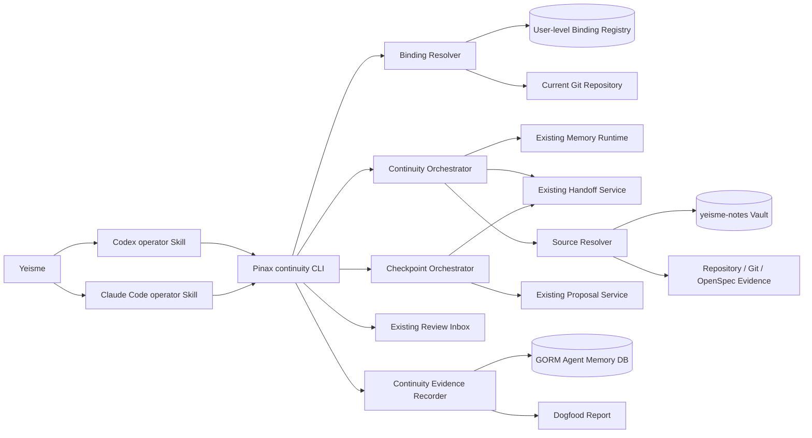
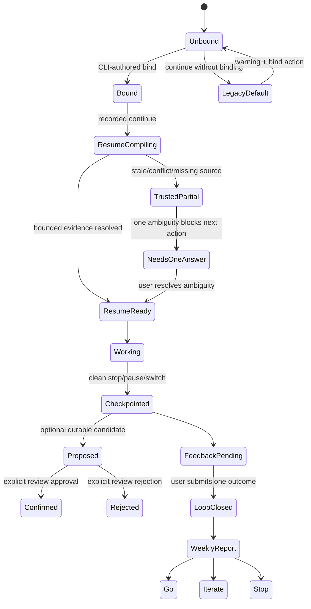

## Context

Pinax 已经具备以下 building blocks：

- experimental `pinax continue` 和 `yeisme.agent_continuity.v1` Continuity Pack；
- provider-neutral principal、scope、context、handoff、proposal、feedback 与 review contracts；
- Markdown vault 真源、GORM memory ledger、bounded source refs 和 lifecycle/proof services；
- `--agent`、`--json`、`--events`、`--explain` 共用的 projection boundary。

当前问题主要在产品编排，而不是底层引擎缺失：`continue` 默认落到 `workspace:default`，用户需要理解 vault、scope、handoff 和底层 memory 命令；真实默认 vault `yeisme-notes` 尚未建立 `project:pinax` handoff 闭环；human renderer 只给出通用 facts，没有突出“上次做到哪里、现在先做什么”；freshness 使用生成时间而非 evidence 时间；repository/OpenSpec source 不能参与现有 note/asset resolver；真实使用结果也没有一个用户明确提交的可信 outcome。

本 change 服务 personal-first、future-public 的产品姿态。当前唯一真实 operator 是 Yeisme，首轮只在 Pinax repository 内使用 Codex 与 Claude Code，但所有领域合同保持 provider-neutral，不能把 runtime 名称写进 memory 主键、scope 生命周期或 canonical state。

### Capability admission

| 能力 | Admission | Canonical owner | 用户可见宿主 | 处理 |
| --- | --- | --- | --- | --- |
| repo/worktree → vault/scope 绑定 | `fit` | `cli/pinax` | `pinax continue bind/status` 与 Agent 自然语言入口 | deliver-now |
| continuity compile、checkpoint、receipt、report | `fit` | `cli/pinax` | `pinax continue*` | deliver-now |
| Codex/Claude 自然语言触发与安装 | `split-owner` | 根仓库 `.skills/yeisme/pinax-agent/` | Codex 与 Claude Code 对话 | deliver-now companion handoff |
| runtime-specific memory database 或 plugin | `reject-now` | 不进入 Pinax | 无 | 使用 provider-neutral CLI contract |
| 跨 vault 全局搜索与自动猜测项目 | `reject-now` | 不进入当前 slice | 无 | 显式 binding；缺失/歧义时询问 |
| Web/桌面客户端、团队协作、公共 onboarding/pricing | `reject-now` | 未来独立 owner | 无 | 六周 scope freeze 后另立 change |
| Feishu/task/action-capture 接口扩张 | `reject-now` | 现有 canary owner | Hermes canary | 完成固定窗口后 Go/Iterate/Stop 并归档 |

### Required Capability Ledger

| ID | Required capability | 状态 | Owner | Delivery slice | Acceptance evidence |
| --- | --- | --- | --- | --- | --- |
| RC-01 | 用户在 Agent 中说“继续这个项目”即可恢复工作 | `required` | split-owner：Skill + Pinax CLI | deliver-now | Codex 与 Claude Code fixture/真实 loop 均无需手填 scope |
| RC-02 | 当前 Git repository/worktree 自动映射到唯一 vault/scope | `required` | Pinax | deliver-now | binding unit、command contract、临时 Git repo e2e |
| RC-03 | 不默认搜索所有 vault，不猜测歧义 | `required` | Pinax | deliver-now | missing/ambiguous tests 返回稳定状态与一个 next action |
| RC-04 | Resume Card 展示目标、状态、决策、阻塞、下一步与来源健康 | `required` | Pinax | deliver-now | human golden + JSON/agent additive contract tests |
| RC-05 | stale/conflict/missing 明示；partial trustworthy 优先 | `required` | Pinax | deliver-now | source drift、conflict、missing handoff e2e |
| RC-06 | 结束/暂停/切换时生成 bounded checkpoint/handoff | `required` | Pinax + Skill | deliver-now | checkpoint process e2e；下一个 runtime 可消费 |
| RC-07 | durable decision/preference/lesson 只进入 proposal，不静默 confirmed | `required` | Pinax lifecycle | deliver-now | auto-confirm count = 0；proposal/review receipt tests |
| RC-08 | 相关 review item inline；其余每周 review ≤5 分钟 | `required` | Pinax + Skill | deliver-now | relevance projection tests + weekly review receipts |
| RC-09 | 用户显式反馈 `trusted|corrected|wrong_project|insufficient` | `required` | Pinax | deliver-now | immutable feedback event contract tests |
| RC-10 | 北极星与六周 Go/Iterate/Stop 报告 | `required` | Pinax | deliver-now | CLI-authored report + denominator/known-bias checks |
| RC-11 | Codex 与 Claude Code 都参与，覆盖三类 Pinax 任务 | `required` | dogfood operator | deliver-now | ≥30 real loops；runtime/task-class coverage facts |
| RC-12 | 未来可公开但当前不建设账号、团队、定价和跨设备 onboarding | `committed` | future owners | retain-next | 仅保留稳定 provider-neutral contract，不实现产品面 |
| RC-13 | 跨项目自动 routing | `exploratory` | future Pinax/root integration | retain-next | 当前报告必须显示 `unvalidated`，不能由单仓库样本毕业 |
| RC-14 | 现有 action-capture canary 完成固定窗口后归档 | `required` | existing change owner | parallel closeout | 2026-09-05 后 Go/Iterate/Stop receipt 与 archive evidence |

### Scope change log

| 日期 | 原方向 | 新决定 | Required capability impact |
| --- | --- | --- | --- |
| 2026-08-29 | 广泛扩展 note/agent/platform surfaces | 六周只推进 Agent work continuity | 其他能力保留但暂停，不删除 |
| 2026-08-29 | 多项目首轮 dogfood | 首轮只测 Pinax repository 的三类真实任务 | 跨项目 routing 标为 unvalidated，不伪装通过 |
| 2026-08-29 | 可能通过 MCP/runtime plugin 接入 | Codex/Claude 共用根仓库 operator Skill 调用 CLI | 自然语言体验保留，owner 移到正确边界 |
| 2026-08-29 | 自动沉淀“有价值记忆” | checkpoint 只写 handoff；长期项只能 proposal/review | durable memory job 保留，silent promotion 被禁止 |

## Goals / Non-Goals

**Goals:**

- 把“继续这个项目”压缩为一次自然语言请求和一张可判断可信度的 Resume Card。
- 让 repository binding、scope resolution、handoff selection、source resolution 和 recovery 行为 deterministic、可诊断、可测试。
- 让一次 substantial session 在结束、暂停或切换 Agent 时产生 bounded handoff，并让下一个 Agent 在不读取 transcript 的情况下继续。
- 通过用户明确 outcome、source coverage、review duration 和 safety facts，判断连续性闭环是否形成真实依赖。
- 保持 CLI、machine output、stored schema、memory lifecycle 与 runtime adapter 边界向后兼容。

**Non-Goals:**

- 不新建 memory engine、ranking engine、向量/RAG provider 或第二套 source truth。
- 不自动创建 confirmed memory，不保存 raw prompt、完整对话、provider payload、私有工具参数或 chain-of-thought。
- 不在 Pinax 内实现 Codex/Claude plugin、MCP Gateway、长期 daemon、聊天 SDK 或通信 bridge。
- 不做团队 workspace、组织 ACL、公共 SaaS、定价、跨设备 onboarding、Web/桌面客户端。
- 不扩大 action-capture canary，不新增 Feishu/task provider 或稳定 `intent=action_capture`。
- 不以本 change 的 Codex + Claude / Pinax-only dogfood 替代 `pinax-agent-memory-runtime` 的 Codex + Ordo 四周 stable gate。

## Architecture



Skill 只负责识别自然语言意图、调用稳定 CLI、渲染 Resume Card 和请求一次用户 outcome；它不读取 Pinax 内部数据库、不复制 memory lifecycle，也不拥有 binding。Pinax CLI/application service 拥有 canonical resolution、checkpoint、receipt 和 report。

## Decisions

### 1. 使用 CLI + generated Skill 组合，不新增 MCP 或 runtime plugin

Pinax 已有本地 CLI、统一 output contract 和短生命周期运行模型。Codex 与 Claude Code 的自然语言入口通过同一个 `pinax-continuity-operator` source skill 生成到两套 runtime skill home，Skill 调用 `pinax ... --json` 或 `--agent` 并消费 typed facts。

选择理由：

- 不需要新的常驻服务、transport、token 或跨项目部署；
- Codex/Claude 使用同一产品合同，避免 runtime-specific schema；
- Skill 可迭代对话文案，Pinax 可稳定领域状态；
- 失败时用户仍可直接使用 CLI 诊断和恢复。

拒绝方案：在 Pinax 内嵌 Codex/Claude plugin，或新增 MCP Gateway 只为本地单用户 dogfood服务。两者都会扩大 owner 和运维边界，且没有跨服务复用证据。

### 2. Binding 是 user-level versioned registry，由 CLI/service 独占写入

新增 logical schema `pinax.continuity_binding.v1`。每条 binding 至少包含：

```text
binding_id
schema_version
canonical_repo_root
repo_root_digest
vault_ref
scope_kind
scope_id
enabled
created_at
updated_at
```

- registry 使用现有 user-level config path resolver 和 owner-only `0600` 权限；不进入 repository、vault note 或 Git。
- `canonical_repo_root` 只用于本机解析，默认 machine output 仅返回 bounded basename、digest 和 status，不泄漏完整 home path。
- `vault_ref` 必须解析到已注册 vault；`scope_kind/scope_id` 必须通过 canonical Pinax service 验证。
- 所有 create/update/disable 操作都通过 `pinax continue bind` 或 application service；Agent 不手写 JSON/YAML。
- 第一 slice 使用 exact canonical worktree root。跨路径移动、remote URL identity 和自动继承其他 worktree 延后，避免错误合并两个本地 checkout。

绑定解析优先级：

1. 显式 `--vault` 与 `--scope`；
2. 当前 Git worktree 的唯一 enabled exact binding；
3. 没有 binding 时保留现有 `workspace:default` 行为，并增加 `binding_status=missing` 与一个 copyable bind action；
4. registry 中出现多个 exact active records 或损坏状态时返回 `continuity_binding_ambiguous` / `continuity_binding_invalid`，不选择任意 vault。

显式参数永远胜出，因此现有脚本行为不被 binding 改写。已创建 binding 是用户对当前 repository 自动解析的明确选择。

### 3. `continue` 保持 leaf 行为，同时增加 additive subcommands 与 opt-in receipt

目标 CLI surface：

```text
pinax continue [existing flags] [--record-run] [--runtime <id>] [--task-class <class>]
pinax continue bind --repo <path> --vault <ref> --scope <kind:id>
pinax continue status --repo <path>
pinax continue checkpoint [bounded handoff flags] [--run <run-id>]
pinax continue feedback --run <run-id> --outcome <value> [--review-seconds <n>]
pinax continue report --since <duration>
```

`continue` 的已有 flags、machine envelope top-level fields、`facts` keys 和 `yeisme.agent_continuity.v1` fields 不删除、不重命名、不 repurpose。新增字段均 optional：

- `binding_status`、`binding_id_digest`；
- `continuity_run_id`（仅 `--record-run`）；
- `evidence_status`、`freshness_status`；
- `recommended_next_action`；
- `review_attention_count`；
- `task_class`、`runtime`（仅 receipt/report）。

默认 read-only 调用不写 run receipt。Operator Skill 对 substantial resume 明确传入 `--record-run`，因此 product dogfood 有证据，但旧调用方不会因一次读取产生新数据库状态。

### 4. Resume Card 是 command-specific human projection，machine contract 只做 additive 扩展

默认 human view 固定为最多六个区块：

```text
Objective
Last state
Key decisions
Blockers / conflicts
Recommended next action
Evidence status
```

设计规则：

- 首屏只显示一个 recommended next action；其他 next actions 放在 detail/JSON。
- 没有 handoff 时显示 `Handoff: missing` 并降级到 context-only，不失败整个请求。
- 有 conflict、stale、missing source 时整体 status 为 `partial`，但仍返回其他可信 section。
- 只有当前 scope 中会改变推荐下一步的 pending review item 才显示一个 bounded inline notice；不得在 Resume Card 展开完整 proposal body。
- `freshness` 改为最新可支持 evidence 的 `observed_at`/revision time；生成时间作为单独 `generated_at` additive field，不能冒充 evidence freshness。
- default human wording 可以为产品体验优化；`--agent` 与 `--json` 保持 English keys 和稳定 envelope。

### 5. Repository evidence 通过现有 SourceRef additive kind 解析

第一 slice 新增 `repository` source kind，`SourceRef.Ref` 使用绑定内可解析的 repository-relative reference 与可选 revision，不保存 source body。Resolver 只允许访问当前 binding 的 canonical repository root，并阻止 `..`、symlink escape、绝对路径注入和跨 binding 访问。

Source coverage 分为：

- `resolved`：对象存在且 revision/hash 条件满足；
- `stale`：对象存在但 revision/hash 漂移；
- `missing`：对象不存在或 binding 不可用；
- `ambiguous`：ref 不能唯一解析，作为 additive detail 统计，同时整体视为 unresolved。

兼容性上保留现有 `total/resolved/missing/stale` 字段；`ambiguous` 作为 optional additive field。`source_coverage` 的旧 ratio 语义不改，报告另算 `resolved / total` 并显式处理 `total=0` 为 `not_measured`，不能当作 100%。

### 6. Checkpoint 复用 handoff service，长期记忆仍走 proposal/review

`pinax continue checkpoint` 是 `agent handoff create` 的 intent facade。它自动使用 resolved binding/scope，并接受 bounded objective、current state、decisions、completed work、blockers、verification、follow-ups、source refs 和 receiving runtime。每个 section 有 item count 与 character cap；超限返回 validation error，不截入完整日志。

Checkpoint 行为：

1. 验证 binding、principal、scope 和 source refs；
2. 创建一个 bounded handoff；
3. 若 operator 识别出 durable decision/preference/lesson，只能调用现有 proposal service 创建 `proposed` memory；
4. 返回 handoff ID、proposal IDs、source status 和 restore/review actions；
5. 绝不把 handoff 或 summary 自动 promotion 为 confirmed memory。

`checkpoint` 不接收 transcript file、raw prompt、provider payload 或自由 JSON dump。复杂字段解析、scope/source boundary 和非显然 fixture 必须有中文注释。

### 7. Run receipt 与 feedback 使用最小、append-only、无内容数据

新增 GORM additive models：

`continuity_runs`：

```text
run_id, binding_digest, scope_kind, scope_id_digest,
runtime, task_class, started_at, checkpointed_at,
handoff_status, source_total, source_resolved, source_stale,
source_missing, warning_codes, proposal_count,
silent_confirmed_write_count
```

`continuity_feedback_events`：

```text
feedback_id, run_id, outcome, review_seconds,
submitted_at, supersedes_feedback_id
```

约束：

- `outcome` 只允许 `trusted|corrected|wrong_project|insufficient`；
- `task_class` 只允许 `implementation_debugging|product_spec_docs|release_operations`；
- `runtime` 是 descriptor，不参与 memory identity；首轮报告期待 `codex` 与 `claude-code`；
- feedback append-only；用户改选时新 event 指向被替代 event，report 使用最新有效值；
- 不存 task title、note title、prompt、body、path、完整 source ref、provider payload 或 tool arguments；
- run/binding/scope 使用 opaque ID 或 digest，默认输出不泄漏本地绝对路径；
- `silent_confirmed_write_count` 由 canonical lifecycle receipts 计算，不由 Agent 自报。

### 8. Review 采用“相关 inline + 每周 bounded inbox”

Continuity orchestrator 只查询当前 resolved scope 的 pending/conflict/stale items，并用 deterministic reason codes 判断是否影响 objective、blocker、decision 或 recommended next action。最多一个 item 在 human card 中提示；machine data 可返回 bounded references 与 count。

其余 item 继续由现有 `pinax review` 展示和处理。Operator Skill 每周发起一次 bounded review，记录从 list 到最后一次 action/finish 的 `review_seconds`，并通过 `continue feedback` 写入同一周的 evidence event。任何 approve/reject 仍调用 canonical lifecycle service，保持 `--yes`、stale check、receipt 和 restore 规则。

### 9. 六周报告以真实 continuation loop 为分母

观察窗口建议为 2026-08-29 至 2026-10-10。一个 `trusted_continuation_loop` 必须同时满足：

- 有 opt-in run receipt 和最终 outcome；
- 用户在 substantial task 中使用 continuity，而不是 synthetic fixture；
- outcome=`trusted`；
- source coverage 已测量且没有 wrong scope/project；
- 没有 silent confirmed memory write。

Go gate：

| Gate | 条件 |
| --- | --- |
| Sample | ≥30 个真实 completed continuity loops |
| Runtime coverage | Codex 与 Claude Code 都至少出现在一个 completed loop |
| Scenario coverage | 三个 task classes 都至少出现一次 |
| Trust | `trusted / all valid outcomes ≥ 80%` |
| Sources | 聚合 `resolved / total ≥ 95%`，且 `total > 0` |
| Review burden | 每个完成 weekly review 的总用时 ≤300 秒 |
| Safety | `silent_confirmed_write_count = 0` |
| Routing claim | Pinax-only 报告必须显示 `cross_project_routing=unvalidated` |

全部门槛达到才能作出 Go，并且 Go 只允许下一 change 进入 onboarding、source quality、recovery、contract hardening 和第二 repository routing validation。未全部达到时：若安全门槛满足且失败集中于最多两个可修复类别，可 Iterate；样本不足、价值信号弱、失败分散或安全边界不能满足时 Stop。任何 outcome 都不得自动解冻团队、provider、Web 或公共 SaaS scope。

### 10. 安装与诊断属于体验的一部分，但 canonical state 仍在 Pinax

根仓库 operator Skill 的首次运行顺序：

1. 检查 `pinax` 可执行文件和版本；
2. 调用 vault/project/binding status；
3. 当前 project scope 缺失时只显示需要执行的 canonical Pinax command；
4. binding 缺失或歧义时只问一个关键问题；
5. ready 后执行 recorded continue；
6. substantial closeout 时执行 checkpoint，并询问四值 outcome。

Skill 不写 registry、不手写 vault metadata、不在用户未同意时切换 project，也不扫描其他 vault。Codex 与 Claude Code runtime copy 由 `scripts/skills.sh` 从同一 source skill 生成，禁止手改生成目录。

### 11. 所有合同采用 expand-only compatibility

| Surface | Change class | Compatibility rule | Rollback |
| --- | --- | --- | --- |
| CLI commands/flags | additive | 保留 existing `continue` RunE 与 flags；新增 subcommands/optional flags | 关闭新 command registration |
| JSON/agent facts/data | additive | 不删除/重命名；old consumer 可忽略 | 停止发出 optional fields |
| Human renderer | experimental UX refinement | machine contract 不变；保留 compact fallback | 恢复 generic renderer |
| User config registry | new versioned schema | 无旧 key repurpose；安全默认 disabled/missing | 忽略 registry，不删除文件 |
| GORM schema | additive tables/index | 不 drop/rename/narrow；旧 DB 可自动 migrate | 停止写新表，保留数据 |
| Source kind | additive enum/string value | unknown kind 继续按 unresolved 处理 | 禁用 repository resolver |
| Skill source | new skill directory | 不重命名已有 skill/profile key | 从 profile 移除并重新 sync |

本 change 无 deprecation window，因为没有旧 surface 被弃用。Rollback 在整个 experimental 窗口保持可行，不执行 destructive reverse migration。

## State Flow



## Failure And Rescue Map

| Failure | Required behavior | User-visible rescue |
| --- | --- | --- |
| 当前目录不是 Git repo | 不扫描父级之外或所有 vault | `binding_status=not_a_repository` + bind/status command |
| binding 缺失 | 保留 legacy default，不猜 vault | partial facts + 一个 bind action |
| binding 歧义/损坏 | fail closed | stable error + disable/fix command |
| vault/project 不存在 | 不创建隐式 scope | invalid binding + canonical project/bind recovery |
| handoff 缺失 | context-only resume | `handoff_status=missing` + checkpoint action |
| repository source escape | 拒绝解析并记录 boundary code | unresolved source + safe inspect command |
| source drift | 标记 stale，不替换事实 | refresh/review action |
| conflicting decision | 两边都保留 | partial card + review attention |
| checkpoint 超限 | 不截入日志或 transcript | validation error + section caps |
| feedback 重复 | append superseding event | latest outcome + audit count |
| DB migration/write failure | continuity pack 仍可在非 recorded 模式读取 | partial result + diagnose command |
| Skill 不可用 | CLI 仍可直接调用 | installation/status guidance |

## Test And Evidence Strategy

### Unit

- binding registry validation、exact worktree lookup、precedence、redaction、0600 permissions；
- repository source path normalization、symlink escape、revision drift、coverage/freshness calculation；
- Resume Card selection、single next action、inline review relevance；
- checkpoint caps、handoff mapping、proposal-only guard；
- receipt/feedback state fold、metrics denominator、known-bias projection。

### Command contract

- 固化现有 `pinax continue --scope ... --json/--agent` keys 和语义；
- 新 subcommands/flags、stable errors、stdout/stderr separation、redaction；
- no binding 时 existing behavior + additive warning；binding 后 auto resolution；
- outcome/task class enum validation 与 repeat feedback supersession。

### Integration / process e2e

- 临时 Git repository + fixture vault + CLI-authored project/binding；
- Codex fixture checkpoint → Claude fixture resume，以及反向流程；
- implementation/debugging、product/spec/docs、release/operations 三种 fixture；
- missing/stale/conflict/ambiguous source、no handoff、DB failure 和 rollback；
- 所有 integration/e2e 入口把成功或失败 evidence 写入 `temp/integration-test-runs/<run-id>/`，至少包含 `summary.json`、`command.txt`、`stdout.log`、`stderr.log`、`env.json` 和 `artifacts/`，并保留原退出码。

### Real dogfood

- 只记录枚举、计数、时间、opaque ID/digest 和 source coverage；
- 至少 30 个 substantial Pinax loops，Codex/Claude 与三类 task 均有分母；
- 每周生成一次 CLI-authored report，最终生成唯一 Go/Iterate/Stop receipt；
- 报告必须列出 single-operator、single-repository、self-selection 和 missing-feedback bias。

所有新增或修改的复杂逻辑、状态机、错误恢复、scope/source 边界、协议转换和非显然 fixture 必须有中文注释，说明约束原因而不是复述代码。

## Risks / Trade-offs

- [单仓库 dogfood 无法验证 wrong-project routing] → 报告固定输出 `cross_project_routing=unvalidated`，Go 后仍需第二 repository change。
- [自动 binding 选错 vault/scope] → exact worktree + explicit binding only；不按目录名、remote 或语义猜测。
- [read command 偷写 telemetry] → receipt 仅在显式 `--record-run` 时写入；默认保持 read-only。
- [Resume Card 过度压缩遗漏风险] → conflict/source warnings 不得被 budget 丢弃，details/JSON 保留 bounded drill-down。
- [checkpoint 变成 transcript dump] → repeated bounded fields、字符上限、body leak guard、禁止 file/payload 输入。
- [Agent 自己判定“trusted”美化数据] → outcome 必须由用户四选一提交；缺失保持 `not_measured`。
- [每周 review 形成负担] → inline 只提示影响当前工作的一项；其余 review 有五分钟硬门槛。
- [新增 registry 与 DB 增加状态面] → registry 仅存本机 mapping；DB 仅存最小 receipts；两者均可禁用且不成为 vault 内容真源。
- [与 active action-capture canary 争抢方向] → 只完成其固定窗口与 closeout，不扩大接口；continuity 是唯一新增主线。
- [产品 UX dogfood 被误当 runtime stable evidence] → 文档和 report 明确两个 gate 独立，现有 Codex + Ordo stable 条件不变。

## Migration Plan

1. 固化现有 `continue`、handoff、review、JSON/agent envelope 和 old DB fixture compatibility tests。
2. 以 additive schema 加入 binding registry、receipt tables 和 repository source resolver；默认未绑定、未记录。
3. 实现 `bind/status` 与 explicit precedence，先验证旧调用完全不变。
4. 实现 Resume Card、evidence freshness 与 partial/conflict behavior。
5. 实现 checkpoint、feedback、report，并完成 unit/contract/process e2e evidence。
6. 在根仓库创建并同步单一 source 的 Codex/Claude operator Skill；只消费已验证 CLI contract。
7. 用真实 `yeisme-notes` 创建或确认 `project:pinax`，由 CLI 建立 repository binding；不手写 metadata。
8. 2026-08-29 至 2026-10-10 执行六周 Pinax-only dogfood；并在 2026-09-05 完成 action-capture canary closeout。
9. 生成唯一 Go/Iterate/Stop receipt；只有 Go 才创建下一 stabilization/second-repository change。

Rollback：从 runtime profiles 移除 operator Skill 并重新 sync；关闭新 subcommand/flag registration、repository resolver 和 receipt writes；忽略 user-level binding registry 与 additive GORM tables；继续使用原有显式 `pinax continue --vault ... --scope ...`、`pinax agent handoff` 和 `pinax review`。不删除 binding/receipt data，不执行 destructive migration。

## Open Questions

- 第二 repository routing validation 选择哪个真实项目，必须在本 change Go 后由独立 CEO decision 确定；当前不预选。
- Repository source 第一 slice 只保证 file/revision 级解析；是否支持 heading/line span，依据真实 stale/inspection failure 再决定。
- `pinax-agent-memory-runtime` 何时满足 Codex + Ordo 四周 stable gate，继续由其现有 change 独立决定，本 change 不修改门槛。
