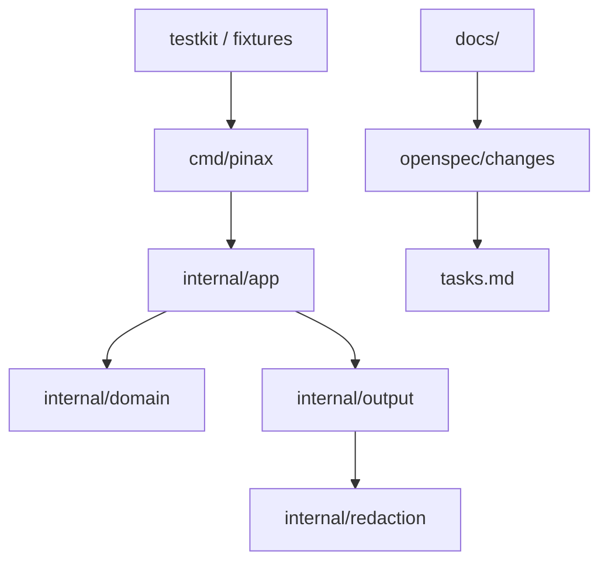

## Context

本 change 只落地开发底座，不落地业务能力。Pinax 的技术选择沿用根级设计：Go/Cobra CLI、GORM repository、testscript command e2e、CLI-backed Provider adapter、AI-native CLI output contract。

## Architecture



## Decisions

- 当前只提供最小 Cobra 入口，确认 Go toolchain、module、测试和 build 可用。
- 业务能力包只保留 `doc.go` ownership marker，避免先写业务逻辑再补 OpenSpec。
- 文档真源放 `cli/pinax/docs/`，根目录不复制项目文档。
- skills profile 由根 `.skills/profiles/targets/cli/pinax.txt` 维护，runtime 副本由 `scripts/skills.sh sync-subprojects` 生成。

## Validation

```bash
go test ./...
go build -trimpath -ldflags="-s -w" -o dist/pinax ./cmd/pinax
openspec validate --all
```

## Deferred

- `pinax init`、vault layout、frontmatter schema、GORM index 和 Git adapter。
- `--agent`、`--json`、`--events`、`--explain` projection 实现。
- Provider adapter、sync engine、MCP stdio server 和 briefing workflow。

